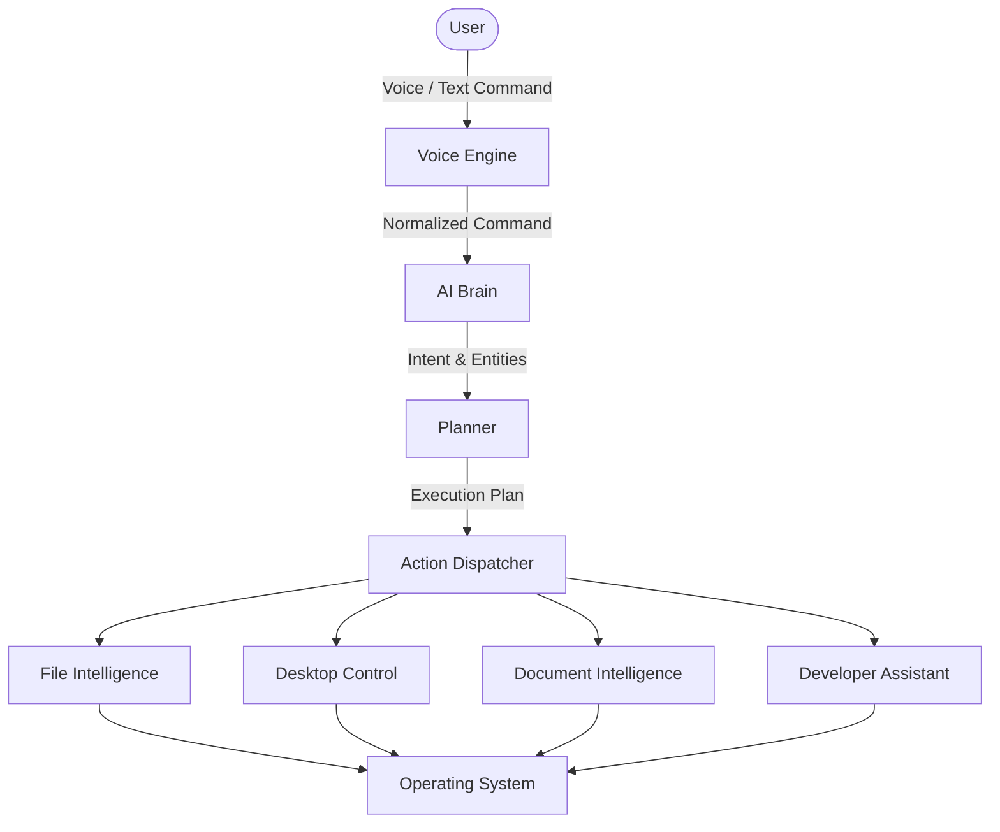
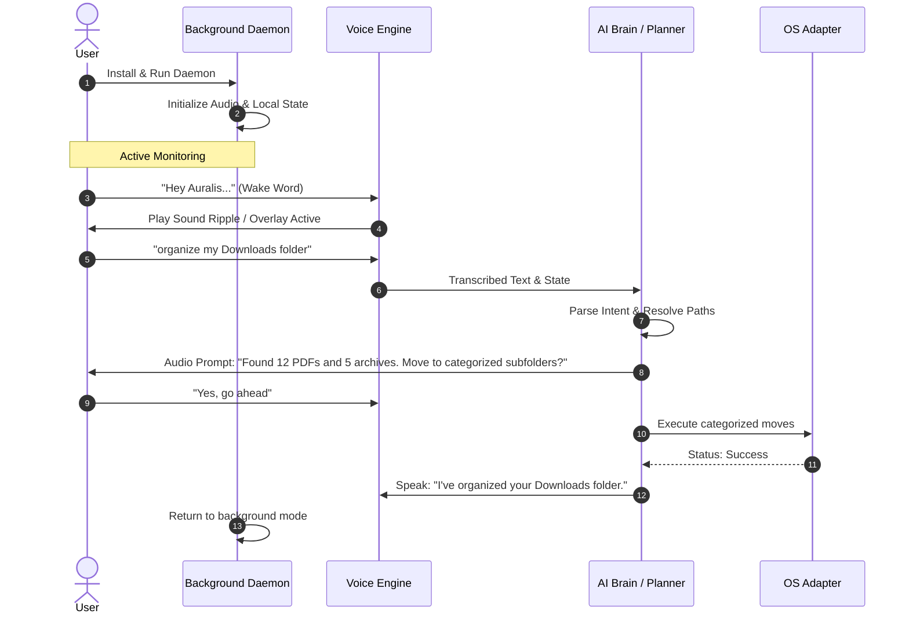

# Auralis

<p align="center">
  <b>Your AI Operating System Assistant</b>
</p>

<p align="center">
  Auralis is a local-first, privacy-respecting desktop assistant that replaces complex menus and system commands with natural language. Talk to your operating system to manage files, extract document intelligence, orchestrate development tasks, and build automated workflows.
</p>

<p align="center">
  <a href="https://github.com/Vish-0806/Auralis-voice-file-manager"></a>
  <a href="https://github.com/Vish-0806/Auralis-voice-file-manager/releases"></a>
  <a href="file:///d:/Auralis-voice-file-manager/LICENSE"></a>
  <a href="https://python.org"></a>
  <a href="https://fastapi.tiangolo.com"></a>
  <a href="#architecture"></a>
</p>

---

## Project Vision

Auralis is designed to bridge the gap between human intent and machine execution. Instead of forcing users to navigate nested folder trees, search through menus, or memorize terminal syntax, Auralis acts as an intelligent operating system abstraction layer. By combining voice-to-text, natural language processing, and command execution, it lets you control your computer as if you were talking to an expert human assistant.

> **"Talk to your computer like you talk to a person."**

Whether organizing cluttered folders, compiling project logs, summarizing complex documents, or spinning up local servers, Auralis interprets commands contextually and executes them securely on your local machine.

---

## Why Auralis?

Traditional desktop environments have remained largely unchanged for decades, leading to several common productivity bottlenecks:

* **Information Fragmentation:** Files are scattered across deep folder hierarchies, making retrieval a slow, manual process.
* **Complex File Discovery:** Searching by exact filename or date is restrictive; users need semantic search based on content and context.
* **Repetitive Workflows:** Tasks like clearing cache, sorting downloads, or backing up repositories require multiple steps.
* **Application Context-Switching:** Users constantly bounce between file managers, browsers, terminals, and editors.
* **Steep Command Line Learning Curve:** Developers and power users spend valuable time looking up system flags, utilities, and configuration syntax.

Auralis solves these problems by providing an intelligent, unified conversational interface. It translates natural language statements into precise system actions, handles permissions and path resolution under the hood, and coordinates multiple tools autonomously to execute complex instructions in seconds.

---

## Core Features

Auralis offers a broad set of capabilities designed for productivity and ease of use:

| Feature | Capability | Description |
| :--- | :--- | :--- |
| **Voice Interaction** | Wake Word & Speech-to-Text | Activate the assistant hands-free and issue spoken commands with natural voice feedback. |
| **AI Conversation** | Contextual Intent Parsing | Recognizes natural language, resolving fuzzy commands, relative dates, and implied locations. |
| **File Intelligence** | Intelligent File Operations | Move, copy, create, and organize files dynamically using flexible names and targets. |
| **Desktop Automation** | GUI & System Controls | Launch applications, control window layouts, and execute basic system settings changes. |
| **Developer Assistant** | Terminal & Git Management | Run backends, commit changes, parse terminal errors, and run local testing scripts. |
| **Document Intelligence** | PDF & Text Summarization | Extract key points, actions, and metadata from local files without opening external apps. |
| **Semantic Search** | Vector-Based Discovery | Find files based on meaning, topic, or content rather than just matching exact filenames. |
| **Workflow Automation** | Multi-Step Chains | Combine multiple operations (e.g., "Clean my desktop and backup active projects") into single commands. |
| **System Monitoring** | Process & Resource Tracking | Query active processes, system resource utilization, and memory availability. |
| **Memory Engine** | User Preferences & History | Remembers previous instructions, active projects, and preferred default locations. |
| **Plugin System** | Extensible Architecture | Add custom integrations, system adapters, and API endpoints via a modular plugin loader. |
| **Privacy First** | Local Execution | Keeps your files, voice data, and operational logs securely on your local system. |

---

## Desktop Automation & Workflow Engine (v0.4.0)

Auralis Version 0.4.0 implements a modular, high-performance Desktop Automation and sequential Workflow Engine. It integrates with the core AI Planner and Dispatcher to support voice and text control of applications, windows, OS settings, clipboard, screen captures, inputs, and multi-step workflows.

### 1. Module Capabilities
- **Application Management**: Launch and terminate applications safely.
- **Window Management**: Minimize, maximize, restore, focus, list, or close windows.
- **System Controls**: Control master audio volume levels, screen brightness, Wi-Fi, Bluetooth, and system power states.
- **Clipboard Automation**: Copy text, paste selection, clear history, and export paths.
- **Screenshot & Capture Utilities**: Fullscreen captures, active window captures, timed delays, clipboard copying, and screen recording.
- **Input Automation**: Synthesized keyboard typing, keystrokes, shortcuts, coordinate-based mouse moves, clicks, scrolls, drag-and-drop, and custom macros.
- **Sequential Workflow Engine**: Orchestrates multiple capability operations sequentially. Includes default registry modes:
  - **Start Coding**: Opens VS Code and Terminal; sets audio volume.
  - **Study Mode**: Opens Edge; mutes system; enables Wi-Fi.
  - **Meeting Mode**: Opens Notepad; mutes system; minimizes active windows.
  - **Movie Mode**: Opens Spotify; raises system volume.
  - **Clean Workspace**: Closes browser and code editor windows; displays desktop.

### 2. Supported Command Syntax Examples
- `open VS Code` / `close Chrome`
- `minimize notepad` / `focus edge`
- `set volume to 60%` / `mute` / `unmute` / `turn on wifi`
- `copy selected text` / `paste` / `clear clipboard`
- `take a screenshot` / `capture the active window`
- `type hello world` / `press enter` / `press Ctrl+S` / `move mouse to 500, 300` / `double click` / `scroll down`
- `Start Coding` / `run workflow Study Mode` / `list workflows`

### 3. Latency Profiling & Structured Logs
All desktop actions are tracked for execution time and logged with detailed JSON context objects, enabling future telemetry analysis and audit log tracing.

---

## Architecture

Auralis uses a modular architecture that separates voice capture, natural language understanding, execution planning, and OS operations:



---

## Modules

The project is structured into independent packages to ensure separation of concerns and ease of contribution:

| Module | Namespace | Function & Responsibility |
| :--- | :--- | :--- |
| **Voice Engine** | `backend/voice/` | Captures microphone input, processes wake word detection, converts speech to text, and runs text-to-speech feedback. |
| **Conversation Engine** | `backend/core/` | Handles NLP parsing, command normalization, and formats conversational agent responses. |
| **Memory Engine** | `backend/memory/` | Manages application state, records historical contexts, and tracks user preferences. |
| **Planner** | `backend/core/planner.py` | Receives parsed actions and maps out the correct sequences of file, terminal, or GUI operations. |
| **File Intelligence** | `backend/capabilities/files/` | Resolves system paths recursively, conducts permission checks, and handles folder restructuring. |
| **Desktop Automation** | `backend/capabilities/desktop/` | Automates application launches, controls windows, screen captures, inputs, and OS system settings. |
| **Workflow Engine** | `backend/automation/workflow/` | Orchestrates multi-step sequential desktop workflows, performs safety validations, and logs histories. |
| **Plugin Manager** | `backend/core/` | Detects, loads, and initializes external extensions and customized tools. |
| **OS Adapter** | `backend/utils/` | Interfaces directly with Windows, macOS, or Linux APIs, abstracting path limits and system differences. |

---

## User Experience

Auralis is designed to stay out of the way in the background and respond instantly when needed.



---

## Example Commands

Auralis supports a wide range of natural language instructions. Here are some of the most common command patterns:

### File Management
* `"Hey Auralis, organize my Downloads."`
  * *Action:* Scan the Downloads folder, group files by type (e.g., PDFs to Documents, ZIPs to Archives), and create folders if missing.
* `"Hey Auralis, clean my desktop."`
  * *Action:* Move screenshot files older than 3 days into an archive folder to keep the workspace clean.
* `"Hey Auralis, backup my projects."`
  * *Action:* Compress active work directories and move them to an external drive or backup partition.

### Developer Automation
* `"Hey Auralis, continue my AI project."`
  * *Action:* Open Visual Studio Code in the active project directory, launch the development terminal, and run docker-compose.
* `"Hey Auralis, run my backend."`
  * *Action:* Activate the virtual environment, install missing requirements, and launch the FastAPI server.
* `"Hey Auralis, commit my changes."`
  * *Action:* Execute git status, stage all changes, generate a contextual commit message based on diffs, and push to main.
* `"Hey Auralis, explain this error."`
  * *Action:* Capture the last terminal error output, analyze the traceback, and provide fixing steps.

### Document Intelligence
* `"Hey Auralis, summarize this PDF."`
  * *Action:* Parse the active PDF document in the explorer window, extract key takeaways, and output a markdown summary.

---

## Technology Stack

The project utilizes modern libraries and frameworks across both frontend and backend modules:

### Frontend
| Technology | Version | Purpose |
| :--- | :--- | :--- |
| **Vite** | Latest | Next-generation build tool and dev server. |
| **React** | 18.x | Component-based UI library. |
| **Vanilla CSS** | Modern | Sleek glassmorphic theme, layout structure, and animation system. |
| **Lucide Icons** | Latest | Premium vector icons for application status and file types. |

### Backend
| Technology | Version | Purpose |
| :--- | :--- | :--- |
| **FastAPI** | 0.136.1 | High-performance, asynchronous web API framework. |
| **Python** | 3.8+ | Core programming language. |
| **Uvicorn** | 0.46.0 | Lightning-fast ASGI server implementation. |
| **PyAudio** | 0.2.14 | Cross-platform library for capturing audio streams. |
| **SpeechRecognition** | 3.16.1 | Speech-to-text processing using multiple engine APIs. |
| **pyttsx3** | 2.99 | Offline text-to-speech converter. |
| **pywin32** | 311 | Native Windows API wrapper for path and file operations. |
| **comtypes** | 1.4.16 | Windows COM interface access. |

---

## Folder Structure

Auralis is designed with modularity in mind. The workspace layout is detailed below:

```
Auralis/
├── backend/                   # FastAPI Backend Application
│   ├── ai_engine/             # NLP parsing, intent matching, and summarization
│   │   ├── command_parser.py
│   │   ├── entity_extractor.py
│   │   ├── intent_classifier.py
│   │   └── response_generator.py
│   ├── api/                   # Router declarations and API endpoints
│   │   ├── routes.py          # HTTP /command handler
│   │   ├── voice_routes.py    # HTTP /voice/listen handler
│   │   ├── listener_routes.py # Background listener management
│   │   └── file_routes.py     # File search and management endpoints
│   ├── app/                   # Central state and application controller
│   │   ├── controller.py
│   │   └── state_manager.py
│   ├── automation/            # System automation and shell execution
│   │   ├── task_runner.py
│   │   └── workflow_manager.py
│   ├── file_engine/           # Path resolvers, permissions, and search engine
│   │   ├── file_operations.py
│   │   ├── path_resolver.py
│   │   ├── permissions.py
│   │   └── search_engine.py
│   ├── utils/                 # Logger configurations and constants
│   │   ├── constants.py
│   │   ├── helpers.py
│   │   └── logger.py
│   ├── voice/                 # Modular Voice Engine subsystems
│   │   ├── speech/            # Microphone capture, DSP audio processing, and STT transcribers
│   │   ├── conversation/      # Conversation state machine and inactivity timers
│   │   ├── tts/               # Text-to-Speech synthesis and Windows play queue workers
│   │   ├── ux/                # UX status tracking and winsound audio transition chimes
│   │   ├── context/           # Conversational memory and pronoun/ordinal reference resolvers
│   │   ├── integration/       # End-to-end pipeline coordination and error recovery loops
│   │   └── wake_word/         # Local pattern-matching wake word detector and listener
│   ├── tests/                 # Unit and integration test suites
│   ├── main.py                # Backend entry point
│   └── requirements.txt       # Python package dependencies
├── frontend/                  # Vite + React Client App
│   ├── public/                # Static assets and icons
│   ├── src/
│   │   ├── components/        # VoiceButton, StatusIndicator, SearchResults, CommandCard
│   │   ├── hooks/             # useVoiceCommands state management hook
│   │   ├── pages/             # Dashboard main page
│   │   ├── services/          # API communication layer (api.js)
│   │   ├── styles/            # global.css (glassmorphism stylesheets)
│   │   ├── App.jsx            # React root component
│   │   └── main.jsx           # App entry file
│   └── vite.config.js         # Proxy configuration and bundler setup
├── docs/                      # Technical documentation and guides
│   ├── AUDIO_SETUP.md         # Detailed microphone configuration manual
│   ├── api_reference.md       # API endpoint specification
│   ├── architecture.md        # Architectural flow and planner design
│   └── deployment.md          # Packaging and background daemon setup
└── scripts/                   # Setup and execution utilities
    └── setup_audio_windows.ps1 # Automated PyAudio installation script
```

---

## Roadmap

Track the development stages of Auralis:

* [x] **Core Pipeline:** Create the modular FastAPI backend structure and link to Vitest-proxied React dashboard.
* [x] **Voice Subsystems (Phase 3):** Implement modular Speech-to-Text (Whisper), Text-to-Speech (Edge-TTS), Session Manager state-machine, Inactivity timers, Voice UX (status tracks, sound chimes), and Context reference resolvers.
* [x] **Pipeline Integration:** Stitch all voice subsystems into a thread-safe, continuous execution pipeline with robust error recovery (mic reconnects, STT fallbacks, planner/capability exceptions, speech interruption).
* [ ] **Current Development:**
  * [ ] Implement basic document intelligence parser using local PyMuPDF extraction.
  * [ ] Refactor the system monitoring panel to display real-time CPU/RAM graphs in the dashboard.
* [ ] **Future Objectives:**
  * [ ] **Plugin Marketplace:** Allow community-developed scripts and action dispatchers to be installed with one click.
  * [ ] **Cross Platform Support:** Expand OS adapters to fully support macOS and desktop Linux environments.
  * [ ] **Cloud Sync:** Securely sync user profiles, common commands, and custom workflows.
  * [ ] **Developer Mode:** Direct terminal integration allowing execution of compilers and local debug sessions.
  * [ ] **Workflow Automation:** Drag-and-drop workflow visual builder inside the web interface.

---

## Privacy

Auralis is designed with security and data autonomy as absolute priorities:

* **Local-First Architecture:** By default, all file manipulations, commands, and operations are run directly on your hardware.
* **User-Controlled Permissions:** Auralis will never write to system files or delete documents without displaying a UI confirmation and asking for permission.
* **Voice Profiles:** Speech synthesis and recognition are processed locally or through user-approved engines, keeping audio streams private.
* **Sensitive Operations Guard:** Critical operations like emptying the recycle bin, permanent deletion, or executing terminal scripts require explicit confirmation.
* **Optional Cloud Features:** If cloud-based large language models (LLMs) or transcription APIs are configured, payload parameters are sanitized to prevent personal information from leaking.

---

## Screenshots

Below are conceptual representations of the Auralis desktop interface:

### Home Dashboard
```
+--------------------------------------------------------------+
| [A] Auralis                                    [ Active ]    |
+--------------------------------------------------------------+
|                                                              |
|   "Hey Auralis, clean up my desktop"                         |
|                                                              |
|                  +------------------+                        |
|                  |      (( ))       |                        |
|                  |    Listening     |                        |
|                  +------------------+                        |
|                                                              |
+--------------------------------------------------------------+
```

### Assistant Overlay
```
+--------------------------------------------------------------+
| Voice Activity                                               |
| [==================== Sound Wave Ripple ===================] |
| Transcribing: "summarize final_report.pdf..."                |
+--------------------------------------------------------------+
```

### File Operations Log
```
+--------------------------------------------------------------+
| Recent Operations                                            |
| [Move]   screenshot_01.png -> Desktop/Screenshots   [Success] |
| [Search] found 3 files matching "invoice"          [Success] |
| [Delete] report_old.txt                            [Pending] |
+--------------------------------------------------------------+
```

---

## Installation

Follow these steps to set up Auralis on your machine.

### Prerequisites
* **Python**: Version 3.8 or higher.
* **Node.js**: Version 16 or higher.
* **Microphone**: Working audio input device.

### Step 1: Clone the Repository
```bash
git clone https://github.com/Vish-0806/Auralis-voice-file-manager.git
cd Auralis-voice-file-manager
```

### Step 2: Configure the Python Environment
Set up a virtual environment and install backend dependencies:
```bash
python -m venv venv
# On Windows:
.\venv\Scripts\activate
# On Linux/macOS:
source venv/bin/activate

pip install -r backend/requirements.txt
```

### Step 3: Install Audio Drivers
For Windows users, run the automated audio script to configure PyAudio and SpeechRecognition:
```powershell
powershell -ExecutionPolicy Bypass -File .\scripts\setup_audio_windows.ps1
```

For macOS/Linux, install development packages:
```bash
# macOS
brew install portaudio
pip install pyaudio

# Linux (Debian/Ubuntu)
sudo apt-get install portaudio19-dev python3-pyaudio
pip install pyaudio
```

### Step 4: Run the Backend API
Start the FastAPI server on port 8000:
```bash
cd backend
uvicorn main:app --reload
```

### Step 5: Launch the Frontend App
Open a new terminal, install Node packages, and run Vite:
```bash
cd frontend
npm install
npm run dev
```
Navigate to `http://localhost:5173` to interact with Auralis.

---

## Future Vision

Auralis aims to evolve from a local voice assistant into an intelligent, autonomous operating system shell. 

Our target is to establish a proactive assistant that learns from your daily habits. If you regularly organize your downloads at the end of the day or open specific editor workspaces on weekday mornings, Auralis will suggest these actions ahead of time.

By building deep document parsing pipelines, local vector databases, and native OS adapters, Auralis will bridge the gap between user intention and machine execution, supporting developers, creators, and general users across Windows, Linux, and macOS.

---

## Contributing

We welcome contributions to Auralis! To get started:

1. **Fork** the repository on GitHub.
2. Create a new **feature branch** (`git checkout -b feature/amazing-feature`).
3. Commit your changes with professional, descriptive messages (`git commit -m 'feat: add semantic search component'`).
4. Push to your branch (`git push origin feature/amazing-feature`).
5. Open a **Pull Request** explaining your implementation.

Please verify that all tests pass (`pytest backend/tests`) and your frontend build succeeds (`npm run build`) before submitting.

---

## License

Distributed under the MIT License. See [LICENSE](file:///d:/Auralis-voice-file-manager/LICENSE) for more details.

---

<p align="center">
  Built with ❤️ by <a href="https://github.com/Vish-0806">Vishal S Naik</a>
  <br>
  <i>"Talk to your computer. Let Auralis handle the rest."</i>
</p>
