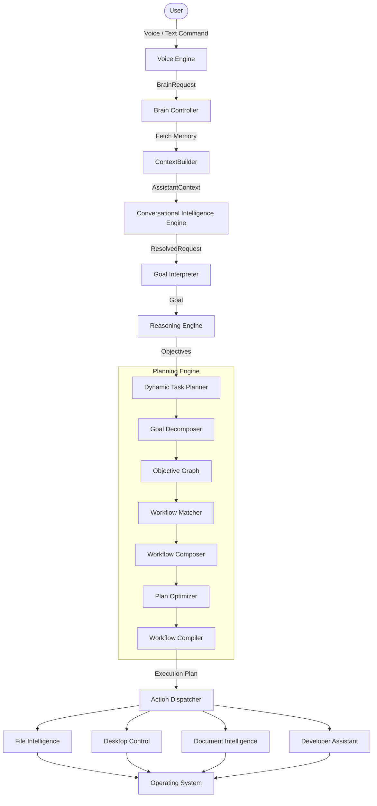

# Auralis 🎙

<p align="center">
  <b>Your AI Operating System Assistant</b>
</p>

<p align="center">
  Auralis is a local-first, privacy-respecting desktop assistant that replaces complex menus and system commands with natural language. Talk to your operating system to manage files, extract document intelligence, orchestrate development tasks, and build automated workflows.
</p>

<p align="center">
  <a href="https://github.com/Vish-0806/Auralis-voice-file-manager"></a>
  <a href="https://github.com/Vish-0806/Auralis-voice-file-manager/releases"></a>
  <a href="file:///d:/Auralis-voice-file-manager/LICENSE"></a>
  <a href="https://python.org"></a>
  <a href="https://fastapi.tiangolo.com"></a>
  <a href="#architecture"></a>
  <a href="#repository-certification"></a>
</p>

---

## Project Vision

Auralis is designed to bridge the gap between human intent and machine execution. Instead of forcing users to navigate nested folder trees, search through menus, or memorize terminal syntax, Auralis acts as an intelligent operating system abstraction layer. By combining voice-to-text, natural language processing, context building, and resilient command execution, it lets you control your computer as if you were talking to an expert human assistant.

> **"Talk to your computer like you talk to a person."**

Whether organizing cluttered folders, compiling project logs, summarizing complex documents, or spinning up local servers, Auralis interprets commands contextually and executes them securely on your local machine.

---

## Core Features

Auralis offers a broad set of capabilities designed for productivity and ease of use:

| Feature | Capability | Description |
| :--- | :--- | :--- |
| **Voice Interaction** | Wake Word & Speech-to-Text | Activate the assistant hands-free and issue spoken commands with natural voice feedback. |
| **AI Conversation** | Contextual Intent Parsing | Recognizes natural language, resolving fuzzy commands, relative dates, and implied locations. |
| **Reference Resolution** | Pre-Planning Entity Mapping | Automatically resolves pronouns (`it`, `them`) and spatial references (`same folder`, `same app`) before goal interpretation. |
| **Context Aggregation** | ContextBuilder & ContextWindow | Assembles recent conversations, executions, latest state, preferences, and workspace context with configurable window limits. |
| **Memory Ranking** | Relevance Scoring Engine | Scores memories by exponential recency decay, session affinity, workspace path match, and keyword/verb similarity. |
| **File Intelligence** | Intelligent File Operations | Move, copy, create, and organize files dynamically using flexible names and targets. |
| **Desktop Automation** | GUI & System Controls | Launch applications, control window layouts, and execute basic system settings changes. |
| **Developer Assistant** | Terminal & Git Management | Run backends, commit changes, parse terminal errors, and run local testing scripts. |
| **Document Intelligence** | PDF & Text Summarization | Extract key points, actions, and metadata from local files without opening external apps. |
| **Semantic Search** | Vector-Based Discovery | Find files based on meaning, topic, or content rather than just matching exact filenames. |
| **Workflow Automation** | Multi-Step Chains | Combine multiple operations (e.g., "Clean my desktop and backup active projects") into single commands. |
| **Autonomous Routines** | Pattern Mining & Execution | Automatically discovers repeated user workflows, recommends routine creation, and schedules background execution. |
| **Proactive Assistant** | Predictive Action Suggestions | Predicts likely next user actions using historical activity analysis and deterministic scoring without LLM overhead. |
| **Conversational Intelligence** | Multi-Turn Dialog & Entity Linking | Resolves ambiguity across turns, links entities, and manages clarification requests and dialogue recovery. |
| **Memory Engine** | Tiered Memory & Persistence | Manages short-term context, workspace profiles, user preferences, n-gram routine mining, and PostgreSQL ORM storage. |
| **Privacy First** | Local Execution | Keeps your files, voice data, and operational logs securely on your local system. |

---

## Desktop Automation & Workflow Engine (v0.4.0)

Auralis Version 0.4.0 implements a modular, high-performance Desktop Automation and sequential Workflow Engine. It integrates with the core AI Planner and Dispatcher to support voice and text control of applications, windows, OS settings, clipboard, screen captures, inputs, and multi-step workflows.

---

## AI Brain Orchestration & Self-Correction Engine (v1.0.0)

Auralis Version 1.0.0 implements the complete Phase 5 **AI Brain Orchestration** and **Self-Correction & Recovery Engine**. It establishes a modular, pipeline-based request execution gateway connecting the Goal Interpreter, Reasoning Engine, Dynamic Task Planner, Capability Selector, Execution Engine, Recovery Engine, and Progress Monitor.

---

## Advanced Memory Retrieval & Context Construction (v1.2.0)

Auralis Version 1.2.0 implements Phase 4 **Advanced Memory Retrieval API**, **Context Builder**, **Brain Memory Integration**, **Reference Resolution**, **Memory Ranking**, and **Context Window Management**.

### Key Additions:
1. **Active PostgreSQL Provider**: Production-grade ORM repositories (`ConversationRepository`, `ExecutionRepository`, `ContextRepository`, `PreferenceRepository`, `MemoryEventRepository`) with session scopes and transaction safety.
2. **ContextBuilder**: Assembles an `AssistantContext` domain model containing recent conversations, execution history, latest context state, user preferences, and workspace profiles.
3. **Brain Memory Integration**: Retrieves and attaches `AssistantContext` to `BrainController.process_request` with failure-resilient fallbacks and structured logging.
4. **Reference Resolution**: Created `ReferenceResolver` to parse and resolve conversational references (`it`, `them`, `this`, `that`, `previous`, `same folder`, `same app`) prior to goal planning.
5. **Memory Ranking**: Created `MemoryRanker` scoring memories using exponential recency decay, session affinity, workspace path matches, entity token overlap, and command verb similarity.
6. **Context Window Management**: Configures retrieval limits (`short_term_limit`, `long_term_limit`, `session_limit`) via `ContextWindowConfig` and enables high-performance `session_only` context loading.

---

## Workspace Intelligence & Awareness Integration (v1.3.0)

Auralis Version 1.3.0 implements the complete **Workspace Intelligence Subsystem** including **Workspace Discovery**, **Workspace Indexer**, **Project Intelligence Engine**, **Workspace Analysis**, **Workspace Cache & Coordinator**, and **Brain Awareness Integration**.

### Key Additions:
1. **Workspace Discovery Engine**: Asynchronously discovers candidate workspace folders inside user search roots while skipping ignored configurations and duplicate nested project paths.
2. **Dynamic FS Indexer**: Traverses workspace directories asynchronously to index folder stats and file trees.
3. **Project Intelligence**: Detects dominant programming languages, build tools, recommended build commands, and Git branches/dirty status.
4. **Thread-Safe Cache & Coordinator**: Serializes path scans and caches the compiled analysis records for 5 minutes (`300.0` seconds) to avoid duplicate file crawlers.
5. **ContextBuilder Integration**: Aggregates the `WorkspaceAnalysis` domain model directly into `AssistantContext` using safe fallback error envelopes.
6. **BrainController Workspace Awareness**: Resolves concise summaries (Language, Build, Project, Branch) and attaches them to `BrainResponse` objects to feed downstream reasoning pipelines.

---

## Intelligent Planning & Reasoning Engine (v1.4.0)

Auralis Version 1.4.0 implements the complete Phase 6 **Intelligent Planning & Reasoning Engine** including **Goal Decomposition**, **Workflow Library**, **Workflow Matcher**, **Workflow Composer**, and **Plan Optimizer**.

### Key Additions:
1. **Goal Decomposition Engine**: Created `GoalDecomposer`, rules-driven `DecompositionRules`, and DFS cycle-safe `DecompositionValidator` to map Reasoning results into validated, nested `ObjectiveGraph` models.
2. **Workflow Library**: Created `WorkflowLibrary` wrapping `WorkflowRegistry` to dynamically register and index workflows with rich metadata, tags, and interface signatures.
3. **Workflow Matcher**: Created deterministic `WorkflowMatcher` scoring matches by exact goal, name, intent, tags, and signatures, ranking results by normalized confidence values.
4. **Workflow Composer**: Created `WorkflowComposer` merging library workflows and dynamic steps into unified, cycle-safe sequences while resolving parameters, exclusive actions, and ordering cycles.
5. **Plan Optimizer**: Created production-grade `PlanOptimizer` executing deduplications, redundant preparation eliminations, parallel depth groupings, and time-reduction metrics.
6. **Integrated Validation**: Added a comprehensive integration test suite verifying that all planning components participate correctly in the pipeline.

---

## Autonomous Routine & Proactive Assistant Engine (v1.5.0)

Auralis Version 1.5.0 implements the complete **Autonomous Routine Engine**, **Proactive Assistant Engine**, and **Conversational Intelligence Engine**.

### Key Additions:
1. **Autonomous Routine Engine (Phase 7.4)**: Automatically discovers repeated user behavior, converts repeated execution patterns into reusable routines, safely recommends routine creation, executes approved routines, monitors their performance, optimizes them over time, and persists them in PostgreSQL.
2. **Proactive Assistant Engine (Phase 7.5)**: Transforms Auralis from a reactive assistant into a proactive desktop assistant capable of predicting user needs before commands are issued using deterministic activity prediction, recommendation scoring, prioritization, history tracking, and user feedback learning.
3. **Conversational Intelligence Engine (Phase 7.6)**: Manages multi-turn dialogue state, active tasks, phases, cross-turn entity linking, deterministic follow-up resolution, ambiguity detection, clarification management, and session context recovery.
4. **Adaptive Recommendation Pipeline**: Triggers workflows based on environmental events (`WorkspaceOpened`, `ApplicationOpened`, `TimeOfDay`, `PreviousWorkflowCompleted`) evaluated through deterministic confidence and cooldown policies.

---

## Long-Running Task & Background Job Scheduler Engine (v1.6.0)

Auralis Version 1.6.0 implements the complete **Long-Running Task Subsystem** and **Background Job Scheduler Subsystem**.

### Key Additions:
1. **Long-Running Task Subsystem (Phase 8.5)**: Manages observable, asynchronous operations (`LongRunningTaskManager`) with progress tracking, event notification framework (`TaskEventDispatcher`), recovery hooks (`TaskPersistenceHook`), timeout cleanup policies, and execution monitor observation without external message queues.
2. **Background Job Scheduler Subsystem (Phase 8.6)**: Schedules one-time and recurring jobs (`ONCE`, `INTERVAL`, `DAILY`, `WEEKLY`, `MONTHLY`, `MANUAL`) via `BackgroundJobScheduler`, deterministic schedule calculations (`RecurringScheduleCalculator`), parameter validations (`RecurringTriggerValidator`), persistence hooks (`BackgroundJobPersistenceHook`), expiration rules, retention cleanup, and seamless `ExecutionEngine` integration without cron or APScheduler dependencies.

---

## Repository Cleanup & Architecture Certification (RC-1 to RC-5)

Auralis has completed a comprehensive **Repository Cleanup Initiative (Phases RC-1 through RC-5)**, transforming the backend architecture into an enterprise-grade, certified modular platform:

### Completed Cleanup Phases:
1. **RC-1 (Repository Audit)**: Identified duplicate modules, obsolete helpers, and package boundary candidates.
2. **RC-1.5 (Candidates Verification)**: Verified static analysis import paths and cross-subsystem references.
3. **RC-1.75 (API Compatibility Verification)**: Verified signature and behavior equivalence across legacy and Brain interfaces.
4. **RC-2 (Compatibility Layer & Import Refactoring)**: Implemented thin facade adapters in `backend/ai/`, `backend/capabilities/files/`, and `backend/app/` while migrating all runtime modules to canonical `backend/brain/` architecture.
5. **RC-3.1 (Safe Legacy Removal & Test Consolidation)**: Consolidated duplicate SQLite JSONB helpers in `backend/tests/conftest.py` and test mocks in `backend/tests/mocks.py`.
6. **RC-3.2 (Legacy Package Deprecation)**: Safely removed unreferenced legacy scripts while preserving backward compatibility wrappers.
7. **RC-4 (Architecture Validation)**: Achieved an **Architecture Score of 100 / 100** with zero circular dependencies and clean DI lifecycle registration.
8. **RC-5 (Repository Certification)**: Achieved a **Repository Health Score of 100.0 / 100 (Grade A)** and 100% test pass rate across **1,936 test cases**.

---

## Provider-Independent AI Architecture & Runtime Subsystem (Phase 10)

Auralis implements a complete **Provider-Independent AI Architecture & Runtime Subsystem** (`backend/brain/ai/`), unifying LLM providers, prompt intelligence, tool execution, memory retrieval, multi-step planning, and runtime resilience.

### Key Additions:
1. **AI Architecture Foundation (Phase 10.1)**: Abstract interfaces (`AIProvider`, `PromptBuilder`, `ContextBuilder`, `ToolRouter`), domain models (`AIContext`, `Prompt`, `ProviderInfo`, `AIRequest`, `AIResponse`, `ToolCall`, `ToolResult`), and `AIOrchestrator`.
2. **Provider Framework (Phase 10.2)**: `BaseAIProvider`, `GroqProvider`, and `ProviderManager` supporting priority provider registration, default selection, and automatic failover.
3. **Prompt Intelligence Pipeline (Phase 10.3)**: `PromptTemplates`, `TokenEstimator`, `ConversationBuilder`, `MemoryInjector`, `WorkspaceContextInjector`, and `PromptOptimizer` enforcing priority order (`System` > `Developer` > `Memory` > `Workspace` > `Conversation` > `User`).
4. **Tool Calling Runtime (Phase 10.4)**: `DefaultToolRegistry`, `DefaultToolParser`, `DefaultToolExecutor`, permission model (`READ`, `WRITE`, `EXECUTE`, `ADMIN`), metadata models, tool schema generation, and routing.
5. **Memory-aware AI Integration (Phase 10.5)**: `AIMemoryProvider`, `DefaultMemoryRetriever`, `DefaultMemoryRanker`, and `DefaultMemoryFilter` enforcing relevance scoring, token budgets, and deduplication.
6. **Multi-Step Planning Engine (Phase 10.6)**: `AIPlanner`, `DefaultGoalAnalyzer`, `DefaultPlanGenerator`, `DefaultPlanValidator`, `DefaultExecutionPlanner` (topological graph cycle detection), and `DefaultExecutionMonitor`.
7. **Runtime Validation & Resilience (Phase 10.7)**: `AIResilienceRuntime`, `DefaultRetryManager` (exponential backoff), `DefaultTimeoutManager`, `DefaultCancellationManager`, `DefaultFailureClassifier`, `DefaultRecoveryManager`, `DefaultCircuitBreaker` (CLOSED/OPEN/HALF_OPEN), and `DefaultEventDispatcher`.

---

Auralis uses a modular architecture that separates voice capture, natural language understanding, memory context building, conversational intelligence and state tracking, execution planning, long-running tasks, background job scheduling, and OS operations:




---

## Technology Stack

The project utilizes modern libraries and frameworks across both frontend and backend modules:

### Frontend
| Technology | Version | Purpose |
| :--- | :--- | :--- |
| **Vite** | Latest | Next-generation build tool and dev server. |
| **React** | 18.x | Component-based UI library. |
| **Vanilla CSS** | Modern | Sleek glassmorphic theme, layout structure, and animation system. |
| **Lucide Icons** | Latest | Premium vector icons for application status and file types. |

### Backend
| Technology | Version | Purpose |
| :--- | :--- | :--- |
| **FastAPI** | 0.136.1 | High-performance, asynchronous web API framework. |
| **Python** | 3.13 | Core programming language. |
| **SQLAlchemy** | 2.x | Asynchronous ORM and relational database mapping. |
| **PostgreSQL** | 15+ | Relational database persistence provider. |
| **Alembic** | 1.16+ | Database schema migration management. |
| **Pydantic** | 2.x | Data validation and domain settings enforcement. |
| **Uvicorn** | 0.46.0 | Lightning-fast ASGI server implementation. |
| **PyAudio** | 0.2.14 | Cross-platform library for capturing audio streams. |
| **SpeechRecognition** | 3.16.1 | Speech-to-text processing using multiple engine APIs. |
| **pyttsx3** | 2.99 | Offline text-to-speech converter. |

---

## Folder Structure

```
Auralis/
├── backend/                   # FastAPI Backend Application
│   ├── api/                   # Router declarations and API endpoints
│   ├── brain/                 # AI Brain Orchestration (Goal, Reasoning, Planning, Recovery, Conversation Intelligence, Controller)
│   ├── capabilities/          # OS capabilities (files, desktop, automation, developer)
│   ├── core/                  # Assistant boundary, intent schemas, planner, and dispatcher
│   ├── memory/                # Tiered Memory System (PostgresProvider, ContextBuilder, Routines, Proactive, Recommendations)
│   ├── voice/                 # Modular Voice Engine subsystems
│   ├── tests/                 # 1,936 unit & integration tests across 110+ test modules
│   ├── main.py                # Backend entry point
│   └── requirements.txt       # Python package dependencies
├── frontend/                  # Vite + React Client App
│   ├── public/                # Static assets and icons
│   ├── src/                   # Components, hooks, pages, services, styles
│   └── vite.config.js         # Proxy configuration and bundler setup
└── docs/                      # Technical documentation and guides
```

---

## Roadmap

Track the development stages of Auralis:

* [x] **Core Pipeline:** Modular FastAPI backend structure and link to Vitest-proxied React dashboard.
* [x] **Voice Subsystems:** Speech-to-Text (Whisper), Text-to-Speech (Edge-TTS), Session Manager state-machine, Voice UX chimes, and context resolvers.
* [x] **AI Brain Orchestration (Phase 5):** Pipeline stages (Goal Interpreter, Reasoning Engine, Dynamic Planner, Capability Selector, Multi-step Execution Engine, Self-Correction & Recovery, Progress Monitor, Controller).
* [x] **Tiered Memory Platform (Phase 6):** Preference Engine, Context Memory, Workspace Profiles, Routine Learning n-gram mining, Personalization decider, and unified Memory Coordinator.
* [x] **Advanced Memory Retrieval & Context Construction (Phase 4):** PostgreSQL ORM Repositories, `ContextBuilder`, `BrainController` context integration, `ReferenceResolver`, `MemoryRanker`, and `ContextWindowConfig`.
* [x] **Workspace Intelligence & Awareness (Phase 5):** Asynchronous indexers, project detectors, thread-safe caching coordinators, context construction, and brain reasoning pipelines.
* [x] **Intelligent Planning & Reasoning Engine (Phase 6):** Goal decomposition, workflow libraries matching and compositions, parallel optimizations, compiler registrants, and integrated test pipelines.
* [x] **Autonomous Routine Engine (Phase 7.4):** Pattern detection, validation, optimization, routine library, matching, background scheduling, monitoring, and database persistence.
* [x] **Proactive Assistant Engine (Phase 7.5):** Activity prediction, suggestion recommendation, deterministic scoring, prioritization, history tracking, user feedback learning, and coordinator integration.
* [x] **Conversational Intelligence Engine:** Multi-turn context tracking, entity linking, ambiguity resolution, follow-up clarification, and session state management.
* [x] **Long-Running Task & Background Job Scheduler Engine (Phase 8.5 & 8.6):** Observable long-running tasks, event notification framework, recurring job scheduling, parameters validation, schedule calculation, persistence hooks, recovery, expiration, and retention cleanup policies.
* [x] **Provider-Independent AI Architecture & Runtime Pipeline (Phases 10.1 to 10.7):** Provider Framework (Groq Provider, failover), Prompt Intelligence, Tool Calling Runtime, Memory-aware AI, Multi-step Planning Engine, and Runtime Resilience Engine.
* [x] **Repository Architecture Stabilization & Cleanup (Phases RC-1 to RC-5):** Facade compatibility layers, canonical Brain ownership, conftest/mock fixture consolidation, 100% test pass rate across 1,936 test cases, and Grade A Repository Health Certification.
* [ ] **Future Objectives:**
  * [ ] Operating System Integration (Phase 11).
  * [ ] Document intelligence parser using local PyMuPDF extraction.
  * [ ] Plugin Marketplace for community extensions.
  * [ ] Drag-and-drop workflow visual builder.

---

## Installation & Testing

```bash
# Setup backend virtual environment
python -m venv venv
.\venv\Scripts\activate

# Install dependencies
pip install -r backend/requirements.txt

# Run complete test suite (1,936 tests across 110+ test modules)
pytest backend/tests

# Launch backend server
cd backend
uvicorn main:app --reload
```

---

## License

Distributed under the MIT License. See [LICENSE](file:///d:/Auralis-voice-file-manager/LICENSE) for details.

---

<p align="center">
  Built with ❤️ by <a href="https://github.com/Vish-0806">Vishal S Naik</a>
  <br>
  <i>"Talk to your computer. Let Auralis handle the rest."</i>
</p>
