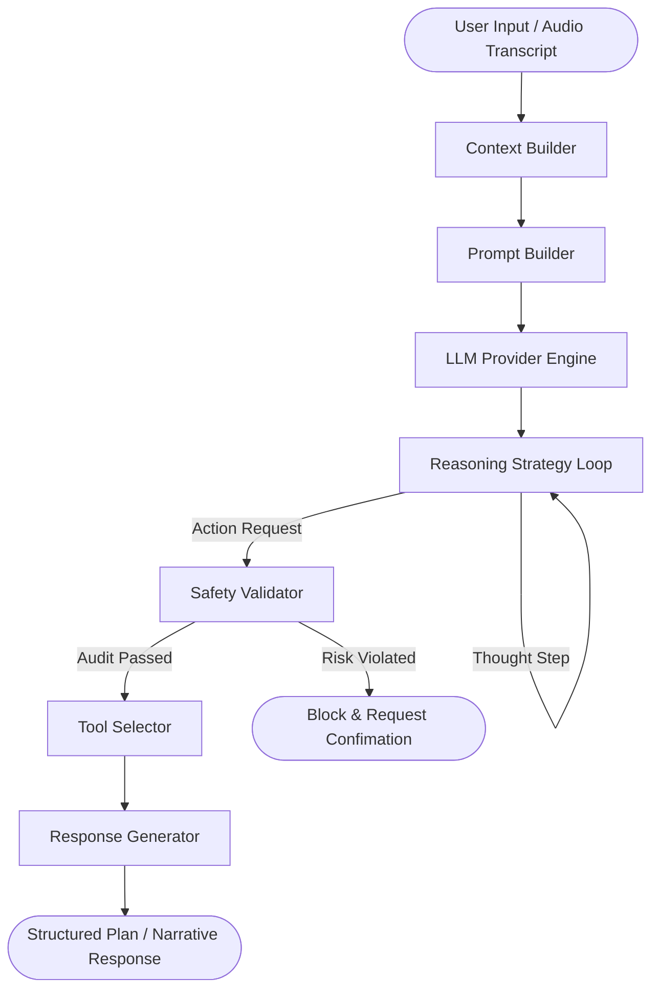
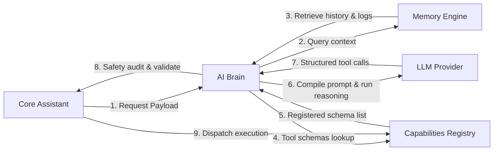

# AI Brain Subsystem

## AI Architecture & Responsibility
The `backend/ai` module represents the cognitive layer of Auralis. Instead of executing hardcoded command-matching strings, it uses a modular, agentic reasoning pipeline. By separating prompt structures, templates, reasoning strategies, tool selections, and safety checks, Auralis can adapt to local model boundaries or cloud LLM interfaces dynamically.

The core responsibilities of this module include:
- **Conversation Tracking:** Organizing session message flows.
- **Context Synthesis:** Aggregating active workspace information and historical logs into prompt payloads.
- **Reasoning Orchestration:** Running iterative loops (ReAct or Chain of Thought) to decompose goals into sequential steps.
- **Tool Mapping:** Formatting registered capabilities into tool schemas.
- **Action Auditing:** Scanning generated tool calls to calculate risks and block destructive commands.

---

## Future Execution Flow

Auralis processes requests by resolving contexts and running a reasoning loop:

---

## Relationship with Other Subsystems

The AI Subsystem interfaces with the rest of the application using strict contracts:

* **Core & Planner:** The Core system calls the AI Brain to parse requests. The Planner uses the AI Brain's output plan to schedule system executions.
* **Memory:** The AI Brain retrieves semantic memories and history blocks from the Memory Engine to enrich the active context window.
* **Capabilities:** The Tool Selector queries the Capabilities registry to map functions into tool definitions for the prompt payload.
* **Voice:** The Response Generator cleans responses and formats speech narratives, which the Voice Engine converts to spoken feedback.
