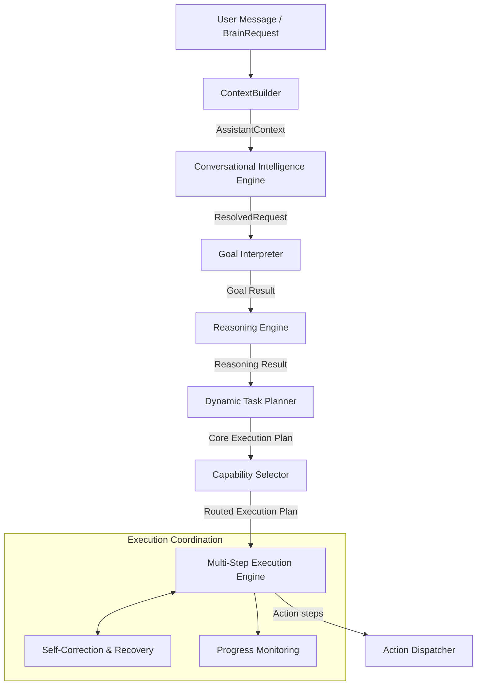

# Auralis AI Brain

This directory contains the core **AI Brain** module of Auralis. The AI Brain is a modular, local-first request processing pipeline that aggregates memory context, resolves entity references, and translates natural language commands into verified, routed, and resilient multi-step executions.

## Subsystem Architecture

The AI Brain is structured as a series of independent, single-responsibility layers coordinated by a central controller:

## Subsystems

| Directory | Subsystem | Purpose & Function |
| :--- | :--- | :--- |
| [goal/](file:///c:/Users/Vishal S Naik/MyProjects/Auralis-voice-file-manager/backend/brain/goal) | **Goal Interpreter** | Translates natural language messages into canonical Goal payloads with confidence scores. |
| [reasoning/](file:///c:/Users/Vishal S Naik/MyProjects/Auralis-voice-file-manager/backend/brain/reasoning) | **Reasoning Engine** | Evaluates matched goals to deduce target objectives, capability requirements, priority, and constraints. |
| [planning/](file:///c:/Users/Vishal S Naik/MyProjects/Auralis-voice-file-manager/backend/brain/planning) | **Dynamic Task Planner** | Formulates ordered steps topologically, prepending checks (e.g. creating directories) to satisfy plan constraints. Resolves conversational context references via `ReferenceResolver`. |
| [capability/](file:///c:/Users/Vishal S Naik/MyProjects/Auralis-voice-file-manager/backend/brain/capability) | **Capability Selector** | Binds and routes plan execution steps to specific system capabilities (Desktop, File, etc.). |
| [execution/](file:///c:/Users/Vishal S Naik/MyProjects/Auralis-voice-file-manager/backend/brain/execution) | **Multi-Step Execution Engine** | Schedules step executions sequentially using execution context states. |
| [recovery/](file:///c:/Users/Vishal S Naik/MyProjects/Auralis-voice-file-manager/backend/brain/recovery) | **Self-Correction & Recovery** | Analyzes step failures, maps fallback strategies (e.g. launching Edge if Chrome is missing), and recovers steps. |
| [monitoring/](file:///c:/Users/Vishal S Naik/MyProjects/Auralis-voice-file-manager/backend/brain/monitoring) | **Progress Monitoring** | Observes execution status, provides percentage estimations, detects stalls, and records execution metrics. |
| [controller/](file:///c:/Users/Vishal S Naik/MyProjects/Auralis-voice-file-manager/backend/brain/controller) | **AI Brain Controller** | Orchestrates the entire pipeline, retrieving context, resolving references, and exposing the centralized execution gateway `process_request`. |
| [conversation_intelligence/](file:///c:/Users/Vishal S Naik/MyProjects/Auralis-voice-file-manager/backend/brain/conversation_intelligence) | **Conversational Intelligence Engine** | Manages multi-turn conversation state, links entities across turns, resolves ambiguity, generates clarification requests, and recovers from dialogue errors. |

## Core Integration Flow

The AI Brain integrates seamlessly into Auralis' main entry point, `AuralisAssistant`:

1. When a request is received, the assistant wraps it into a `BrainRequest` and sends it to the `BrainController`.
2. The controller invokes `ContextBuilder` to aggregate and rank an `AssistantContext` (conversations, executions, preferences, workspace state).
3. The controller routes the request to the `ConversationalIntelligenceEngine` to manage dialogue state, check pending clarifications, resolve contextual follow-ups, link entities, and detect ambiguities.
4. If ambiguous, the engine registers a pending clarification in the dialogue state and prompts the user; otherwise, the resolved request is processed through the pipeline stages (Goal Interpreter, Reasoning, Planner, Capability Selector, Execution Engine).
5. If the Goal Interpreter returns low confidence or an `UNKNOWN` goal classification, the controller bypasses the AI Brain and falls back to legacy rule-based execution.
6. If a step fails during execution, the Multi-Step Execution Engine intercepts the failure, invokes the Recovery Engine to apply safe remediations, and resumes execution seamlessly.
