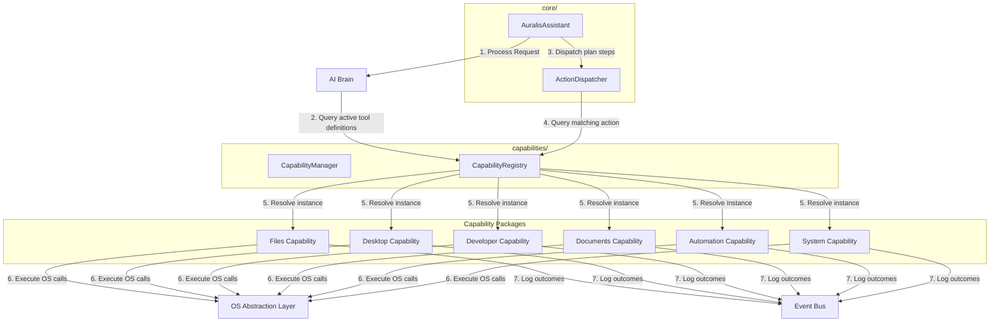

# System Capabilities Subsystem

## Capability Registration & Discovery
Capabilities in Auralis are modular plugins that extend the assistant's functional capacity. Every capability class implements the `ICapability` interface and registers itself with the central `CapabilityRegistry`.

During system bootstrap:
1. **Scans packages:** The `CapabilityManager` scans the `backend/capabilities/` sub-directories.
2. **Registers tools:** It instantiates active capabilities and registers them in the `CapabilityRegistry`.
3. **Dispatcher Discovery:** The `ActionDispatcher` queries the `CapabilityRegistry` to resolve target actions dynamically at runtime.
4. **Third-Party Plugins:** Future plugins can register new capabilities dynamically by calling `CapabilityRegistry.register()` during initialization.

---

## Architectural Relationships

