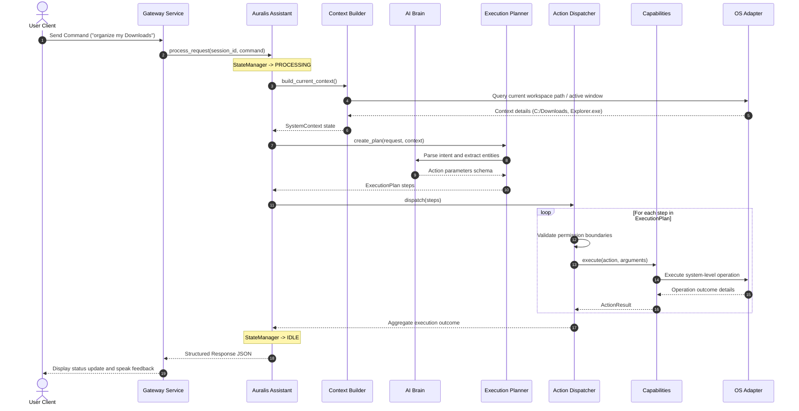

# Core System Orchestration

## Why the Core Module Exists
The `backend/core` module is the central orchestrator of the Auralis AI Operating System Assistant. It encapsulates the core workflow rules, coordination state, and execution plan lifecycles. By defining strict interfaces, the Core module separates orchestration logic from technical details like specific local LLM runtimes, database connections, speech libraries, and operating system platforms.

This decoupled structure ensures the system is:
- **Scalable:** New capabilities or OS integrations can be added without modifying the core state machine.
- **Maintainable:** Changes to external AI or speech APIs do not affect system execution rules.
- **Testable:** All core workflows can be tested independently of hardware or model states using mocks.

---

## How Requests Flow Through Core
Every user query (voice command or chat input) runs through a structured request processing pipeline inside the Core module:

---

## Component Relationships & Responsibilities

The Core module acts as the glue code mapping five primary subsystems together:

| Component | Role in Core | Core Dependency / Interface Binding |
| :--- | :--- | :--- |
| **Assistant** | Central manager coordinating operations. | Instantiates `SessionManager`, `ContextBuilder`, `Planner`, and `ActionDispatcher`. |
| **Planner** | Generates the steps needed to achieve a user goal. | Communicates via the `IAgentBrain` interface to parse user intents. |
| **Dispatcher** | Runs the steps in the execution plan. | Iterates through registered instances of the `ICapability` interface. |
| **Memory** | Stores historical context for planning. | Communicates via the `IMemoryEngine` interface to retrieve relevant context. |
| **AI (Brain)** | Provides reasoning and tool selection logic. | Bound via the `IAgentBrain` interface. |
| **Capabilities** | Performs actions (e.g. file moves, code analysis). | Dispatched via the `ICapability` interface. |
| **OS Layer** | Interfaces with the host operating system. | Decoupled via the `IOSAdapter` interface. |
