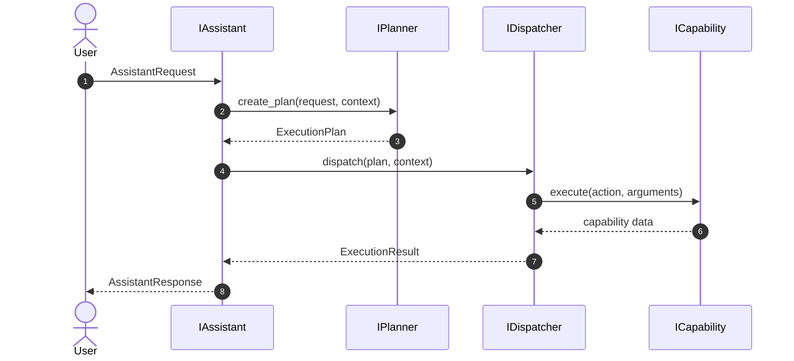

# Core Layer

This package contains the shared core contracts and the first orchestration
implementations for Auralis. The current scope covers typed intents, request
models, planner logic, dispatcher routing, and assistant coordination without
introducing real file operations, OS interaction, voice, or AI behavior.

## Current Package Surface

- `intents.py` defines the strongly typed `Intent` enum used across planning,
    dispatch, and assistant orchestration.
- `models.py` defines the reusable Pydantic v2 data contracts.
- `interfaces.py` defines the abstract boundaries for the assistant, planner,
    dispatcher, and capability layers.
- `planner.py` performs deterministic keyword parsing and returns an
    `ExecutionPlan`.
- `dispatcher.py` routes execution plans to a mock capability and returns an
    `ExecutionResult`.
- `assistant.py` orchestrates the planner and dispatcher and returns an
    `AssistantResponse`.
- `exceptions.py` defines the shared core exception hierarchy.

## Typed Intent

The core execution flow now uses `Intent` instead of raw string constants.
`ExecutionPlan.intent` stores an `Intent` value internally, while serialization
keeps the outward JSON shape string-compatible for backward compatibility.

Supported values are:

- `OPEN_FOLDER`
- `OPEN_FILE`
- `SEARCH_FILE`
- `LIST_DIRECTORY`
- `UNKNOWN`

## Models

- `AssistantRequest` represents an incoming command or message together with
    its source and timestamp.
- `ExecutionPlan` represents planner output: intent, optional target,
    structured parameters, and confidence.
- `ExecutionResult` represents the outcome of a dispatch operation, including
    success state, response text, structured data, and an optional error.
- `AssistantResponse` wraps the final assistant response together with the
    plan that was executed and the result that was produced.
- `SessionContext` captures the shared session state needed across the core
    layers.

All models use Pydantic v2 so validation, serialization, and future extension
stay consistent across the backend.

## Interfaces

- `IAssistant` defines the orchestration boundary for processing a request and
    returning a structured response.
- `IPlanner` defines the contract for turning a request into an execution plan
    and validating that plan before dispatch.
- `IDispatcher` defines the contract for executing a validated plan.
- `ICapability` defines the execution boundary for a single capability.

The package also keeps the legacy interface names available for compatibility
with the current backend wiring.

## Exceptions

- `AuralisException` is the base exception for new core code.
- `PlanningException` is raised for planning failures.
- `DispatchException` is raised for dispatch failures.
- `CapabilityException` is raised for capability contract or execution
    failures.
- `ValidationException` is raised when contract input fails validation.

The legacy `AuralisCoreException` name is retained for compatibility with the
existing modules under `backend/capabilities/` and `backend/os/`.

## Execution Flow

1. A caller creates an `AssistantRequest` from an incoming user message.
2. The assistant implementation uses `IPlanner` to produce an `ExecutionPlan`.
3. The dispatcher implementation validates and executes the plan.
4. The execution outcome is captured in an `ExecutionResult`.
5. The assistant returns an `AssistantResponse` containing the plan and result.

## Future Extensibility

The core layer is intentionally narrow so it can grow without breaking the
current architecture:

- New request metadata can be added to `AssistantRequest` or `SessionContext`.
- New intents can be added to the `Intent` enum without changing the overall
    orchestration contract.
- New dispatch metadata can be added to `ExecutionPlan` or `ExecutionResult`.
- New execution layers can implement the same interfaces without changing API
    routes or package import paths.
- The exception hierarchy can be expanded with more specialized subclasses as
    new subsystems appear.
