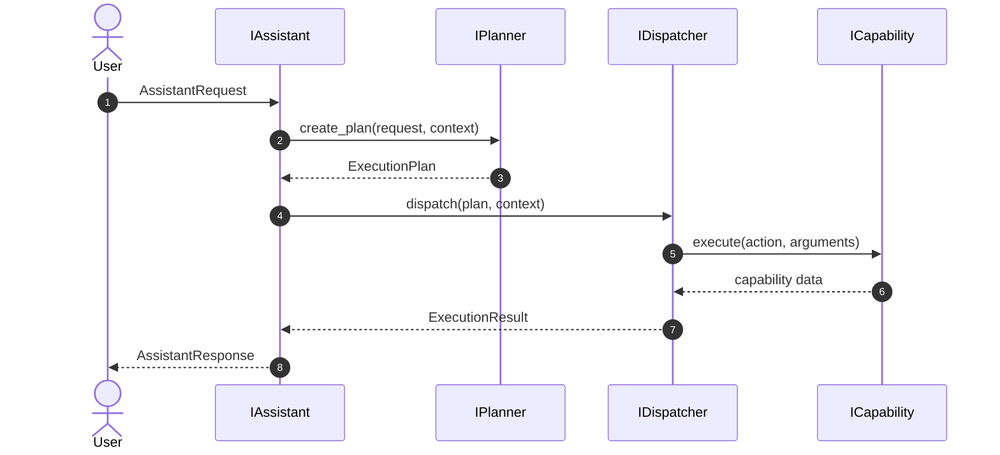

# Core Contracts

This package defines the shared contracts for Auralis core orchestration. The
goal of Phase 1, Step 1 is to publish reusable data models, abstract service
interfaces, and a small exception hierarchy without introducing assistant,
planner, dispatcher, or capability business logic.

## Models

- `AssistantRequest` represents an incoming command or message with its source
    and timestamp.
- `ExecutionPlan` represents planner output: intent, optional target,
    structured parameters, and confidence.
- `ExecutionResult` represents the outcome of a dispatch operation, including
    success state, response text, structured data, and an optional error.
- `AssistantResponse` wraps the final assistant response together with the
    plan that was executed and the result that was produced.
- `SessionContext` captures the shared session state needed across the core
    layers.

All models use Pydantic v2 so validation, serialization, and future extension
stay consistent across the backend.

## Interfaces

- `IAssistant` defines the orchestration boundary for processing a request and
    returning a structured response.
- `IPlanner` defines the contract for turning a request into an execution plan
    and validating that plan before dispatch.
- `IDispatcher` defines the contract for executing a validated plan.
- `ICapability` defines the execution boundary for a single capability.

Legacy interfaces remain available for the current codebase so the package can
be imported safely while the rest of the system migrates to the new contracts.

## Exceptions

- `AuralisException` is the base exception for new core code.
- `PlanningException` is raised for planning failures.
- `DispatchException` is raised for dispatch failures.
- `CapabilityException` is raised for capability contract or execution
    failures.
- `ValidationException` is raised when contract input fails validation.

The legacy `AuralisCoreException` name is retained for compatibility with the
existing modules under `backend/capabilities/` and `backend/os/`.

## Execution Flow

1. A caller creates an `AssistantRequest` from an incoming user message.
2. The assistant implementation uses `IPlanner` to produce an `ExecutionPlan`.
3. The dispatcher implementation validates and executes the plan.
4. The execution outcome is captured in an `ExecutionResult`.
5. The assistant returns an `AssistantResponse` containing the plan and result.

## Future Extensibility

The contract layer is intentionally narrow so it can grow without breaking the
current architecture:

- New request metadata can be added to `AssistantRequest` or `SessionContext`.
- New dispatch metadata can be added to `ExecutionPlan` or `ExecutionResult`.
- New execution layers can implement the same interfaces without changing API
    routes or package import paths.
- The exception hierarchy can be expanded with more specialized subclasses as
    new subsystems appear.
