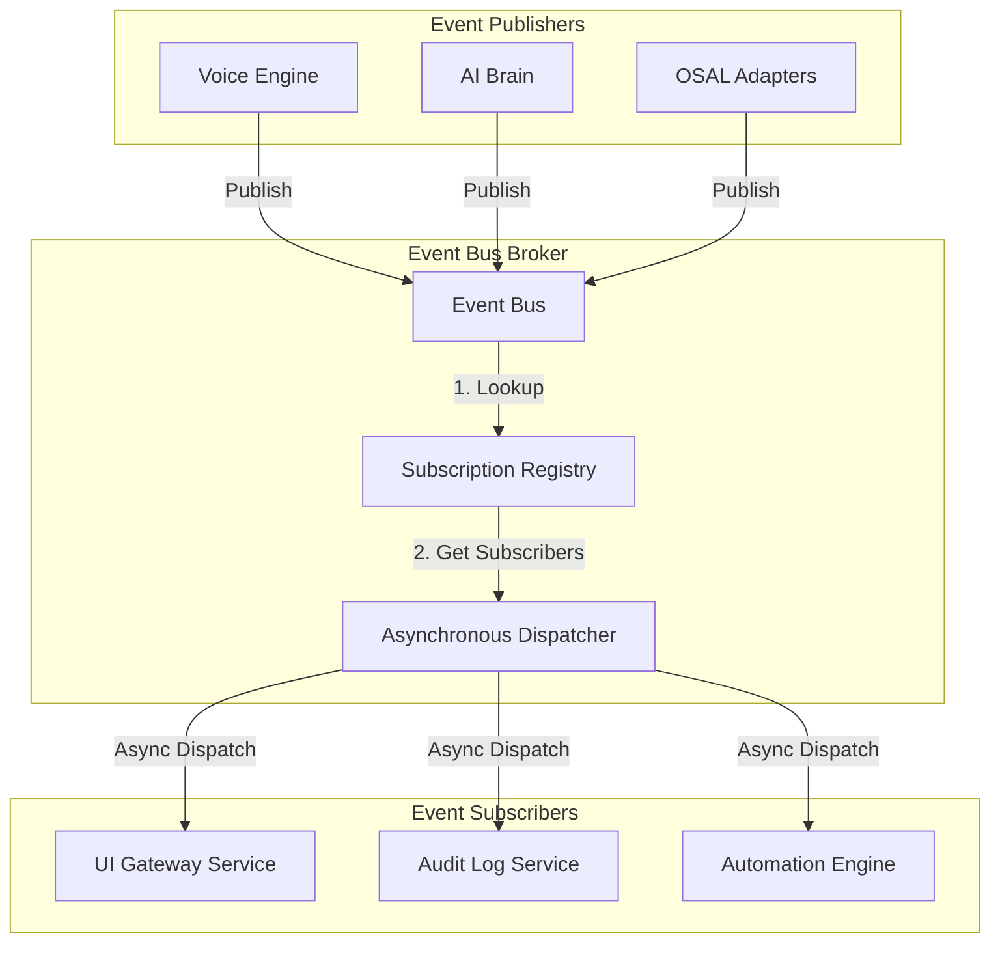
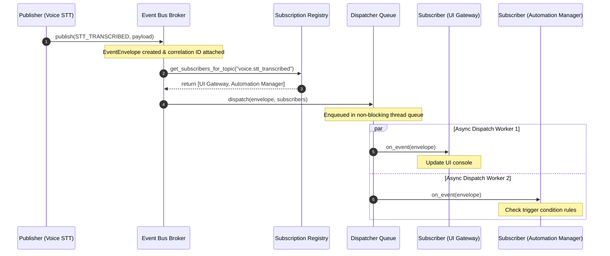

# Event Bus Subsystem

## Event-Driven Architecture (EDA)
Auralis uses an Event-Driven Architecture (EDA) to coordinate events and status notifications asynchronously. Instead of tightly coupling sub-systems (for example, having the voice parser directly call the file search engine, or the file system directly updating the UI state), components communicate by publishing and subscribing to standardized event payloads over a central **Event Bus**.

### Benefits of EDA
- **Loose Coupling:** Sub-systems function independently. A publisher does not need to know who is listening to its events or how they are processed.
- **Asynchronous Execution:** Slow operations (such as indexing folders or generating speech summaries) run in the background, preventing system bottlenecks.
- **Scalability:** New features (e.g. custom plugins or notifications) can listen to existing events without changing original code modules.
- **Extensibility:** Facilitates the integration of background processes and multi-step macro automations.

---

## Publish/Subscribe Model
The system uses the publish/subscribe pattern to route events. Components register their interest in specific topics (e.g., `voice.wake_word_detected`) or wildcard scopes (e.g., `voice.*`) with the central Subscription Registry. When an event is published, the Event Bus matches the topic and dispatches the event asynchronously to all matching subscribers.

---

## Future Event Lifecycle

The diagram below illustrates the lifecycle of a system event, from the initial trigger to asynchronous delivery:

