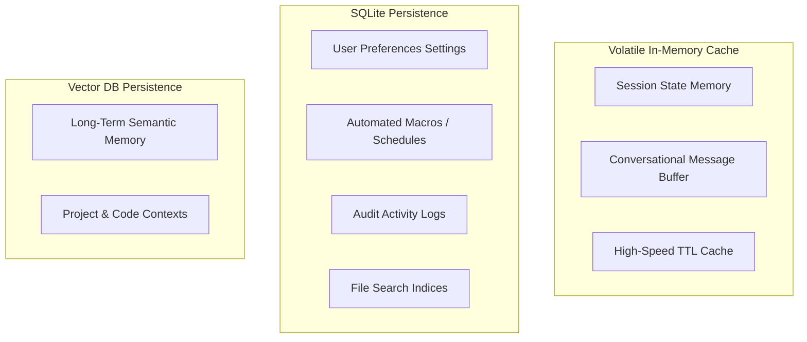
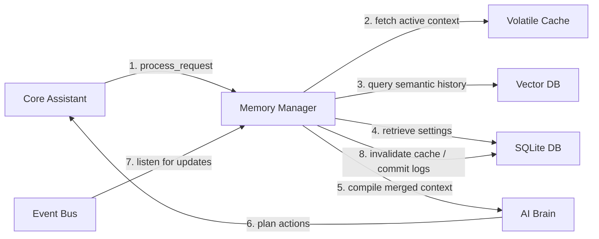

# Memory Subsystem

## Memory Architecture & Lifecycles
Auralis uses a tiered memory system to maintain operational and conversational context without overloading the LLM's context window. Memory is divided into short-term (in-memory, transient), mid-term (relational settings/workflows), and long-term (semantic vector store) tiers. All memory is stored locally to ensure user privacy.

The memory lifecycle has three stages:
1. **Gather:** Context parameters (workspace paths, settings, active window) are collected during a request.
2. **Retrieve:** Similar memories are fetched from the vector store and injected into the active prompt payload.
3. **Commit:** Chat turns and execution logs are committed back to short-term, long-term, and preference systems after a response.

---

## Memory Types & Storage Targets

Auralis categorizes memory into distinct scopes to optimize lookup speeds and context relevance:

- **Session Memory:** Active variables and state scopes. Cleared when the session closes.
- **Conversational Memory:** The current sliding message buffer (up to 15-20 turns).
- **Preference Memory:** Persistent user configurations (e.g. default directories, favorite apps) stored in SQLite.
- **Workflow Memory:** Registered automated routine configurations and schedules stored in SQLite.
- **Activity Memory:** Audit logs of executed commands and outcomes.
- **Project Memory:** Active directory paths, git branch info, and environment profiles stored in SQLite.
- **File Memory:** Indexed system file properties and path structures.
- **Long-Term Memory:** Semantically embedded summaries of historical interactions stored in the vector database.

---

## Subsystem Interactions

The Memory Manager coordinates memory operations across all system layers:

* **Core & AI:** The Core Assistant calls the Memory Manager to build context maps. The AI Brain uses this context to make accurate planning decisions.
* **Capabilities:** System capabilities publish lifecycle events (e.g. `file_created`, `task_started`) to the Event Bus. The Memory Manager listens to these events and updates file search indexes and activity logs.
* **Events:** System events trigger memory updates (e.g., updating user preferences when settings changes are detected).
