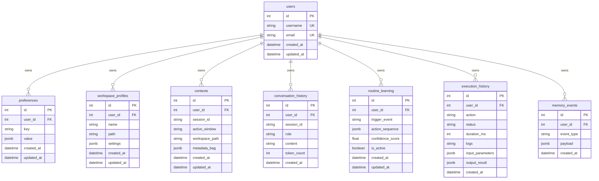

# Memory Subsystem ORM Models

Provides the declarative database schemas for the Auralis memory sub-layer modules, built using SQLAlchemy 2.x and Pydantic.

## Models Schema & Relationships

The database mapping comprises a core `User` model, serving as the root parent, and 7 dependent models representing different tiers of Auralis's local memory store:



* **Cascades:** All foreign keys pointing to `users.id` configure `ondelete="CASCADE"`, meaning when a User is deleted, all their associated database records are automatically deleted.
* **JSONB Fields:** Used to hold complex settings parameters, trigger action histories, execution bags, and dynamically published payloads, which allows standard key/index search optimizations in PostgreSQL.

## Metadata Auto-Discovery

To make sure Alembic (the database migration framework) can automatically generate database upgrade scripts, the package initialization file `__init__.py` imports all models. This hooks them onto the shared `Base.metadata` registry. When configuring Alembic, reference this metadata:

```python
from memory.database import Base
target_metadata = Base.metadata
```
