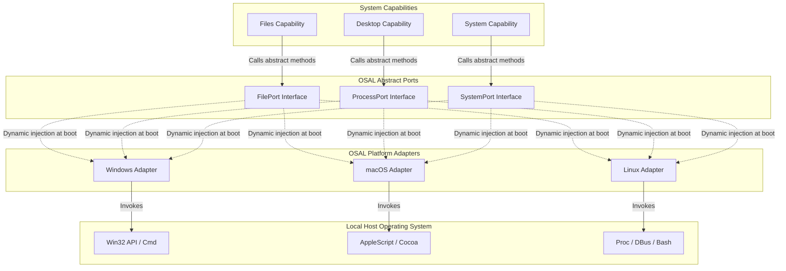

# Operating System Abstraction Layer (OSAL)

## OSAL Architecture & Port and Adapter Pattern
To ensure Auralis runs seamlessly across Windows, Linux, and macOS without duplicating code, all operating system actions are decoupled using the **Port and Adapter pattern** (Hexagonal Architecture).

- **Ports (`ports/`):** Define the abstract interfaces (contracts) describing system actions (e.g. `FilePort`, `ProcessPort`, `NotificationPort`).
- **Adapters (`adapters/`):** Implement the abstract ports utilizing platform-specific libraries. For example, `WindowsFileAdapter` implements `FilePort` using python's `shutil` or Win32 APIs, while `LinuxFileAdapter` implements the same interface using standard bash utilities.

At startup, the `OSManager` detects the host operating system platform and dynamically binds the correct platform adapter implementations.

---

## Architectural Interaction Layout

---

## Subsystem Integration & Cross-Platform Philosophy
Auralis keeps the core orchestrator and AI brain completely platform-independent by separating OS-level details from planning workflows.

- **Core & Capabilities:** Capabilities coordinate actions using OSAL port interfaces. The Core Assistant instantiates OSAL adapters at boot and passes them to capabilities via Dependency Injection.
- **Events:** OSAL adapters publish hardware metrics or filesystem events (e.g. `storage.vector_index_rebuilt`) to the Event Bus asynchronously.
- **Memory:** The local file indexer uses OSAL file ports to monitor workspace path updates.
