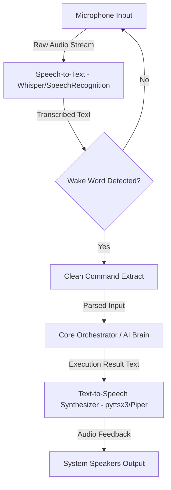

# Voice Engine Subsystem

## Responsibilities
The `backend/voice` module provides the audio capabilities for the Auralis assistant. It encapsulates:
- **Speech-to-Text (STT):** Captures microphone streams and converts spoken commands into clean text.
- **Text-to-Speech (TTS):** Narrates textual outcomes back to the user via audio.
- **Wake Word Detection:** Monitors audio streams for activation phrases (e.g. "Hey Auralis").
- **Continuous Listener Daemon:** Runs in a background thread to enable hands-free voice operations.

---

## Architecture & Speech Pipeline

The diagram below maps the execution flow of the speech processing pipeline:

---

## Core Relationships & Future AI Integration
- **Relationship with Core:** The Core Assistant orchestrates the continuous listener daemon and invokes the TTS engine to announce execution results.
- **Future AI Integration:** Transcribed voice inputs feed into the AI context builder. Once the LLM reasoning loop constructs a result, the `ResponseGenerator` cleans the output and routes it to the TTS engine for spoken feedback.
- **Wake Word Architecture:** The wake word engine uses local pattern matching to detect activation phrases (e.g., "Hey Auralis", "Hi Auralis"). When a match is detected, the engine cleans punctuation and whitespace, passes the command to the parser, and alerts the UI to display the sound-wave animation overlay.
