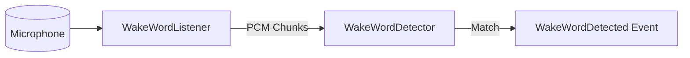

# Wake Word Subsystem

A modular, independent, and extensible Wake Word subsystem for Auralis. It continuously monitors microphone input for activation phrases, emitting a system event when a match occurs, without performing full speech recognition or executing commands.

## Architecture

The subsystem consists of three core components:



1. **Models (`models.py`)**: Data structures representing configuration settings, dynamic engine state, and detection events.
2. **Listener (`listener.py`)**: Runs an asynchronous, non-blocking background thread that captures raw PCM data from the microphone and pipes chunks to the detector. Automatically falls back to a simulated silent loop if PyAudio or audio hardware is missing.
3. **Detector (`detector.py`)**: Standardizes pattern matching for configured activation phrases. It is decoupled from voice synthesis or general speech-to-text, publishing events to the central `EventBus` once activated.

---

## Configuration

Custom settings can be configured using `WakeWordConfiguration`:

| Parameter | Type | Default | Description |
| :--- | :--- | :--- | :--- |
| `wake_phrases` | `List[str]` | `["hey auralis", "hello auralis", "auralis"]` | Phrases triggering the detector |
| `sample_rate` | `int` | `16000` | Audio stream sample rate (Hz) |
| `chunk_size` | `int` | `1024` | Buffer size for audio reads (frames) |
| `sensitivity` | `float` | `0.5` | Target detection sensitivity threshold |
| `device_index` | `Optional[int]` | `None` | Custom microphone device index |

---

## Usage

### Simple Implementation

```python
from voice.wake_word.detector import WakeWordDetector
from voice.wake_word.listener import WakeWordListener
from voice.wake_word.models import WakeWordConfiguration

# 1. Initialize configuration and detector
config = WakeWordConfiguration(wake_phrases=["hey auralis", "auralis"])
detector = WakeWordDetector(config=config, event_bus=event_bus)

# 2. Register callbacks (optional)
def on_wake_detected(event):
    print(f"Wake word '{event.phrase}' detected at {event.detected_at}!")

detector.register_callback(on_wake_detected)

# 3. Initialize and start the background listener
listener = WakeWordListener(detector=detector, config=config)
listener.start(run_in_thread=True)

# 4. Stop listener when done
# listener.stop()
```

### Simulation / Testing Mode

For local automated test pipelines or environments lacking a physical microphone:

```python
# Simulate detection on next incoming audio chunk
detector.simulate_wake_word("hey auralis", confidence=0.98)
```
