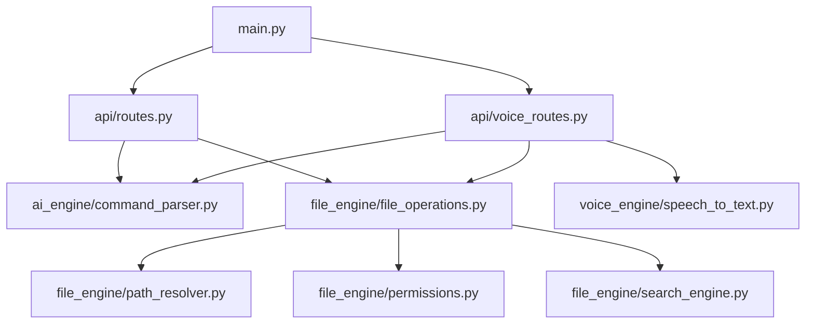
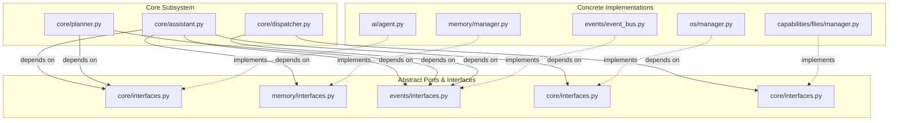

# Dependency Graph

This document analyzes the current import topology of the Auralis backend, identifies coupling risks, and provides a target dependency flow for the redesigned architecture.

---

## Analysis of the Current Codebase

1. **High Coupling / Command Dependency:**
   In the legacy structure, API routes (`api/routes.py`) and controllers (`app/controller.py`) import concrete executors directly (e.g. `from file_engine.file_operations import execute_action`). This prevents testing the routes without running active disk IO modifications.
2. **Circular Import Risks:**
   During the previous refactoring of `file_routes.py` and `search_engine.py` imports, circular paths were resolved by moving helpers to `utils/`. In the future planner-based architecture, circular dependencies are prevented by requiring all subsystems (AI, Memory, OSAL) to reference only interface ports (`interfaces.py`) rather than concrete classes.
3. **Low Cohesion:**
   Legacy modules like `file_engine/path_resolver.py` and `file_engine/permissions.py` are platform-specific (tied to Windows directory parameters) but reside within the general file operations directory. These must be moved to platform adapters under the OS Abstraction Layer (OSAL).

---

## Legacy Dependency Graph

The legacy application is highly coupled, with the entry points importing concrete engines directly:

---

## Target Redesigned Dependency Graph

The redesigned architecture uses interfaces to decouple components. Low-level adapters and capabilities implement abstract interfaces and are injected into the Core Assistant:

