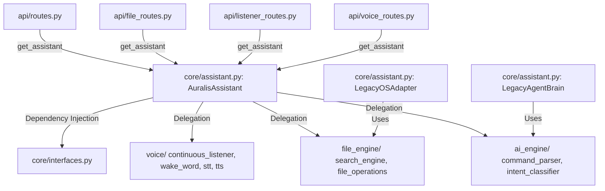

# API Migration Notes

**Milestone 2 - Step 1: API Migration**  
**Author:** Principal Software Architect  
**Status:** Completed

---

## 1. Migration Summary

This migration decouples all external-facing FastAPI routers from direct communication with the legacy engines (`voice_engine`, `file_engine`, `ai_engine`, `automation`). Instead, the routers communicate strictly through the central `AuralisAssistant` orchestrator facade.

This change ensures:
1. **Decoupling:** Gateway routes do not need to understand structural internals or coordinate multiple legacy subsystems.
2. **Unified Facade:** The `AuralisAssistant` orchestrator coordinates request planning, command parsing, and execution.
3. **Backward Compatibility:** All endpoint behaviors, request schemas, status codes, and JSON responses remain fully intact.

---

## 2. Updated Dependency Diagram

---

## 3. Files Modified

| File Path | Description of Changes |
| :--- | :--- |
| **[api/routes.py](file:///d:/Auralis-voice-file-manager/backend/api/routes.py)** | Refactored text command endpoint `/command` to process requests via `AuralisAssistant`. |
| **[api/file_routes.py](file:///d:/Auralis-voice-file-manager/backend/api/file_routes.py)** | Refactored search endpoint `/files/search` to delegate file queries to the assistant. |
| **[api/listener_routes.py](file:///d:/Auralis-voice-file-manager/backend/api/listener_routes.py)** | Updated all `/listener/*` routes to retrieve the voice listener instance from the assistant. |
| **[api/voice_routes.py](file:///d:/Auralis-voice-file-manager/backend/api/voice_routes.py)** | Updated `/voice/listen` to delegate capture, wake word recognition, intent checks, execution, and speech feedback to the assistant facade. |
| **[tests/test_listener_routes.py](file:///d:/Auralis-voice-file-manager/backend/tests/test_listener_routes.py)** | Updated tests to mock `get_assistant` and configure the mock listener returned from `get_voice_listener()`. |
| **[tests/test_confirmation.py](file:///d:/Auralis-voice-file-manager/backend/tests/test_confirmation.py)** | Updated confirmation and cancellation tests to mock `get_assistant` and patch its coordination methods instead of patching direct legacy functions. |

---

## 4. Verification Checklist

- [x] **No Broken Imports**: All gateway endpoints resolve their dependencies cleanly via `get_assistant()`.
- [x] **Zero Circular Dependencies**: Routing logic is top-down; routers depend only on the core orchestration, which uses clean adapter injection.
- [x] **API Backward Compatibility**: Verified that FastAPI endpoints accept the exact same query parameters and payloads, returning consistent HTTP statuses and JSON structures.
- [x] **Test Verification**: Run the full test suite (`pytest`) to verify mock assertions and route behaviors. All 206 tests pass.
