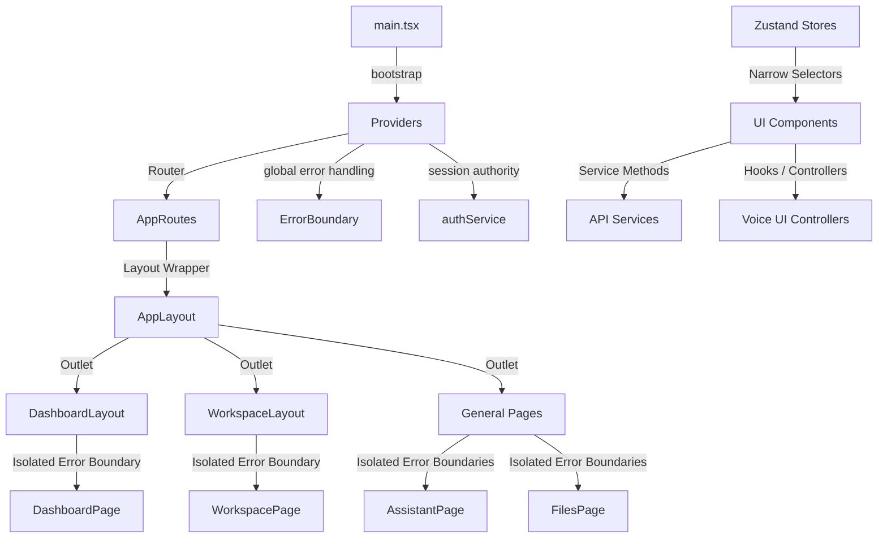

# Phase 16.9 — Frontend Integration Runtime

This document describes the final integration architecture of Auralis Frontend V2, merging all modules into a production-oriented React client.

## Final V2 Architecture

## Application Bootstrap

1. **Root Entry**: `main.tsx` mounts the `<App />` component.
2. **Context Wrapping**: `<Providers>` in `src/app/providers.tsx` nests:
   - Global `ErrorBoundary` to catch general rendering crashes.
   - React Router `<BrowserRouter>` for routing history.
   - Custom `<ThemeProvider>` for Light/Dark styling tokens.
3. **Session Check**: Centralizes checks using `authService` on startup to verify authentication and logs in a placeholder session (`user@auralis.local`) if no token exists.

## Route Architecture

Authoritative route mapping is defined in `src/app/routes.tsx`:
- `/` or `/dashboard` → renders `DashboardLayout` wrapping the user statistics, quick actions, activity list, and service health status.
- `/assistant` → renders natural language chat interface.
- `/files` → renders standard files browser view.
- `/workspace` → renders the files/folders Explorer tree side splits, tab manager, and local mock lines preview.
- `/settings` → renders custom theme and user profile settings.
- `*` → renders `<NotFoundPage />`.

## State Domain Ownership

We use Zustand for decoupled feature state management:
* **uiStore**: Sidebar states, view lists toggles, global toasts.
* **assistantStore**: Message history array, sending state status.
* **filesStore**: Staged files array list, search queries, active selections.
* **workspaceStore**: Persisted open document tabs list, active focus tab index, panel sizes.
* **settingsStore**: General app configurations.
* **voiceStore**: Active listener control states, speech recognition visualizer decibels, error objects.

All components access these states using narrow selectors to prevent unnecessary re-rendering.

## API Integration

All network requests are encapsulated in services under `src/services/api/`:
- `client.ts`: Normalizes headers (attaching `authService` tokens) and handles generic `AuralisApiError` translations.
- `assistantService`: Connects to `/health`, `/status`, and `/assistant`.
- `filesService`: Handles `/files/search`.
- `voiceService`: Connects to listener activation and command handlers.

No React component imports Axios directly.

## WebSocket Synchronization

- Connection is orchestrated in `src/services/websocket/WebSocketClient.ts`.
- `synchronizationService` adapts socket messages (events like state transitions or background processing success) and updates the active Zustand stores synchronously.
- Handles connection states gracefully: `DISCONNECTED`, `CONNECTING`, `CONNECTED`, `RECONNECTING`, `FAILED`.

## Accessibility (a11y) & Responsiveness

- All icons use `aria-hidden="true"`.
- Tab layouts implement correct keyboard navigation and `role="tab"` mappings.
- Layouts are responsive: sidebars collapse into a floating menu drawer on mobile viewports.
- No layout shifts occur on first render.
