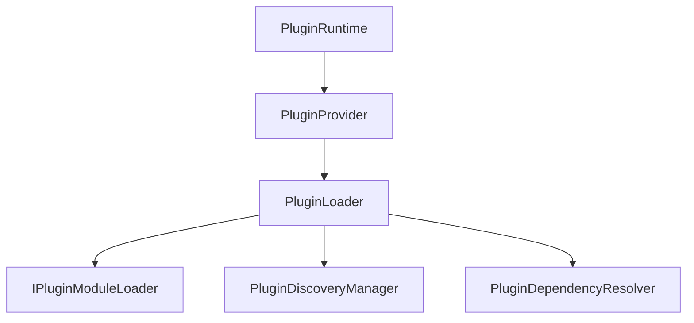
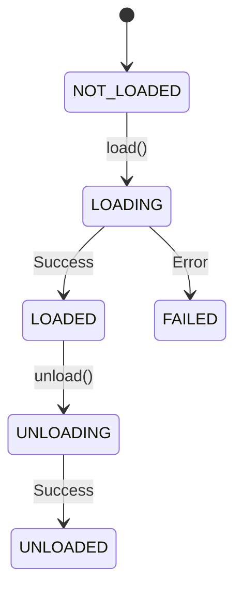

# Phase 17.4 — Plugin Loading Runtime

## Objective
The Plugin Loading Runtime is responsible for loading validated, dependency-resolved plugin entry points into the Auralis Frontend V2 plugin system. It handles state tracking, asynchronous dynamic imports, concurrency protection, duplicate prevention, and telemetry gathering.

## Architecture

## Loader State Machine

## Loader Abstract Features

### 1. Module Loader Abstraction (`IPluginModuleLoader`)
To avoid coupling with specific browser/environment APIs, loading of JavaScript modules is abstracted through `IPluginModuleLoader`. This allows embedding Auralis into desktop containers (Electron, Tauri) or mock environments for test cases.

### 2. Dependency-Aware Loading
During `loadAll()`, the loader queries the topological execution plan produced by `PluginDependencyResolver`. Plugins are loaded in order (dependencies before dependents). If a required dependency fails to load, downstream dependents fail recursively, while optional dependency failures are tolerated.

### 3. Duplicate & Concurrent Protection
- **Duplicate Prevention**: If a plugin is already loaded, repeat load requests are rejected with a duplicate loader warning/telemetry increment without re-running the module loader.
- **Concurrent Load sharing**: In-flight load promises are cached. Concurrent loads share the same promise.

### 4. Bounded History & Telemetry
Every load/unload attempt records starts/ends to calculate monotonic durations. Stats (attempts, successes, failures, timing minimum/maximum/average) are collected. Telemetry records are preserved in a bounded memory history array.

---

## Boundaries & Limitations

### Phase 17.4 DOES:
- Load validated plugin entry points.
- Validate loaded modules shape.
- Respect topological dependency plans.
- Transition loading state machines.
- Record timing telemetry.
- Manage unloading module states.

### Phase 17.4 DOES NOT:
- Orchestrate plugin activation/deactivation hooks (Phase 17.5).
- Expose extension APIs or execute capabilities (Phase 17.6).
- Sandbox code or enforce permissions (Phase 17.7).
- Download packages over network/marketplace (Phase 17.8).
