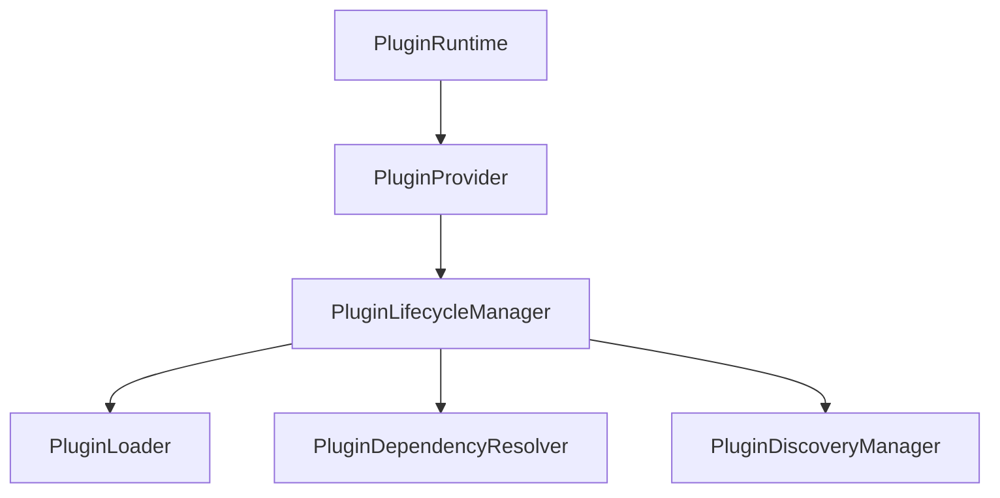
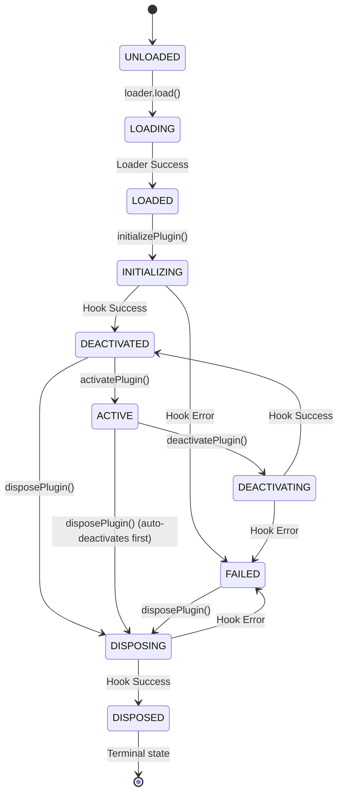

# Phase 17.5 — Plugin Lifecycle Runtime

## Objective
The Plugin Lifecycle Runtime manages the lifecycle transitions of a loaded plugin: from loading and initialization, to activation, deactivation, and disposal. It coordinates topological dependency ordering, protects operations against race conditions, executes lifecycle hooks with failure isolation, and publishes telemetry.

## Architecture

## Lifecycle State Machine

## Abstract Features

### 1. Hook System
Hooks allow plugins to perform setup and teardown tasks during initialization (`onInitialize`), activation (`onActivate`), deactivation (`onDeactivate`), and disposal (`onDispose`).
Hooks are executed asynchronously and isolated from each other. A failed hook transitions that specific plugin into `FAILED` state without corrupting the state of unrelated plugins.

### 2. Dependency-Aware Lifecycle Ordering
Topological order generated by `PluginDependencyResolver` controls bulk executions:
- **Initialization & Activation**: Forward topological order (dependencies initialized/activated before dependents).
- **Deactivation & Disposal**: Reverse topological order (dependents deactivated/disposed before dependencies).

### 3. Concurrency Protection
Conflicting simultaneous operations (e.g., calling `initializePlugin` twice concurrently or running `activate` while `deactivate` is executing) are prevented by an internal promise-sharing map. Concurrent calls share the same Promise.

### 4. Telemetry, Statistics & Health
- **Statistics**: Tracks attempts, successes, failures, active/disposed/failed plugin counts, and min/max/average lifecycle times.
- **Diagnostics**: Combines statistics and health evaluations into a deep-frozen immutable report.
- **Health**: Determines health status based on transition failure rates and failed plugin metrics.

---

## Boundaries & Limitations

### Phase 17.5 DOES:
- Manage lifecycle state transitions.
- Validate transition checks.
- Handle topological-aware lifecycle operations.
- Execute optional plugin hooks.
- Provide failure isolation and operation concurrency protection.
- Expose deep-frozen diagnostics snapshots.

### Phase 17.5 DOES NOT:
- Sandboxing or permission checks (Phase 17.7).
- Extension capability registration or execution (Phase 17.6).
- Plugin configuration UI integration (Phase 17.9).
- Marketplace or remote code installation (Phase 17.8).
