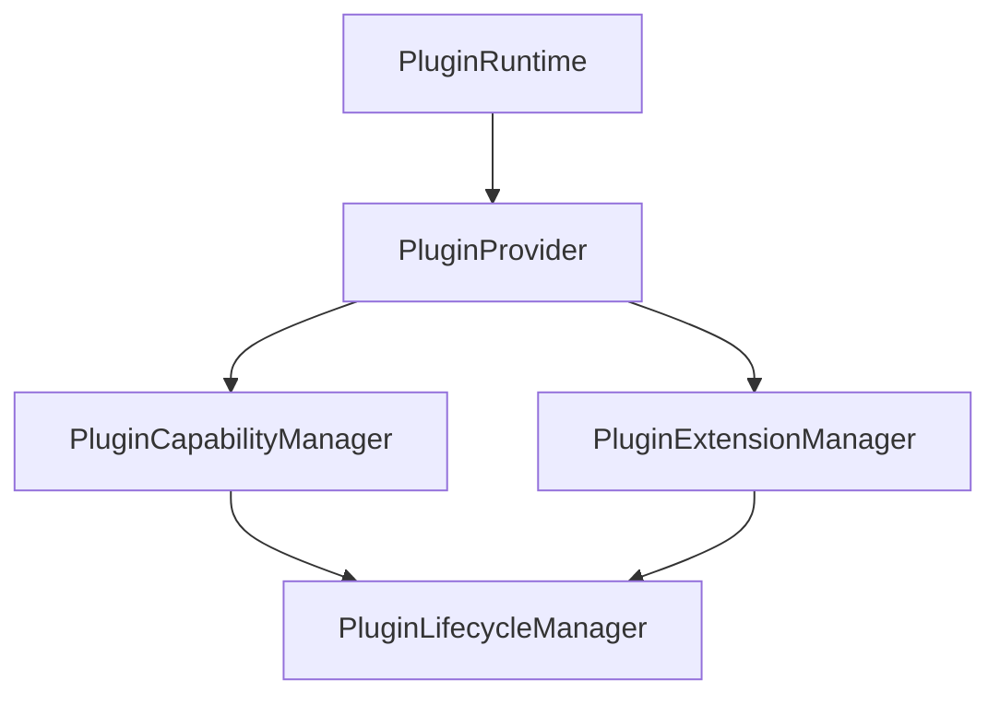

# Phase 17.6 — Plugin Capability & Extension Runtime

## Objective
The Capability & Extension Runtime allows active plugins to declare, register, expose, query, and remove capabilities and extensions in a controlled, provider-independent manner. It enforces priority ordering, cardinality constraints, ownership validation, and lifecycle alignment.

## Architecture



### Flow Diagram

```
Plugin Manifest
      ↓
Capability Declaration
      ↓
Lifecycle Validation (ACTIVE/READY Check)
      ↓
Capability Registration
      ↓
Capability Registry
      ↓
Extension Point (SINGLE/MANY Cardinality)
      ↓
Extension Registration (Priority / Compatibility validation)
      ↓
Active Extension list (Sorted by Priority & FIFO tie-breaking)
```

## Abstract Features

### 1. Capability & Extension points
- **Capabilities**: Category categories such as `COMMAND`, `SERVICE`, `EVENT`, `VIEW`, `WORKSPACE`, `FILE_OPERATION`, `ASSISTANT`, and `CUSTOM` allow plugins to expose services.
- **Extension Points**: Define accepted types and cardinality rules (`SINGLE` vs `MANY`).
- **Extensions**: Bind a capability/action to an extension point.

### 2. Cardinality
- **SINGLE**: Only one active extension can occupy the point. A second registration will throw a `PluginExtensionConflictError`.
- **MANY**: Allows multiple active extensions, sorted deterministically.

### 3. Priority & Ordering
Extensions registered against the same extension point are ordered deterministically:
1. Higher priority first (descending numerical value).
2. FIFO tie ordering (deterministic registration timestamp order).

### 4. Lifecycle Integration
- **Active State Validation**: Capabilities and extensions can only be registered if the owning plugin is in `PluginState.ACTIVE` or `PluginState.READY` state.
- **Automatic Cleanup**: When a plugin is deactivated, its registered capabilities and extensions are automatically disabled/removed from the registries via event listeners.

---

## Boundaries & Limitations

### Phase 17.6 DOES:
- Register and remove capabilities, extension points, and extensions.
- Enforce SINGLE/MANY cardinality constraints.
- Sort extensions topologically by priority and FIFO tie ordering.
- Align registries with plugin lifecycle transitions.
- Publish stats, health, and diagnostics.

### Phase 17.6 DOES NOT:
- Implement security sandboxing or policies (Phase 17.7).
- Execute sandboxed code.
- Remote plugin installation or marketplace features.
- Plugin configuration UI.
