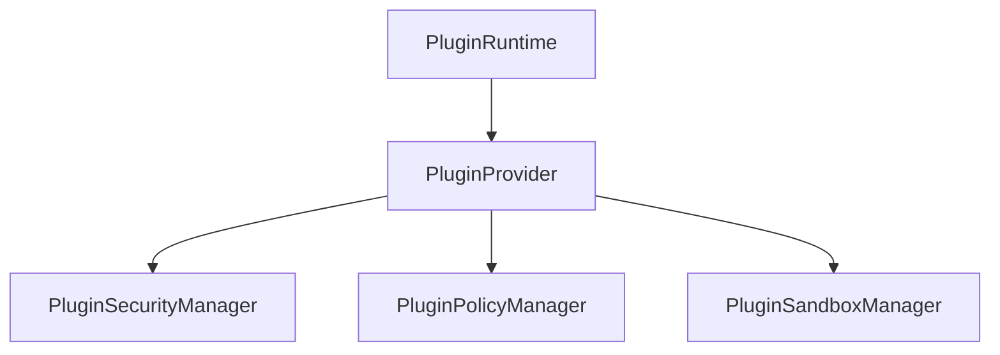

# Phase 17.7 — Plugin Security & Sandbox Runtime

## Objective
Establish a provider-independent logical security policy and sandbox layer for plugins to define permission scopes, evaluate security policies, restrict capability execution, enforce logical resource limits, record violations, and generate immutable audit logs.

## Architecture



### Security Flow

```
Plugin Operation Request
          │
          ▼
Permission Manager (Check scope & action)
          │
          ▼
Policy Manager (Sort by priority, check effect, DENY wins)
          │
          ▼
Sandbox Manager (Check ACTIVE state, resource limits, denied capabilities)
          │
          ├── DENY → Violation + Audit Record
          │
          ▼
ALLOW (Execute operation)
```

---

## Technical Specifications

### 1. Permissions & Policies
- **PluginPermission**: Grants explicitly scoped actions (`GLOBAL`, `PLUGIN`, `SESSION`, `WORKSPACE`, `USER`) for specific activities (`READ_FILES`, `WRITE_FILES`, `NETWORK_ACCESS`, etc.).
- **PluginSecurityPolicy**: Priority-based declarative policy rules with `ALLOW` or `DENY` effects.

### 2. Sandbox Abstraction
- Implements a **logical sandbox boundary** rather than physical OS-level execution isolation.
- Manages sandbox states (`CREATED`, `ACTIVE`, `SUSPENDED`, `TERMINATED`, `VIOLATION`).

### 3. Resource Limits
Tracks logical limits:
- `maxConcurrentOperations`
- `maxRequestsPerMinute`
- `maxQueueDepth`
- `maxSubscriptions`
- `maxExtensions`

### 4. Audit Engine
- Immutable audit histories with bounded size eviction (FIFO).
- Telemetry reporting for health, violations, decision statistics, and evaluation latency.

---

## Threat Model & Security Guarantees

- **Default Deny**: Any operation without an explicit matching permission or policy evaluates to `DENY`.
- **Deny-Overrides-Allow**: An explicit `DENY` policy or permission overrides any matching `ALLOW` rules.
- **Fail Closed**: Any evaluation errors or missing profiles resolve immediately to `DENY`.

---

## Limitations

> [!WARNING]
> Phase 17.7 provides logical policy enforcement. It **does NOT** implement OS-level process isolation, web workers, iframes, browser storage sandboxing, or execution-level memory virtualization.

---

## Testing Strategy
Comprehensive tests in [plugin_security.test.ts](file:///c:/Users/Vishal%20S%20Naik/MyProjects/Auralis-voice-file-manager/frontend/tests/plugins/plugin_security.test.ts) covering permissions management, policies engine, sandbox validation, logical resource enforcement, audit trails, and lifecycle hook integration.
