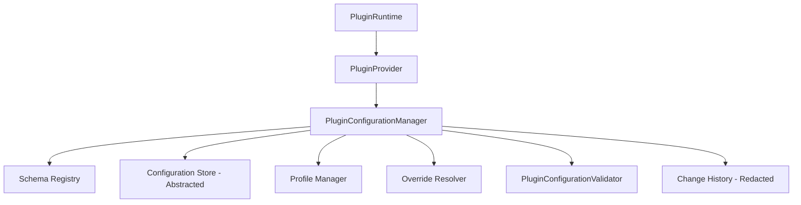

# Phase 17.8 — Plugin Configuration Runtime

## 1. Objective
The Plugin Configuration Runtime provides a secure, strongly typed, validated, and provider-independent configuration system for individual plugins. It isolates each plugin's configuration space, ensuring they have no direct access to the application's global configuration system or external environments while enforcing schema compliance, security actions (`CONFIG_READ`, `CONFIG_WRITE`), versioning, and change tracking.

---

## 2. Architecture
The Plugin Configuration Runtime sits as a sub-service inside the `PluginProvider` (which delegates operations to it) and is coordinated by the `PluginRuntime`.

---

## 3. Configuration Models
Defined in `src/plugins/models/configuration.ts`:
- **PluginConfigurationValueType**: Enumerates primitive values (`string`, `number`, `boolean`, `object`, `array`, `null`).
- **PluginConfigurationField**: Represents constraints on individual configuration keys (e.g. `required`, `sensitive`, `readOnly`, `nullable`, bounds, patterns).
- **PluginConfigurationSchema**: Structure of constraints describing fields for a plugin.
- **PluginConfiguration**: Active snapshot mapping keys to values, tracking its own schema reference and version.
- **PluginConfigurationProfile**: Named sets of overrides (e.g., `dev`, `prod`).
- **PluginConfigurationOverride**: Managed overrides bound to priority and source hierarchy.
- **PluginConfigurationChange**: Unmodifiable record of key modification, hiding secret plaintext.
- **PluginConfigurationValidationResult** & **PluginConfigurationValidationIssue**: Immutable reports detailing schema compliance issues.

---

## 4. Schema System
A schema describes the valid configurations for a plugin. Schema registration is strict; defaults are validated against the schema constraints immediately upon registration.
- **Strict Mode**: If `schema.strict` is `true`, unexpected/unknown configuration keys are rejected.
- **Immutability**: Once registered or queried, all schema and field records are frozen using `freezeDeepSafe`.

---

## 5. Validation Engine
Implemented in `PluginConfigurationValidator.ts`. The validation engine validates:
1. Required fields.
2. Strict mode constraints (unknown key rejection).
3. Types (`string`, `number`, `boolean`, `object`, `array`, `null`).
4. Nullability checks.
5. Minimum / maximum numeric values.
6. Minimum / maximum string lengths.
7. Allowed values lists.
8. Pattern/Regex validation.
9. Defaults validation.
10. Read-only field updates block.
11. Version compatibility constraints.

---

## 6. Profiles
Profiles represent configurations designed for environment states (e.g., `development`, `testing`, `production`).
- Profile values are merged over defaults during configuration resolution.
- Attempting to delete an active profile will raise a `PluginConfigurationProfileError` to prevent leaving a plugin in an invalid/unconfigured state.

---

## 7. Override Precedence
Overrides are resolved deterministically based on source priority and registration time (FIFO order for duplicate priorities):

$$\text{DEFAULT} \rightarrow \text{PROFILE} \rightarrow \text{USER} \rightarrow \text{SESSION} \rightarrow \text{WORKSPACE} \rightarrow \text{SYSTEM}$$

Higher priority (e.g. `SYSTEM`) overrides lower priority (e.g. `DEFAULT` or `USER`).

---

## 8. Versioning
- **schemaVersion**: Version of the layout constraints.
- **configurationVersion**: Revision index incremented on updates.
- **Compatibility checks**: The static `PluginConfigurationValidator.validateCompatibility` method detects incompatible type shifts, removed required fields, and invalid default changes when upgrading schemas.

---

## 9. Persistence Abstraction
- **IPluginConfigurationStore**: Interface containing `read()`, `write()`, `remove()`, and `exists()`.
- **InMemoryPluginConfigurationStore**: Standard mock/in-memory store for isolated, browser-free testing.
- **Critical Isolation**: No browser-specific APIs (like `localStorage` or `sessionStorage`) or Node `fs` APIs are directly invoked by this layer.

---

## 10. Import / Export
- **exportConfiguration**: Serializes the current active configuration, stripping sensitive keys (redacted to `[REDACTED]`) unless `allowSensitive` is authorized.
- **importConfiguration**: Un-serializes a configuration payload. Unless `allowSensitive` is set, sensitive fields are stripped, forcing defaults to resolve. The resulting import is strictly validated against the schema before updating.

---

## 11. Sensitive Configuration Handling
Sensitive fields (e.g. API keys, secrets) are protected at boundaries:
- Plaintext values are **never** included in diagnostics, audit records, errors, or health logs.
- Plaintext values are redacted on default exports.
- Audit history tracks `previousValueChanged: true` and `newValueChanged: true` rather than raw values.

---

## 12. Security Integration
Integrates directly with the `PluginSecurityManager`:
- Configuration read/write actions require authorization checks:
  - `CONFIG_READ`
  - `CONFIG_WRITE`
- Action authorization is evaluated against the plugin's security profile. If the action is denied, `PluginConfigurationPermissionError` is thrown (fail-closed behavior).

---

## 13. Lifecycle Integration
Integrated with `PluginLifecycleManager`:
- **REGISTERED $\rightarrow$ LOADING $\rightarrow$ LOADED**: No active configurations.
- **INITIALIZING $\rightarrow$ CONFIGURATION INITIALIZATION**:
  - Validates default configuration values.
  - Ensures a valid configuration exists prior to completing activation.
- **ACTIVATION**: `addActivateListener` verifies schema compliance on the resolved configuration and aborts activation if invalid.
- **DEACTIVATION**: Configuration remains persistent.
- **DISPOSAL**: Clean up transient configurations; triggers `addDisposeListener` to purge schema, override, and runtime configuration entries.

---

## 14. Diagnostics
Exposes aggregate system telemetry:
- Registered schemas count, profiles, active/inactive overrides.
- Historiography depths.
- Performance statistics (average, max, and min timing bounds for updates and validation requests).
- **Absolute Privacy**: Plentiful diagnostics omit secret strings.

---

## 15. Health Model
Evaluates system sanity dynamically:
- Counts total schemas, configurations, profiles, and overrides.
- Computes validation failure rates.
- Flags configuration inconsistencies or orphans.
- Health inspection is purely analytical; it does not mutate state.

---

## 16. Error Handling
Defines custom configuration errors under the existing `PluginRuntimeError` tree:
- `PluginConfigurationError`
- `PluginConfigurationSchemaError`
- `PluginConfigurationValidationError`
- `PluginConfigurationNotFoundError`
- `PluginConfigurationConflictError`
- `PluginConfigurationPersistenceError`
- `PluginConfigurationPermissionError`
- `PluginConfigurationProfileError`
- `PluginConfigurationOverrideError`
- `PluginConfigurationVersionError`

---

## 17. Testing Strategy
Unit tests in `frontend/tests/plugins/plugin_configuration.test.ts` verify all Phase 17.8 specifications including:
- Schema and override registrations, priority orderings.
- Read-only protection, type constraints, pattern matching.
- Sensitive redactions, import/export safeguards.
- Mock persistence, diagnostics counts, and lifecycle integration.
- Schema version compatibility validator.

---

## 18. Explicit Limitations
- No browser persistence is used by the runtime.
- No filesystem access is used.
- Persistence is abstracted via `IPluginConfigurationStore`.
- Sensitive values are redacted from diagnostics.
- Configuration access is subject to plugin security policies.

---

## 19. Future Migration Support
`PluginConfigurationValidator.validateCompatibility` acts as the entrypoint for detecting schema version gaps. A migration processor can build on this by applying translation functions to legacy configurations when version transitions are detected.
