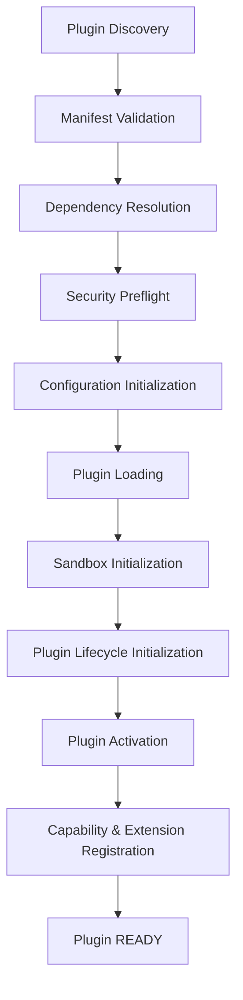

# Phase 17.9 — Plugin Runtime Integration Architecture

This document describes the design, architecture, and operation of the Plugin Runtime Integration layer implemented in Phase 17.9.

## 1. Overview & Architecture

The Plugin Runtime Integration layer acts as the orchestrator for all previously implemented subsystems (discovery, validation, dependencies, security, configuration, loading, sandbox, lifecycle, capability, and extensions). It coordinates complex plugin integration workflows, manages topological dependency ordering, ensures transactional rollback, provides telemetry, and exposes an immutable public API interface.



## 2. Integration Pipeline Workflow

### Startup Pipeline (Topological Order)
1. **DISCOVERY**: Look up and locate the plugin manifest.
2. **VALIDATION**: Validate structural integrity of the manifest via `PluginManifestValidator`.
3. **DEPENDENCY_RESOLUTION**: Check and topologically sort dependencies.
4. **SECURITY_PREFLIGHT**: Pre-authorize plugin security profile and actions.
5. **CONFIGURATION_INITIALIZATION**: Load schema and validate user settings.
6. **LOADING**: Dynamically load module code via Vite-compliant plugin loader.
7. **SANDBOX_INITIALIZATION**: Instantiates sandbox and bounds resource allocations.
8. **LIFECYCLE_INITIALIZATION**: Transitions plugin state through `INITIALIZING` to `DEACTIVATED`.
9. **ACTIVATION**: Activates plugin lifecycle and switches sandbox state to `ACTIVE`.
10. **CAPABILITY_REGISTRATION**: Registers capabilities and extension points from manifest declarations.
11. **READY**: Marks plugin as fully integrated and ready for operations.

### Shutdown Pipeline (Reverse Topological Order)
1. **DEACTIVATION**: Cleans up capability and extension registrations and suspends sandbox.
2. **UNLOADING**: Disposes lifecycle hooks, destroys sandbox, and unloads module resources.

---

## 3. Transactional Rollback

If any step in the startup pipeline fails, a deterministic, reverse-ordered transactional rollback occurs:
1. Unregisters all capabilities and extensions registered during the current flow.
2. Deactivates lifecycle states if activation occurred.
3. Disposes plugin resources if initialized.
4. Destroys the plugin's sandbox.
5. Unloads the plugin module.
6. Updates diagnostics and telemetry counters with failures and rollback details.

---

## 4. Telemetry & Diagnostics

The `PluginIntegrationManager` gathers granular runtime data and telemetry:
- **Statistics**: Integration attempt counters, average durations, phase-specific failure trackers, average/max/min durations.
- **Health snapshots**: Overall health status, failure rates, count of failed/ready plugins.
- **Auditing**: History tracking of all integration records including start/end timestamps, durations, and rollback records.
- **Aggregations**: Delegates diagnostics into the unified `PluginProvider.diagnostics()` tree.

---

## 5. API Usage Example

```typescript
import { createPluginProvider } from '@auralis/plugins';

// Initialize the plugin provider
const provider = createPluginProvider();
provider.initialize();

// Get the integration manager
const integration = provider.integration();

// Integrate a single plugin
const result = await integration.integrate('my-voice-plugin');
if (result.success) {
  console.log(`Plugin loaded and ready! Sandbox status: ${result.sandboxStatus}`);
} else {
  console.error(`Plugin integration failed at phase ${result.phase}:`, result.errors);
}

// Startup all discovered plugins topologically
const startupResults = await integration.startup();

// Shutdown and clean up in reverse topological order
await integration.shutdown();
```
