# Phase 18.7.10 — Alerting Runtime Production Certification & Hardening

This document outlines the production certification and hardening framework built for the Auralis V2 Alerting Runtime.

## 1. Certification Architecture & Sandbox Isolation

To guarantee that active production state remains unaffected, the `AlertCertifier` executes E2E scenarios inside isolated sandboxes.
* **Sandbox Instances**: Instantiates private, self-contained `AlertingProvider` and `AlertingRuntime` dependencies.
* **Non-Mutating Execution**: No registered rules, suppression overrides, or triggered chimes bleed into the active client state.
* **Memory Bounded FIFO Evictions**: History boundaries are asserted during registry checks.

```mermaid
graph TD
    ProdRuntime[Active Production Runtime] -.->|Isolated Sandbox| Sandbox[Fresh AlertingProvider]
    Sandbox --> Stage1[FOUNDATION Checks]
    Sandbox --> Stage2[RULE_VALIDATION Checks]
    Sandbox --> Stage3[EVALUATION Checks]
    Sandbox --> Stage4[GENERATION Checks]
    Sandbox --> Stage5[FINGERPRINTING Checks]
    Sandbox --> Stage6[DEDUPLICATION Checks]
    Sandbox --> Stage7[LIFECYCLE Checks]
    Sandbox --> Stage8[SUPPRESSION Checks]
    Sandbox --> Stage9[NOTIFICATION Checks]
    Sandbox --> Stage10[ORCHESTRATION Checks]
    Sandbox --> Stage11[FAILURE_ISOLATION Checks]
    Sandbox --> Stage12[CONCURRENCY Checks]
    Sandbox --> Stage13[IDEMPOTENCY Checks]
    Sandbox --> Stage14[IMMUTABILITY Checks]
    Sandbox --> Stage15[BOUNDED_STORAGE Checks]
    Sandbox --> Stage16[DIAGNOSTICS Checks]
    Sandbox --> Stage17[STATISTICS Checks]
    Sandbox --> Stage18[END_TO_END Checks]
    Stage1 & Stage2 & Stage3 & Stage4 & Stage5 & Stage6 & Stage7 & Stage8 & Stage9 & Stage10 & Stage11 & Stage12 & Stage13 & Stage14 & Stage15 & Stage16 & Stage17 & Stage18 --> Reporter[Report Aggregator & Scorecard]
```

## 2. All 18 Certification Stages

1. **FOUNDATION**: Verifies provider initialization state transitions (`UNINITIALIZED` → `READY`), that repeated initializations are safe, and that shutdown completes cleanly.
2. **RULE_VALIDATION**: Asserts schema validations for valid/malformed inputs, operators, and metadata fields.
3. **EVALUATION**: Runs standard operator logic checks (e.g. `GT` evaluations) verifying field matching behaviors.
4. **GENERATION**: Confirms matching rule runs build valid immutable `AlertRecord` items.
5. **FINGERPRINTING**: Confirms deterministic FNV-1a hashing remains invariant to object field orderings.
6. **DEDUPLICATION**: Confirms first occurrence accepted logic and subsequent duplicate blocks during active cooldown intervals.
7. **LIFECYCLE**: Verifies state transitions (`ACTIVE` → `ACKNOWLEDGED` → `RESOLVED` → `CLOSED`).
8. **SUPPRESSION**: Confirms alert snoozing overrides and window boundaries.
9. **NOTIFICATION**: Asserts channel registration, dispatcher mappings, and enabled/disabled filters.
10. **ORCHESTRATION**: Verifies complete orchestrate pipelines return `SUCCESS` stages under normal conditions.
11. **FAILURE_ISOLATION**: Confirms pipeline halts and fails closed on missing rules or stage crashes.
12. **CONCURRENCY**: Asserts in-flight promise sharing on concurrent identical request IDs.
13. **IDEMPOTENCY**: Asserts repeated runs resolve identically without double-counting stats.
14. **IMMUTABILITY**: Verifies nested structures are deeply frozen using `freezeDeepSafe`.
15. **BOUNDED_STORAGE**: Asserts registry bounds are cleaned and cached rules match.
16. **DIAGNOSTICS**: Verifies diagnostics snap structures.
17. **STATISTICS**: Asserts counter consistency conditions.
18. **END_TO_END**: Runs E2E integration validations.

## 3. Scorecard Design

Scoring follows a weighted points system:
* **Successful Stage**: 10 points
* **Warning Stage**: 5 points
* **Failed Stage**: 0 points
* **Maximum Score**: 180 points

Possible Report Status outcomes:
* `CERTIFIED` (180 points, 100%)
* `CERTIFIED_WITH_WARNINGS` (Any warning, 0 failures)
* `FAILED` (Any stage failure)

## 4. Certification Performance Methodology

Lightweight benchmarking verifies operations run with low overhead.
* **Scope**: Evaluates registration and lookup latency over 1000 iterations.
* **Accuracy**: Measured using `performance.now()` where available, otherwise fallback timestamps.
* **Indicators**:
  - Alert Registration: < 0.1 ms/op
  - Alert Lookup: < 0.01 ms/op
  - Diagnostics Gen: < 0.5 ms/op

## 5. Certification Result Summary

> [!NOTE]
> Certification passed according to the implemented checks.
> Local benchmark results represent sanity checks under clean runtime conditions, not production SLAs or hardware guarantees.
