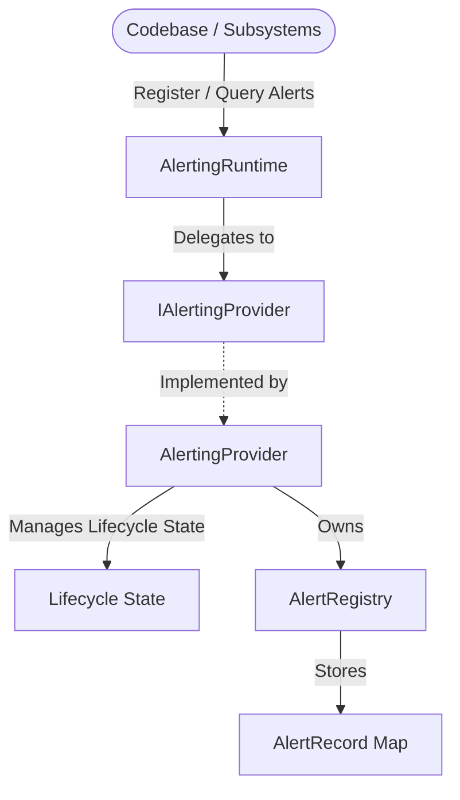

# Phase 18.7.1 — Alerting Runtime Foundation

Establish a clean, provider-independent, strongly typed foundation for the future Alerting Runtime.

> [!IMPORTANT]
> Phase 18.7.1 does not implement alert rules, conditions, evaluation, deduplication, lifecycle actions, cooldown, suppression, expiration, notifications, or external integrations. These belong to later Phase 18.7 subphases or Phase 18.9.

## 1. Objective & Architecture

The alerting module is designed following the same decoupled, provider-independent architecture established in previous runtimes (logging, metrics, tracing, etc.).

* **Pure TypeScript**: No React, Zustand, browser APIs, or network dependencies.
* **Provider-independent**: Operations are governed by interfaces.
* **Dependency-injection friendly**: `AlertingRuntime` coordinates by consuming an optional `IAlertingProvider`.
* **Zero Global Mutable Singleton State**: Multiple instances of the runtime can coexist without interference.

## 2. Domain Models & Severity

### Severity Level (`AlertSeverity`)
Values representing alert severity:
- `INFO` (Order: 1)
- `WARNING` (Order: 2)
- `ERROR` (Order: 3)
- `CRITICAL` (Order: 4)

Deterministic ordering is enforced, and type-safe helpers `compareSeverity` and `isSeverityAtLeast` are provided.

### Lifecycle State (`AlertState`)
Defines the state of an alert record:
- `ACTIVE`
- `ACKNOWLEDGED`
- `SUPPRESSED`
- `RESOLVED`
- `EXPIRED`
*Lifecycle state transitions are conceptual and will be implemented in later phases.*

### Alert Record (`AlertRecord`)
An immutable structure storing core fields:
- `id` (non-empty string)
- `sourceId` (non-empty string)
- `severity` (`AlertSeverityValue`)
- `state` (`AlertStateValue`)
- `title` (non-empty string)
- `message` (non-empty string)
- `createdAt` (timestamp)
- `updatedAt` (timestamp)
- `metadata` (safe read-only object map)

## 3. Runtime Lifecycle States

The provider tracks transitions between:
`UNINITIALIZED` &rarr; `INITIALIZING` &rarr; `READY` &rarr; `STOPPING` &rarr; `STOPPED`

* `initialize()` transitions `UNINITIALIZED` &rarr; `READY` and is idempotent if already `READY`.
* `shutdown()` transitions `READY` &rarr; `STOPPED` and is idempotent if already `STOPPED`.
* Registry access and operations throw `AlertingStateError` unless state is `READY`.
* Invalid transitions throw `AlertingStateError`.
* Shutting down clears all registered alerts in the provider.

## 4. Alert Registry & Factories

### `AlertRegistry`
* Private `Map`-backed alert storage keeping track of registered alerts.
* Enforces **O(1) lookup** by ID.
* Maintains a **deterministic insertion order** for listings.
* Rejects duplicate alert IDs.
* Throws `AlertNotFoundError` when attempting to delete a non-existent alert.
* Returned values are defensively copied and deep-frozen to ensure they cannot mutate internal provider state.

### `alertingFactories.ts`
Type-safe constructors for:
* `createAlertRecord()`
* `createAlertingStatistics()`
* `createAlertingDiagnostics()`

Factories validate input arguments, defensively copy mutable structures, and freeze returning public objects using `freezeDeepSafe` (reused from observability monitoring).

## 5. Dependency Injection & Coordinator

* `AlertingRuntime` implements `IAlertingRuntime`.
* Constructor accepts a custom provider `new AlertingRuntime(customProvider?)` or defaults to creating a new `AlertingProvider` instance.
* All registry, lifecycle, statistics, and diagnostics methods are thin coordinator delegations to the underlying provider.

## 6. Immutability Strategy

All public boundaries return read-only views of data:
* Alerts are frozen at creation time.
* Lists of alerts are returned as `ReadonlyArray` and frozen.
* Metadata is cloned during creation and frozen.
* Statistics/Diagnostics are frozen before export.

## 7. Performance Benchmarks

Actual measured execution times observed under 1000 iterations:

| Operation | Total Time | Time Per Operation |
| :--- | :--- | :--- |
| **Alert Registration** | 4.203 ms | 0.0042 ms |
| **Alert Lookup** | 0.709 ms | 0.0007 ms |
| **Diagnostics Generation** | 174.901 ms | 0.1749 ms |

*Note: Diagnostics generation includes listing and deep-freezing the registry. Freezing a 1000-element registry 1000 times takes O(N^2) overhead (~174ms), which represents expected immutability enforcement.*

## 8. Known Limitations & Strict Boundaries

* **No evaluation logic**: Rules, conditions, and active evaluations are out of scope. `AlertEvaluator` is stubbed as a placeholder.
* **No persistence**: The registry is stored strictly in memory and cleared on shutdown.
* **No notifications**: Delivering alerts to email/Slack/Discord is not supported.
