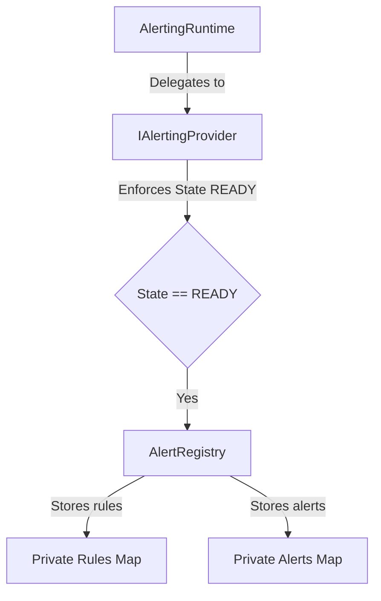

# Phase 18.7.2 — Alert Rule & Condition Runtime

Establish the strongly typed, provider-independent, and immutable domain models and registry storage for alert rules and conditions.

> [!IMPORTANT]
> Phase 18.7.3 (Rule Evaluation / Conditions Matching) is **NOT** implemented.
> This phase does NOT perform alert rule evaluation, alert firing, notification delivery, deduplication, cooldowns, suppression, maintenance windows, database persistence, or UI dashboards.

## 1. Objective & Architecture

This phase defines **WHAT** an alert rule is and implements rule management and registration within the Alerting Runtime registry, provider, and coordinator.

* **Decoupled**: Pure TypeScript without React, Zustand, browser APIs, or backend dependencies.
* **Registry Separation**: The registry manages alerts and rules in independent private `Map` tables.
* **Immutability**: All returned objects are defensively cloned and deep-frozen before leaving registry/provider boundaries.

## 2. Domain Models

### Rule Condition (`RuleCondition`)
An individual evaluation criteria element containing:
- `id` (non-empty string, unique within the rule)
- `field` (non-empty string representing target path)
- `operator` (`AlertOperatorValue`)
- `expectedValue` (optional compared value)
- `metadata` (optional metadata record)

### Supported Condition Operators
A strongly typed set of operators defined in `AlertOperator`:
- `EQ` (Equals)
- `NEQ` (Not Equals)
- `GT` (Greater Than)
- `GTE` (Greater Than or Equal)
- `LT` (Less Than)
- `LTE` (Less Than or Equal)
- `CONTAINS`
- `NOT_CONTAINS`
- `STARTS_WITH`
- `ENDS_WITH`
- `EXISTS`
- `NOT_EXISTS`
- `MATCHES` (regex match)

### Condition Group (`ConditionGroup`)
Supports nesting conditions using logical operators:
- `ALL` (AND logical check)
- `ANY` (OR logical check)
- `NOT` (Negate logical check)

### Alert Rule (`AlertRule`)
An immutable representation of a rule containing:
- `id` (non-empty string)
- `name` (non-empty string)
- `description` (string)
- `enabled` (boolean)
- `severity` (`AlertSeverityValue`, reusing Phase 18.7.1 enums)
- `conditions` (`ConditionGroup`)
- `sourceId` (non-empty string)
- `tags` (string tags array)
- `createdAt` (timestamp)
- `updatedAt` (timestamp)
- `version` (optional positive number)
- `metadata` (optional key-value record)

## 3. Validation Rules

Factories in `alertingFactories.ts` enforce the following strict rules:
* **Required values**: Non-empty string validations for rule/condition IDs, rule names, field paths, and source IDs.
* **Invalid operators**: Reject operators not matching the `AlertOperator` enum.
* **Duplicate Condition IDs**: Validates condition groups recursively; throws if duplicate condition IDs exist within the same rule.
* **Nesting Depth Limit**: Recursively checks nesting depth of `ConditionGroup` composition; throws `AlertRuleValidationError` if depth exceeds 10.
* **Severity validation**: Matches against the existing `AlertSeverity` values.
* **Timestamps & version**: Rejects negative values or invalid numbers.

## 4. Extended Registry APIs

`AlertRegistry` is extended with O(1) rule maps and insertion-order array arrays:
* `registerRule(rule: AlertRule): void` — Throws if duplicate rule ID exists.
* `unregisterRule(ruleId: string): void` — Throws if rule not found.
* `getRule(ruleId: string): AlertRule | null`
* `hasRule(ruleId: string): boolean`
* `listRules(): ReadonlyArray<AlertRule>` — Returns insertion-order snapshots.
* `updateRule(rule: AlertRule): void` — Rejects updates if rule is not found.
* `clearRules(): void`

## 5. Provider & Runtime Delegation

* `IAlertingProvider` and `IAlertingRuntime` are extended to include the seven rule management signatures.
* State checks (`ensureReady`) are performed on all provider methods to enforce `READY` state.
* The coordinator `AlertingRuntime` is kept as a thin delegation layer.

## 6. Statistics & Diagnostics

Alert statistics and diagnostics are extended with rule metrics:
* `registeredRuleCount`: total registered rules.
* `enabledRuleCount`: rules registered with `enabled === true`.
* `disabledRuleCount`: rules registered with `enabled === false`.

Diagnostics output is frozen and read-only.

## 7. Testing Strategy

Unit tests under `frontend/tests/observability/alerting/` cover:
1. **Condition and group factory validation**:
   - Operator checks, group nesting depth limits (rejection of recursion depths > 10).
2. **Rule validation**:
   - Duplicate condition ID detection, invalid severity rejection, invalid version, and timestamps.
3. **Registry operations**:
   - Register, unregister, duplicate rejection, update, missing rule update rejection, deterministic ordering.
4. **Provider and Runtime delegation**:
   - Injection of provider, delegation validation, isolation of states.
5. **Statistics & Diagnostics**:
   - Check `registeredRuleCount`, `enabledRuleCount`, and `disabledRuleCount`.
6. **Immutability verification**:
   - Verify rules, conditions, condition groups, and stats/diags lists are frozen.
7. **Regression tests**:
   - Verify Phase 18.7.1 alert registry, provider initialization, and lookup functionality are intact.
