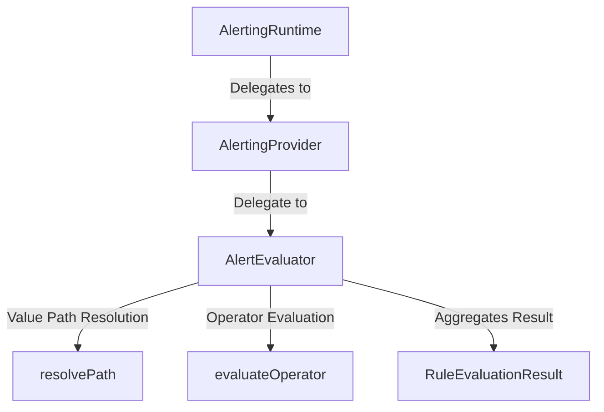

# Phase 18.7.3 — Alert Rule Evaluation Engine

Implement a pure, strongly typed, provider-independent evaluation engine that answers: *"Does this AlertRule match the supplied runtime data?"*

> [!IMPORTANT]
> Phase 18.7.4 (Alert Generation & Fingerprinting) is **NOT** implemented.
> This phase does NOT perform alert generation, alert firing, alert state transitions, deduplication, cooldowns, notifications dispatching, suppression, maintenance windows, database persistence, or UI dashboards.

## 1. Architecture & Design

The evaluation engine is decoupled, deterministic, and side-effect free. It runs evaluations on input parameters without mutating rules or contexts.



* **Decoupled**: Pure TypeScript without React, Zustand, browser APIs, or backend dependencies.
* **No Side Effects**: Evaluating a rule does NOT register/unregister alerts, modify alert state, update cooldowns, send notifications, or mutate the rule/context.

## 2. Evaluation Context & Path Resolution

Evaluation uses an input context `AlertEvaluationContext` holding runtime metrics/logs data:

```typescript
export interface AlertEvaluationContext {
  readonly values: Record<string, unknown>;
}
```

* **Nested Path Resolver**: Dot-notation paths (e.g. `"system.cpu.usage"`) are resolved recursively.
* **Existence Semantics**: Resolves paths that are missing, null, or undefined deterministically. If a key doesn't exist, it evaluates to `{ exists: false, value: undefined }`. If a key is null, it resolves to `{ exists: true, value: null }`.

## 3. Operator Semantics

The evaluator implements deterministic logic for all operators:

| Operator | Comparison Target | Match Criteria | Null/Missing Field Handling |
| :--- | :--- | :--- | :--- |
| **EQ** | `actual === expected` | Strict equality. | Return `false`. |
| **NEQ** | `actual !== expected` | Strict inequality. | Return `false`. |
| **GT** | `actual > expected` | Numeric greater than. | Throws evaluation type error. |
| **GTE** | `actual >= expected` | Numeric greater or equal. | Throws evaluation type error. |
| **LT** | `actual < expected` | Numeric less than. | Throws evaluation type error. |
| **LTE** | `actual <= expected` | Numeric less or equal. | Throws evaluation type error. |
| **CONTAINS** | Array / String | True if substring or array element exists. | Throws type error if actual is not string/array. |
| **NOT_CONTAINS**| Array / String | Logical inverse of CONTAINS. | Throws type error if actual is not string/array. |
| **STARTS_WITH** | String | Starts with search string. | Throws type error if not strings. |
| **ENDS_WITH** | String | Ends with search string. | Throws type error if not strings. |
| **EXISTS** | Any | True if field is defined and not `null`/`undefined`.| Returns `false`. |
| **NOT_EXISTS** | Any | True if field is missing, `null`, or `undefined`. | Returns `true`. |
| **MATCHES** | RegExp | Matches JavaScript RegExp pattern. | Throws RegExp parsing error if pattern is invalid. |

Any runtime comparison errors are captured into the condition result status `ERROR` rather than crashing the evaluator.

## 4. Condition & Group Evaluation

* **Condition evaluation**: Computes resolved value, applies operator, calculates duration, and returns `ConditionEvaluationResult`.
* **Group evaluation**: Evaluates ALL, ANY, and NOT recursive groups.
  * **ALL**: True if all children match.
  * **ANY**: True if at least one child matches.
  * **NOT**: Inverts the child logic. To prevent error masking, an evaluation `ERROR` from a child does not get inverted into a matching state; it remains `matched: false`.
  * **Diagnostic Integrity**: Evaluates all conditions inside groups without short-circuiting to capture a complete diagnostic evaluation tree.

## 5. Disabled Rules & Skipped Status

If a rule has `enabled === false`:
- The evaluator skips walking the condition tree.
- Returns status `'SKIPPED'` and `matched: false`.
- Disabled rules are not considered errors.

## 6. Statistics & Diagnostics

Alert stats and diagnostics interfaces are extended with:
* `totalEvaluations`: count of rule evaluations run.
* `matchedEvaluations`: count of rule evaluations returning status `'MATCHED'`.
* `unmatchedEvaluations`: count of rule evaluations returning status `'NOT_MATCHED'`.
* `errorEvaluations`: count of rule evaluations resulting in status `'ERROR'`.
* `skippedEvaluations`: count of rule evaluations resulting in status `'SKIPPED'`.
* `totalEvaluationDuration`: total evaluation time in milliseconds.
* `averageEvaluationDuration`: total duration divided by total evaluations.

## 7. Verification & Testing

Unit tests under `frontend/tests/observability/alerting/alert_evaluator.test.ts` verify:
1. All operator behaviors under valid/invalid states.
2. Missing, null, and undefined path resolution.
3. Logical group nesting and recursion.
4. Error handling under NOT group.
5. Skipping disabled rules.
6. Stats counter increments and average calculations.
7. Immubality checks on returned rule evaluation results.
8. delegation check from provider and coordinator.
