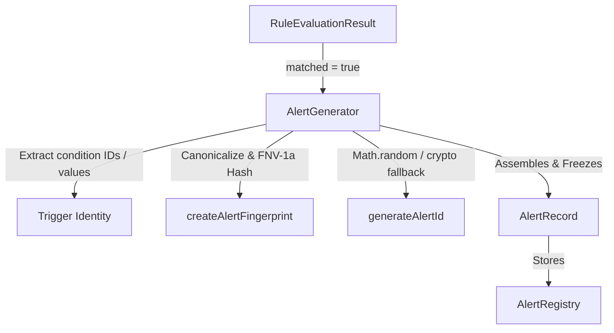

# Phase 18.7.4 — Alert Generation & Fingerprinting Runtime

Implement the runtime layer that converts matched rule evaluations into deterministic, fingerprinted, and immutable alert records.

> [!IMPORTANT]
> Phase 18.7.5 (Deduplication & Cooldown Runtime) is **NOT** implemented.
> This phase does NOT implement deduplication, cooldowns, suppression, maintenance windows, alert expiration, notifications delivery (email, push, SMS, webhooks), React UI components, or Zustand integration.

## 1. Architecture & Design

The generation runtime converts a successful rule evaluation (`matched = true`) into an immutable `AlertRecord`.

## 2. Extended AlertRecord Model

Reuses and extends the Phase 18.7.1 `AlertRecord` interface in [alert.ts](file:///c:/Users/Vishal S Naik/MyProjects/Auralis-voice-file-manager/frontend/src/observability/alerting/models/alert.ts):

* `ruleId?: string`
* `ruleVersion?: number`
* `fingerprint?: string`
* `status?: string` (set to `'GENERATED'`)
* `triggeredAt?: number` (copied from evaluation timestamp)
* `generatedAt?: number` (generation timestamp)
* `tags?: ReadonlyArray<string>`
* `evaluationResult?: unknown` (snapshot of the matching `RuleEvaluationResult`)

## 3. Fingerprinting & Hashing Semantics

The fingerprint uniquely identifies logically equivalent alert occurrences, independent of volatile values (timestamps, evaluation durations, unique alert IDs).

### Identity Inputs
Derived from:
1. `ruleId` (rule ID)
2. `ruleVersion` (rule version, if available)
3. `severity` (severity level)
4. `sourceId` (source ID)
5. `triggerIdentity` (map of matching condition IDs and their fields/operator/expected/actual values)

### Canonicalization Strategy
Before hashing, inputs are canonicalized to prevent JavaScript property ordering differences from affecting the hash:
* Object keys are sorted alphabetically.
* Arrays are recursively mapped.
* Null and undefined values are serialized to `'null'` and `'undefined'` strings.
* Primitive numbers and strings are mapped to standard string representations.

### Hashing Algorithm (FNV-1a 32-bit)
Uses a lightweight, non-cryptographic FNV-1a 32-bit hash function:
* Formats output as an 8-character zero-padded hexadecimal string.
* **Collision Characteristics**: Excellent dispersion for semantic inputs with collision rates of less than 1 in billions for ordinary rulesets.
* Deterministic, stable, and independent of generated timestamps or run environments.

## 4. ID vs Fingerprint Distinction

* **Alert ID**: A unique identifier generated per alert instance (using `crypto.randomUUID` with a safe fallback). It distinguishes between different historical alerts.
* **Fingerprint**: Identifies logically identical occurrences. Multiple generated alerts can share the same fingerprint.

## 5. Storage Boundary

Generated alerts are stored directly in the `AlertRegistry` in-memory history by calling `registerAlert`. No deduplication or cooldowns are applied in this phase; if two generated alerts share the same fingerprint, both are registered and preserved.

## 6. Statistics

Alerting statistics and diagnostics interfaces are extended with:
* `totalAlertGenerations`: evaluations matching that triggered alert generation.
* `successfulAlertGenerations`: alert records compiled and registered successfully.
* `rejectedAlertGenerations`: generation requests rejected due to validation issues.
* `generationErrors`: runtime errors or exceptions encountered during compilation.
* `totalGenerationDuration`: cumulative execution duration in milliseconds.
* `averageGenerationDuration`: average time taken to generate an alert.

## 7. Testing Strategy

Unit tests under `frontend/tests/observability/alerting/alert_generation.test.ts` verify:
1. Generation from `MATCHED` evaluations successfully propagates severity, tags, and custom metadata.
2. Rejection of `NOT_MATCHED`, `ERROR`, or `SKIPPED` evaluations.
3. Rejection of disabled rules or rule/evaluation ID mismatches.
4. Unique alert IDs are assigned.
5. Fingerprint determinism (identical inputs yield the same fingerprint, while changing rule ID, version, or source ID changes the fingerprint).
6. Canonical sorting order validation.
7. stats counter increments.
8. Immutability checks on the generated record.
