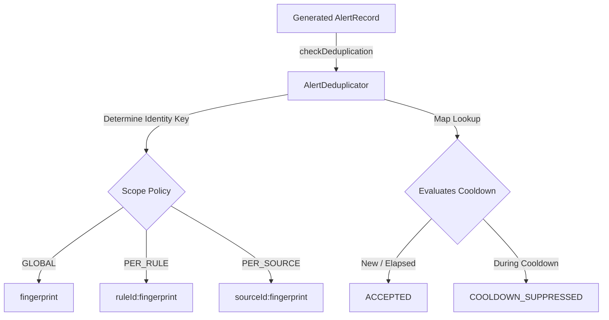

# Phase 18.7.5 — Alert Deduplication & Cooldown Runtime

Implement a deterministic deduplication and cooldown layer between alert generation and alert lifecycle processing.

> [!IMPORTANT]
> Phase 18.7.6 (Alert Lifecycle Runtime) is **NOT** implemented.
> This phase does NOT implement alert lifecycle states (acknowledgment, resolution, closing), suppression policies, maintenance windows, notifications delivery, persistence, React UI, or Zustand integration.

## 1. Concepts & Architecture

This phase decides whether a newly generated alert occurrence should be accepted as a new alert, or treated as a duplicate/cooldown occurrence.

### Core Distinctions
* **Fingerprint**: Identifies logically identical alerts (Phase 18.7.4 FNV-1a hash).
* **Deduplication**: Checks whether an equivalent fingerprint is already tracked in-memory.
* **Cooldown**: Prevents repeated acceptance of the same fingerprint during a configured time window.

## 2. Deduplication Policies & Scopes

The deduplication policy is defined in `DeduplicationPolicy`:
* `enabled`: boolean toggle.
* `cooldownMs`: number (>= 0, finite). If `cooldownMs` is `0`, deduplication tracking still runs, but subsequent matches are accepted immediately.
* `scope`:
  * `GLOBAL`: tracks alert class by fingerprint only.
  * `PER_RULE`: tracks rule-scoped alerts by `ruleId:fingerprint`.
  * `PER_SOURCE`: tracks source-scoped alerts by `sourceId:fingerprint`.
* `maxHistorySize`: bounded tracking record capacity (default: 1000).

## 3. Deduplication Semantics

The `AlertDeduplicator` implements the following transitions based on the evaluation clock `now`:

### First Occurrence
If the tracking key has never been observed:
* **Decision**: `ACCEPTED`.
* **Tracking record created**: `occurrenceCount = 1`, `acceptedCount = 1`.
* **Cooldown bound**: `nextEligibleAt = now + cooldownMs`.

### Repeated Occurrence During Cooldown
If the key exists and `now < nextEligibleAt`:
* **Decision**: `COOLDOWN_SUPPRESSED`.
* **State updated**: `occurrenceCount` and `cooldownSuppressionCount` are incremented.
* **Alert instance**: The alert record is not stored or accepted as new. Cooldown bounds remain unchanged.

### Repeated Occurrence After Cooldown
If the key exists and `now >= nextEligibleAt`:
* **Decision**: `ACCEPTED`.
* **State updated**: `occurrenceCount` and `acceptedCount` are incremented, `lastSeenAt` is set to `now`, and a new cooldown window is computed (`nextEligibleAt = now + cooldownMs`).

## 4. Bounded Retention (FIFO Eviction)

To prevent memory leaks from unbounded Map growth:
* Tracks key insertion order.
* If keys count exceeds `policy.maxHistorySize`, the oldest record is evicted deterministically.
* Exposes `trackedFingerprintCount` diagnostics.

## 5. Timestamp Rules

* The evaluator accepts an explicit `now` parameter.
* Rejects `NaN`, `Infinity`, or negative timestamps with `AlertDeduplicationError` to guarantee deterministic tests independent of wall-clock timing.

## 6. Statistics

Exposes the following metrics:
* `totalDeduplicationChecks`: total checks evaluated.
* `acceptedAlertCount`: total accept decisions.
* `duplicateAlertCount`: total duplicates (including cooldown suppressions).
* `cooldownSuppressedCount`: total suppressions due to cooldowns.
* `activeCooldownCount`: total fingerprints currently in cooldown.
* `trackedFingerprintCount`: total fingerprints tracked in the deduplicator.

## 7. Testing Strategy

Unit tests under `frontend/tests/observability/alerting/alert_deduplication.test.ts` verify:
1. Accept decisions on first occurrences.
2. Suppression of duplicates during the cooldown window.
3. Accept decisions immediately after the cooldown window elapses.
4. Independent evaluation of scopes (GLOBAL, PER_RULE, PER_SOURCE).
5. 0ms cooldown behaviour.
6. Negative/NaN parameter rejections.
7. Atomic synchronous checks.
8. FIFO eviction limits.
9. Stats counter increments.
10. Immutability checks on returned decisions and records.
11. Provider and Runtime delegation APIs.
