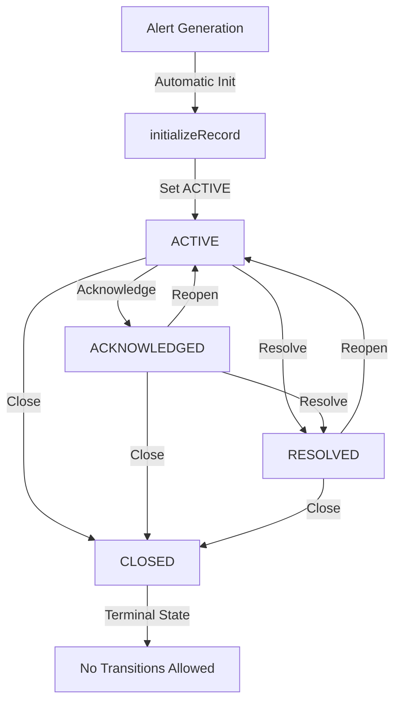

# Phase 18.7.6 — Alert Lifecycle Runtime

Build the Alert Lifecycle Runtime responsible for managing the state transitions of generated alerts (ACTIVE, ACKNOWLEDGED, RESOLVED, CLOSED).

> [!IMPORTANT]
> Phase 18.7.7 is **NOT** implemented.
> This phase does NOT implement alert suppression rules, snoozing, escalation policies, maintenance windows, notification routing, notification channels (email, push, SMS, webhook), React/Zustand UI components, or persistent databases.

## 1. Lifecycle Architecture

Lifecycle business logic is isolated in `AlertLifecycleManager`. The `AlertingProvider` holds an instance of the manager and exposes APIs that delegate tracking actions from the thin `AlertingRuntime` coordinator.

## 2. State Transition Matrix

The lifecycle manager enforces deterministic transition paths. Invalid paths throw `AlertLifecycleTransitionError` and leave the state unchanged.

| From State | To State | Action / Method | Valid? |
| :--- | :--- | :--- | :--- |
| **ACTIVE** | `ACKNOWLEDGED` | `acknowledgeAlert` | Yes |
| **ACTIVE** | `RESOLVED` | `resolveAlert` | Yes |
| **ACTIVE** | `CLOSED` | `closeAlert` | Yes |
| **ACKNOWLEDGED** | `ACTIVE` | `transitionAlert(..., 'ACTIVE')` | Yes (Reopen) |
| **ACKNOWLEDGED** | `RESOLVED` | `resolveAlert` | Yes |
| **ACKNOWLEDGED** | `CLOSED` | `closeAlert` | Yes |
| **RESOLVED** | `ACTIVE` | `transitionAlert(..., 'ACTIVE')` | Yes (Reopen) |
| **RESOLVED** | `CLOSED` | `closeAlert` | Yes |
| **CLOSED** | Any State | Any | **No (Terminal)** |

## 3. History Entry Model

Every successful transition generates a deep-frozen historical log entry:
* `alertId`: matches instance ID.
* `fingerprint`: tracks the grouping identifier.
* `previousState`: previous state snapshot (null for initial creation).
* `nextState`: new state snapshot.
* `timestamp`: epoch timestamp.
* `actor`: `'SYSTEM' | 'USER' | 'PLUGIN' | 'AUTOMATION'`.
* `operation`: descriptive transition title.
* `reason`: optional text commentary.
* `metadata`: optional key-value pairs (normalized and cloned).

## 4. Initialization Behavior

* Upon generating a new alert record via `generateAlert(...)`, the system automatically initializes the alert lifecycle to `ACTIVE` with a history action of `INITIALIZE`.
* Initialization is idempotent; repeated calls for the same alert return the existing record without altering states or appending history.

## 5. Storage & Eviction

* Employs bounded, private, in-memory Map lookup tracking.
* Restricts unbounded memory growth using FIFO key queue eviction when the number of tracked alerts exceeds `maxCapacity` (default: 1000).

## 6. Statistics & Diagnostics

Exposes the following metrics:
* `lifecycleTransitions`: total valid transitions.
* `acknowledgements`: total acknowledges.
* `resolutions`: total resolutions.
* `closures`: total closures.
* `invalidTransitions`: total invalid transition attempts (throwing errors).
* `activeAlerts`, `acknowledgedAlerts`, `resolvedAlerts`, `closedAlerts`: current counts.
* `historySize`: total history entries logged.
* `lastTransitionTimestamp`: newest transition epoch timestamp.

## 7. Testing Strategy

Unit tests under `frontend/tests/observability/alerting/alert_lifecycle.test.ts` verify:
1. State-transition pathways (ACTIVE -> ACKNOWLEDGED -> RESOLVED -> ACTIVE -> CLOSED).
2. Terminal closure rejections.
3. Idle state immutability.
4. Duplicate initialization checks.
5. Stats and diagnostics incrementation.
6. FIFO queue eviction behavior.
7. Provider/Runtime delegation.
