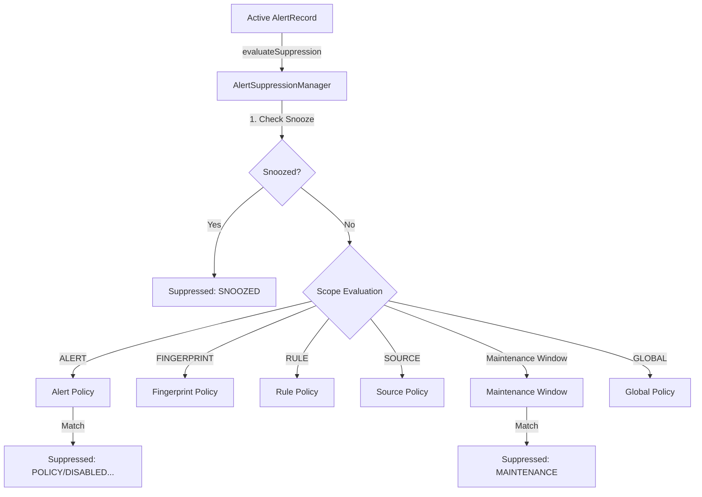

# Phase 18.7.7 — Alert Suppression & Maintenance Runtime

Implement the suppression and maintenance layer that determines whether a generated/active alert is currently allowed to proceed through the alerting pipeline.

> [!IMPORTANT]
> Phase 18.7.8 is **NOT** implemented.
> This phase does NOT implement notification channels (email, push, SMS, webhooks), routing engines, notification templates, escalation delivery, React components, Zustand stores, database persistence, or external observability integrations.

## 1. Concepts & Architecture

Suppression is orthogonal to lifecycle and deduplication states. It evaluates whether alerts should be suppressed, without modifying lifecycle states or deduplication counters.

## 2. Evaluation Precedence

Precedence order when multiple suppression mechanisms match:
1. **Explicit alert snooze**: Alert-specific snooze record.
2. **Alert-specific policy**: Scope `ALERT`, matching specific alert instance ID.
3. **Fingerprint-specific policy**: Scope `FINGERPRINT`, matching fingerprint.
4. **Rule-specific policy**: Scope `RULE`, matching rule ID.
5. **Source-specific policy**: Scope `SOURCE`, matching source ID.
6. **Maintenance window**: Enabled maintenance window active during `startTime <= now < endTime`.
7. **Global policy**: Scope `GLOBAL`, matching unconditionally.

### Priority & Tie-Breaking
Within any scope level:
* Policies are sorted by `priority` (higher numeric priority wins).
* If priorities tie, lexicographical `policyId` ordering determines the winner.

## 3. Maintenance Windows

Maintenance windows are registered as explicit time intervals:
* Active only when `startTime <= currentTime < endTime`.
* Optionally scoped to alert, rule, fingerprint, or source.
* Invalid ranges (e.g. `startTime >= endTime`) are rejected.

## 4. Alert Snoozing

Temporary alerts silencing:
* Allows callers to call `snoozeAlert(...)` to mute an alert for a specific duration.
* The mutes are tracked by `AlertSnoozeRecord`.
* Mutes can be queried via `getSnooze`/`isSnoozed` and cleared using `clearSnooze`.
* Muting is temporary and does not alter the alert lifecycle state.

## 5. Bounded History & Storage

* Policies, maintenance windows, and snooze states are kept in private Map lookup collections.
* Recent suppression decisions are recorded in a bounded FIFO queue to prevent memory leaks from unbounded list growth (default capacity: 1000).

## 6. Fail-Safe Behavior

* Malformed policies or evaluation runtime crashes must never silently suppress alerts.
* Evaluation errors increment `evaluationFailures` and throw `AlertSuppressionEvaluationError` rather than defaulting to `suppressed = true`.

## 7. Statistics & Diagnostics

Exposes the following metrics:
* `suppressionEvaluations`: total checks evaluated.
* `suppressedAlerts`: count of suppressed decisions.
* `allowedAlerts`: count of allowed decisions.
* `policyMatches`: count of policy-matched suppressions.
* `maintenanceMatches`: count of maintenance-matched suppressions.
* `snoozedMatches`: count of snooze-matched suppressions.
* `evaluationFailures`: count of evaluation failures.
* `activePolicies`, `activeMaintenanceWindows`, `activeSnoozes`: active configurations count.
