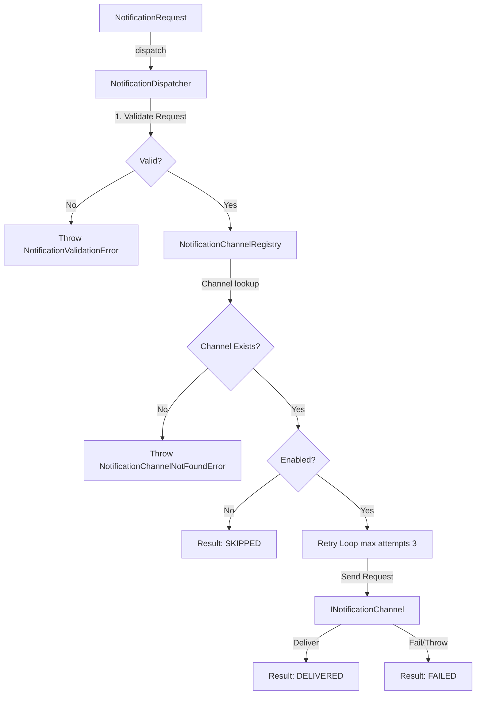

# Phase 18.7.8 — Notification Channel Runtime

Build a provider-independent Notification Channel Runtime responsible for representing notification requests, registering channels, dispatching notifications through enabled channels, tracking delivery attempts, and maintaining bounded delivery history.

> [!IMPORTANT]
> Phase 18.7.9 is **NOT** implemented.
> This phase does NOT implement the final alerting orchestration layer (automatically connecting rule evaluation to suppression to notification channel delivery), React components, Zustand stores, database persistence, external email/push/SMS SDK configurations, or production certification.

## 1. Concepts & Architecture

Notification dispatching is handled asynchronously and remains decoupled from suppression evaluation and lifecycle mutations.

## 2. Channel Registry

The `NotificationChannelRegistry` registers and manages in-memory channel instances:
* Toggles channel enablement status via `enableNotificationChannel`/`disableNotificationChannel`.
* Throws `AlertNotificationError` for duplicate channel ID registrations.
* Map-backed lookup with O(1) average complexity.

## 3. InMemoryNotificationChannel

A deterministic test channel implementation that:
* Accepts valid notification requests.
* Exposes sent requests history.
* Simulates custom failure counts via `simulateFailures(count)`.
* Reports mock health status checks.

## 4. Notification Dispatcher & Bounded Retries

The `NotificationDispatcher` handles delivery orchestration:
* **Validation**: Rejects invalid requests before attempting channel delivery.
* **Skipped State**: Skip deliveries when channels are disabled (status `SKIPPED`).
* **Bounded Retries**:
  - Configurable maximum retry attempts (default: 3).
  - Retries failed attempts sequentially.
  - Captures cumulative durations and formats error objects into normalized frozen models.
* **Duplicate Prevention**: If a notification ID was already successfully delivered, throws `NotificationDispatchError` to prevent duplicate delivery.
* **Bounded History**: Decisions logged to a FIFO bounded history queue (default: 1000).

## 5. Lifecyle & Suppression Independence

* Delivery states do NOT modify alert lifecycles (e.g. failing to deliver does not close or resolve an alert).
* Suppression evaluation (checking policies/maintenance windows) is completed before a notification request is created.

## 6. Statistics & Diagnostics

Exposes the following metrics:
* `notificationRequests`: total requests made.
* `validationFailures`: count of validation errors.
* `dispatchedNotifications`: count of channel send operations.
* `deliveredNotifications`: count of successfully delivered dispatches.
* `failedNotifications`: count of failed dispatches.
* `skippedNotifications`: count of skipped dispatches.
* `retryAttempts`: total retry attempts triggered.
* `averageDeliveryDuration`: average execution time.
