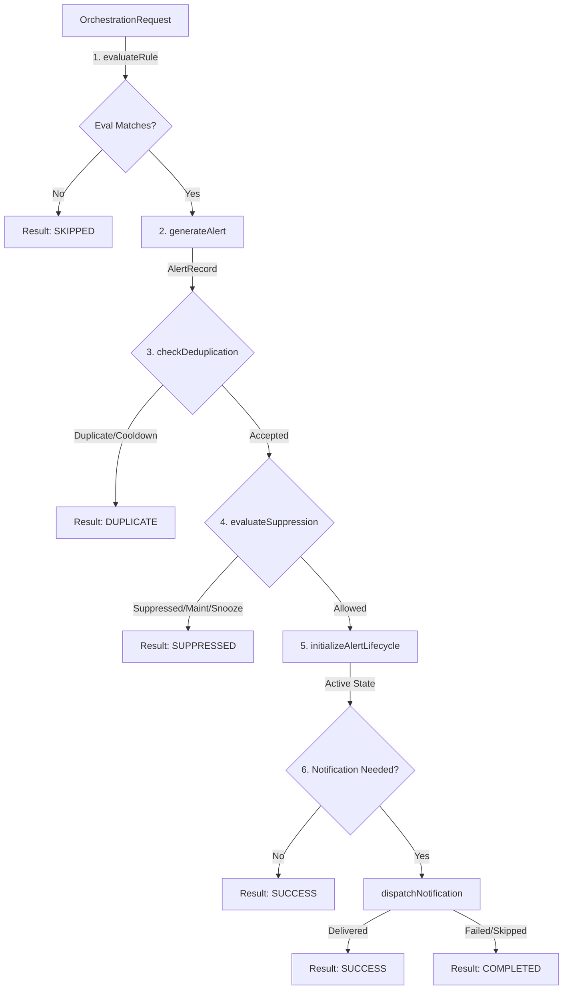

# Phase 18.7.9 — Alerting Orchestration Runtime

Build a provider-independent Alerting Orchestration Runtime that coordinates the already implemented alerting subsystems into one deterministic end-to-end pipeline.

> [!IMPORTANT]
> Phase 18.7.10 is **NOT** implemented.
> This phase does NOT implement dashboard panels, alert list screens, user action triggers, Zustand store synchronizers, browser indexdb caching, push message SDK connectors, or third-party webhooks.

## 1. Concepts & Architecture

The Alerting Orchestrator coordinates evaluations, alert records generation, cooldown checks, suppression policies, lifecycle state registrations, and dispatch channels:

## 2. Pipeline Execution Stages

Each orchestration request evaluates the following stages sequentially:
1. **Rule Evaluation**: Uses `AlertEvaluator`. If status is `NOT_MATCHED` or `SKIPPED`, remaining pipeline stops with status `SKIPPED`.
2. **Alert Generation**: Uses `AlertGenerator` to build a unique `AlertRecord`.
3. **Deduplication**: Runs the `AlertRecord` through `AlertDeduplicator`. If a duplicate is detected or a cooldown is active, the pipeline halts with status `DUPLICATE`.
4. **Suppression**: Evaluates active policies, maintenance windows, and snooze states. If suppressed, halts with status `SUPPRESSED`.
5. **Lifecycle**: Registers the `AlertRecord` in the `AlertLifecycleManager`.
6. **Notification**: If the request contains a target channel and recipient details, builds a `NotificationRequest` and triggers the `NotificationDispatcher` (which coordinates retries and skip rules).

## 3. Failure Boundaries & Compensation

* **Failure Isolation**: If evaluation, generation, deduplication, suppression, or lifecycle stages crash, the pipeline halts immediately, marks the orchestration as `FAILED`, and logs the error details.
* **Closed-Fail Policy**: If deduplication or suppression managers fail, the orchestrator fails-closed and avoids dispatching notification requests.
* **Notification Failures**: If the notification delivery fails or times out, the alert and lifecycle records are **preserved**. The orchestration status is set to `COMPLETED` rather than `FAILED` to prevent corrupting successful lifecycle setups.

## 4. Idempotency & Promise Caching

Concurrently executed requests containing the same `orchestrationId` are deduplicated using a Map:
* Shared execution promise is returned to all concurrent callers.
* Avoids duplicate alert registration and redundant notification channel dispatches.
* Promise references are cleaned from the map upon resolution or rejection.

## 5. Batch Orchestration

The `orchestrateMany` interface supports batch requests:
* Independent task execution using `Promise.all`.
* Failure isolation: A crash in one orchestration request does not abort others.
* Preserves original request order in the output array.

## 6. History & Capacity Limit

Exposes a bounded FIFO completed execution queue (default: 1000):
* Snapshot results are deeply frozen using `freezeDeepSafe`.
* Query support by `orchestrationId`.

## 7. Statistics & Diagnostics

Exposes detailed orchestration counters:
* `orchestrationsTotal`: total orchestration events.
* `orchestrationsSuccessful`: successful dispatches.
* `orchestrationsSkipped`: skipped rule evaluations.
* `orchestrationsDuplicate`: deduplicated/cooldown events.
* `orchestrationsSuppressed`: snoozes and maintenance suppressions.
* `orchestrationsFailed`: pipeline crashes.
* `averageOrchestrationDuration`: average execution time.
* `activeOrchestrations`: in-flight count.
