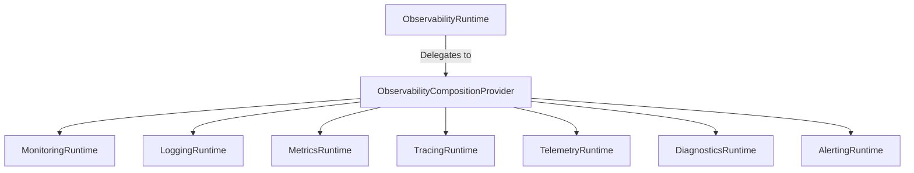

# Phase 18.8.1 — Observability Runtime Composition

This document defines the architecture and design of the unified Observability Composition Runtime for the Auralis V2 Frontend.

## 1. Composition Architecture

The `ObservabilityRuntime` is a provider-independent coordinate boundary containing **no subsystem business logic**. Its sole responsibility is orchestrating and managing the shared lifecycles and diagnostics of the underlying observability subsystems:

## 2. Deterministic Subsystem Initialization Sequence

To prevent initialization deadlocks or state inconsistencies, subsystems are initialized sequentially in order of dependency requirements:
1. **Monitoring**: Foundation health and check registry.
2. **Logging**: Diagnostic tracing logger boundary.
3. **Metrics**: Instrumental collectors.
4. **Tracing**: Hierarchical trace and span contextual indexers.
5. **Telemetry**: Buffers and multi-exporters.
6. **Diagnostics**: Aggregates diagnostics providers.
7. **Alerting**: Evaluating and generating alerts.

## 3. Failure Compensation / Rollback

If any subsystem fails to initialize (e.g. subsystem $N$ fails):
1. **Interrupt Sequence**: Halts the initialization workflow. Telemetry, Diagnostics, or Alerting stages are bypassed.
2. **Rollback**: Triggers the `shutdown()` transition of already initialized subsystems $1$ to $N-1$ in reverse order.
3. **Primary Error Preservation**: The original exception from subsystem $N$ is preserved and returned.
4. **State Transition**: Transitions the composition runtime state directly to `FAILED`.

## 4. Reverse Shutdown Sequence

Shutdown runs in reverse order of initialization:
1. **Alerting**
2. **Diagnostics**
3. **Telemetry**
4. **Tracing**
5. **Metrics**
6. **Logging**
7. **Monitoring**

* **Failure Isolation**: If any subsystem fails to shut down, the certifier continues shutting down all other subsystems in the chain. The composition state settles to `FAILED` if any errors occur.

## 5. Health & Diagnostics Aggregation

Overall composition health is mapped using a precedence hierarchy:
$$\text{UNHEALTHY} > \text{DEGRADED} > \text{HEALTHY} > \text{UNKNOWN}$$

* **Monitoring**: Derived natively using `monitoringRuntime.getHealth().status`.
* **Other Subsystems**: Inferred from their current `getState()` outputs (`READY` / `INITIALIZED` is healthy, `ERROR` / `FAILED` is unhealthy, otherwise unknown).

Returned diagnostic and statistics objects are deeply frozen using `freezeDeepSafe` to maintain immutability.

## 6. Strict Phase Boundaries

> [!IMPORTANT]
> PHASE 18.8.2 AND ALL LATER PHASE 18.8 FEATURES ARE NOT IMPLEMENTED.
> This phase does NOT implement automatic metrics mapping from logs, automatic alerting from trace anomalies, cloud telemetry exporters, Zustand stores, or UI panels.
