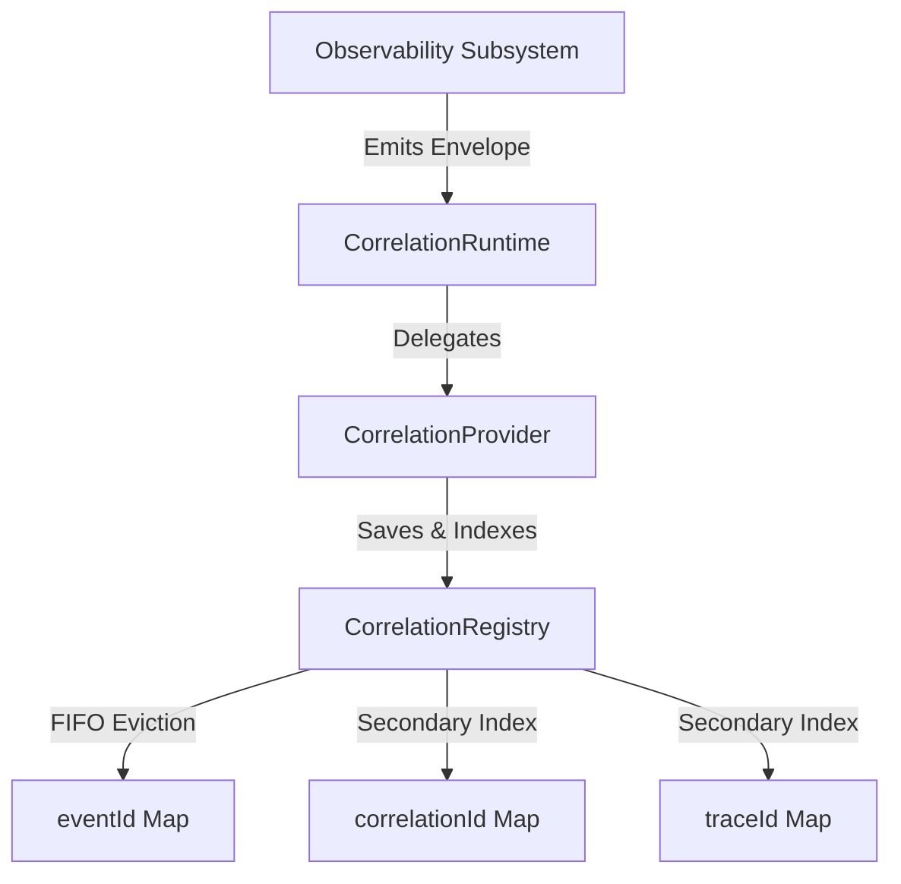

# Phase 18.8.2 — Cross-Runtime Event Correlation

This document defines the architecture, data models, registry capabilities, lifecycles, and security hygiene rules for the Cross-Runtime Event Correlation subsystem in the Auralis V2 Frontend.

## 1. Objective & Scope

The purpose of Phase 18.8.2 is to provide a common correlation identity and event-envelope mechanism that allows observations originating from different observability subsystems (Monitoring, Logging, Metrics, Tracing, Telemetry, Diagnostics, Alerting) to be associated with the same logical operation. 

This phase focuses exclusively on the **correlation infrastructure**. Subsystems can read/write correlation metadata manually, but automatic cross-runtime event forwarding or automated log-to-metric integrations are strictly reserved for Phase 18.8.3+.

## 2. Architecture

The Correlation layer acts as an independent intermediary coordinate system. It does not couple subsystems directly to one another. Instead, subsystems dispatch event envelopes to the correlation manager, which indexes them in a private, bounded, Map-backed store:

## 3. Data Models

### CorrelationContext
Represents the correlation coordinates. Does not require all fields:
* `correlationId`: string (unique)
* `traceId?: string`
* `spanId?: string`
* `parentCorrelationId?: string`
* `requestId?: string`
* `operationId?: string`
* `source?: string`
* `timestamp: number`
* `metadata?: Record<string, unknown>` (contains sanitized telemetry properties)

### CorrelatedEvent
The structural wrapper for observations:
* `eventId`: string (unique)
* `eventType`: string
* `timestamp: number`
* `context: CorrelationContext`
* `sourceSubsystem: string`
* `metadata?: Record<string, unknown>`
* `payload?: Record<string, unknown>`

### CorrelationLink
Represents lightweight relationships between telemetry entities:
* `sourceId`: string
* `targetId`: string
* `kind`: `EVENT_TO_EVENT` | `EVENT_TO_TRACE` | `EVENT_TO_SPAN` | `EVENT_TO_ALERT` | `EVENT_TO_REQUEST` | `EVENT_TO_OPERATION`
* `metadata?: Record<string, unknown>`

## 4. Query Semantics

Queries can target combinations of:
* `correlationId`, `traceId`, `requestId`, `operationId`, `eventType`, `source`, `startTime`, and `endTime`.

Result lists are:
1. **Sorted**: Ascending chronologically by event timestamp.
2. **Indexed**: O(1) searches are performed when query contains `correlationId`, `traceId`, `requestId`, or `operationId`.
3. **Immutable**: Deeply frozen lists.

## 5. Bounded Storage & FIFO Eviction

To prevent memory leaks and unbounded memory growth in the browser:
* The `CorrelationRegistry` is configured with strict upper limits (`maxEvents` and `maxLinks`, defaulting to 1000).
* When limits are exceeded, the oldest records are evicted in a First-In, First-Out (FIFO) pattern.
* Eviction removes the event from the primary index (`eventId`) as well as all secondary search indices.

## 6. Immutability & Security (Data Hygiene)

### Redaction Rules
Telemetries must not leak credentials. The provider automatically normalizes and redacts properties matching keys such as `password`, `token`, `secret`, `cookie`, `authorization`, `api_key`, or `credential`.

### Normalization
* **React Elements**: Replaced with `'[REACT_ELEMENT]'`.
* **DOM Nodes**: Replaced with `'[DOM_NODE_<Name>]'`.
* **Error Objects**: Transformed into safe objects `{ name, message, stack }` rather than leaking raw native class prototype chains.
* **Circular references**: Tracked and pruned (replacing recursive structures with `'[CIRCULAR]'`).

## 7. Lifecycles

The correlation provider utilizes a state transition lifecycle:
$$\text{UNINITIALIZED} \rightarrow \text{INITIALIZING} \rightarrow \text{READY} \rightarrow \text{STOPPING} \rightarrow \text{STOPPED}$$

* Concurrent initialization and shutdown requests in the same tick share the same async execution promise.
* Invalid transitions throw `CorrelationStateError`.

---

> [!IMPORTANT]
> Phase 18.8.3 and all later phases are NOT implemented. Automatic tracing-to-alerting forwarding, telemetry cloud upload, Zustand stores, and React components are not included.
