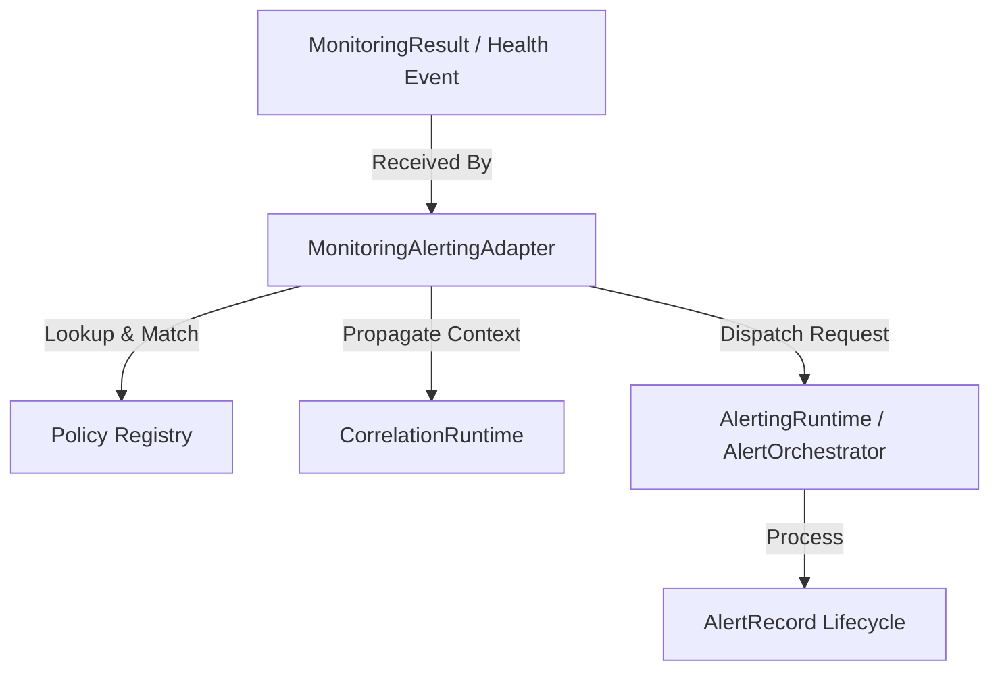

# Phase 18.8.3 — Monitoring ↔ Alerting Integration

This document defines the architecture, trigger semantics, policy matching rules, lifecycles, and security hygiene rules for the Monitoring-Alerting Integration layer in the Auralis V2 Frontend.

## 1. Objective & Scope

The purpose of Phase 18.8.3 is to establish a provider-independent integration layer that allows monitoring checks and health transitions to produce alerting requests through a controlled adapter.

* **Monitoring Responsibility**: Evaluates components and checks status results.
* **Alerting Responsibility**: Deduplicates, suppresses, fingerprints, registers lifecycles, and orchestrates actions.
* **Adapter Responsibility**: Translates monitoring results into normalized alerting requests (`AlertOrchestrationRequest`), propagates correlation context, handles state transition deduplication, and records integration stats.

## 2. Architecture

The integration layer operates between the existing subsystems:

## 3. Data Models

### MonitoringAlertPolicy
Configures which monitoring outcomes map to which alert rules:
* `id`: string (unique)
* `enabled`: boolean
* `componentId?: string`
* `checkId?: string`
* `source?: string`
* `severity?: string`
* `ruleId`: string
* `metadata?: Record<string, unknown>`

### MonitoringAlertTrigger
Details the transient trigger coordinates:
* `triggerId`: string
* `componentId`: string
* `checkId?: string`
* `status`: MonitorStatusValue
* `severity?: string`
* `result?: MonitoringResult`
* `timestamp`: number
* `correlationId?: string`

### MonitoringAlertRequest
Normalized input forwarded to the Alerting orchestrator.

## 4. Policy Matching Rules & Precedence

Policy matching resolves candidate matches using strict precedence sorting rules:
1. **Check-specific match**: Matches both `componentId` and `checkId` (Specificity score: 4).
2. **Component-specific match**: Matches `componentId` only (Specificity score: 3).
3. **Source-specific match**: Matches `source` key only (Specificity score: 2).
4. **Global match**: No filters specified (Specificity score: 1).

If multiple policies have the same specificity, they are resolved deterministically by alphabetical sorting of policy IDs (`policy.id.localeCompare`).

## 5. State Transition Awareness & Recovery

* **Deduplication**: The integration layer caches the last observed health status per monitored target (`${componentId}/${checkId || ''}`). If the status hasn't changed, the trigger is skipped, preventing repeated alert noise.
* **Recovery (UNHEALTHY $\rightarrow$ HEALTHY)**: When status recovers to `HEALTHY`, the integration layer still propagates the event to the Alerting orchestrator. The Alerting engine evaluates this as `NOT_MATCHED` against the rule's trigger conditions and automatically transitions active alerts to `RESOLVED` (via built-in AlertLifecycleManager resolution rules).

## 6. Concurrency & Protection

To protect the execution pipe from duplicate parallel inputs, an in-flight Promise map caches pending operations using execution keys:
`${componentId}/${checkId || ''}/${status}/${completedAt}`
Concurrent evaluations of the exact same result return the cached promise.

## 7. Statistics & Diagnostics

* Diagnostics are deeply frozen (`freezeDeepSafe`) to prevent memory mutation leaks.
* Tracks statistic counters: `evaluations`, `matchedPolicies`, `skippedTriggers`, `alertingRequests`, `successfulAlertingRequests`, `failedAlertingRequests`, `suppressedRequests`, `deduplicatedRequests`, `duplicateIntegrationRequests`, `integrationErrors`, `averageIntegrationDuration`.

---

> [!IMPORTANT]
> PHASE 18.8.4 AND ALL LATER PHASE 18.8 FEATURES ARE NOT IMPLEMENTED.
> Logging-Metrics mapping, cloud exporter services, Zustand syncs, and UI views are omitted.
