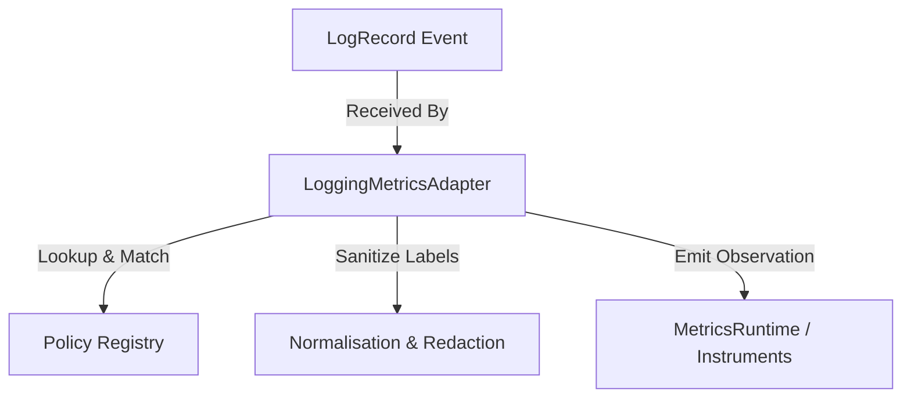

# Phase 18.8.4 — Logging ↔ Metrics Integration

This document defines the architecture, trigger semantics, policy matching rules, lifecycles, and security hygiene rules for the Logging-Metrics Integration layer in the Auralis V2 Frontend.

## 1. Objective & Scope

Create a clean, provider-independent integration layer that allows structured `LogRecord` events to produce Metrics observations in a deterministic and controlled way.

* **Logging Responsibility**: Records structured events.
* **Metrics Responsibility**: Manages instrument values (Counter, Gauge, Histogram, Timer).
* **Adapter Responsibility**: Translates matching `LogRecord` fields to metrics request objects, normalizes labels, and records metric updates.

## 2. Architecture

The integration layer sits between the existing Logging and Metrics systems:

## 3. Data Models

### LoggingMetricsPolicy
Configures logging filters mapping to metrics operations:
* `id`: string (unique)
* `enabled`: boolean
* `loggerName`: string
* `minLevel`: LogLevelValue
* `metricName`: string
* `metricType`: MetricTypeValue
* `labels?: Record<string, string>`
* `alwaysCountErrors?: boolean`
* `samplingRate?: number`
* `priority`: number
* `metadata?: Record<string, unknown>`

### LoggingMetricTrigger
Details transient log event trigger coordinates.

### LoggingMetricRequest
Normalized metric payload forwarded to the Metrics Runtime.

## 4. Policy Matching Precedence

Policy matching resolves candidate matches using strict precedence sorting rules:
1. **Logger-specific**: `loggerName` matches and is not `*` (Specificity score: 3).
2. **Level-specific**: `loggerName` is `*` and `minLevel` is not `TRACE` (Specificity score: 2).
3. **Global**: `loggerName` is `*` and `minLevel` is `TRACE` (Specificity score: 1).

If multiple policies have the same specificity, they are resolved by:
1. Higher numeric priority (`priority`).
2. Alphabetically smaller policy ID (`id`).

## 5. Security & Label Normalization

Labels are automatically normalized and sanitized:
* Alphabetical sorting of label keys for deterministic schema layouts.
* Explicit redaction of credentials: any keys matching `password`, `token`, `secret`, `authorization`, `cookie`, `api_key`, `credential` are skipped.

## 6. Concurrency & Idempotency

* **Idempotency**: Prevents accidental duplicate observations of duplicate events using a FIFO bounded queue tracking recently processed event IDs (capacity: 1000).
* **Concurrency**: Active duplicate log integrations in the same tick share the same Promise.

---

> [!IMPORTANT]
> PHASE 18.8.5 IS NOT IMPLEMENTED.
> Telemetry integrations, tracing integrations, diagnostics integrations, dashboard, React UI, Zustand stores, IndexedDB, and remote exporters are omitted.
