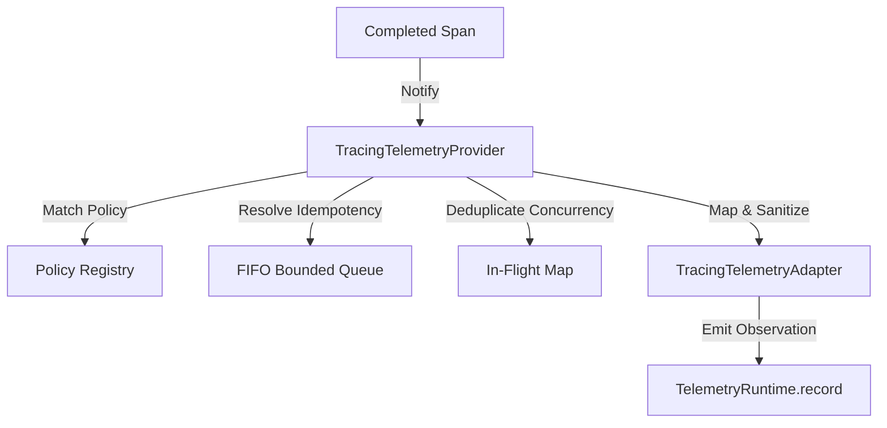

# Phase 18.8.5 — Tracing ↔ Telemetry Integration

This document defines the architecture, data flow, policy precedence, translation mappings, sampling logic, idempotency controls, and security/redaction rules for the Tracing-Telemetry Integration layer in the Auralis V2 Frontend.

## 1. Objective

Create a clean, provider-independent integration layer that converts eligible completed tracing spans/traces into normalized telemetry records and submits them through the existing Telemetry Runtime.

## 2. Architecture

The integration decouples tracing inputs from telemetry outputs:

## 3. Data Flow

1. **Span Completion**: A tracing span finishes execution.
2. **Policy Evaluation**: The provider checks the span against registered policies.
3. **Trigger Creation**: A `TracingTelemetryTrigger` captures the transient state of the completed span.
4. **Sampling & Redaction**: The adapter verifies duration limits, checks sampling configurations, and redacts sensitive parameters.
5. **Telemetry Record Dispatch**: A `TelemetryRecord` is created and recorded via the public `ITelemetryRuntime`.

## 4. Policy Matching Precedence

Candidates are sorted descending by specificity score:
$$\text{SPAN-SPECIFIC (Score 5)} > \text{TRACE-SPECIFIC (Score 4)} > \text{STATUS-SPECIFIC (Score 3)} > \text{KIND-SPECIFIC (Score 2)} > \text{GLOBAL (Score 1)}$$

Equal specificity matches are resolved by:
1. Higher numeric priority (`priority`).
2. Alphabetically smaller policy ID (`id`).

## 5. Security & Attribute Normalization

* Circular references inside attributes/events are safely caught and represented as `'[CIRCULAR]'` to prevent serialization crashes.
* Sensitive keys matching `password`, `token`, `secret`, `authorization`, `cookie`, `api_key`, `credential` are automatically replaced with `[REDACTED]`.

## 6. Concurrency & Idempotency

* **Idempotency**: Prevents processing the same span multiple times under the same policy using a FIFO bounded queue tracking recently processed event keys (capacity: 1000).
* **Concurrency**: Duplicate requests for the same trace/span combination share the same Promise.

---

> [!IMPORTANT]
> PHASE 18.8.6 IS NOT IMPLEMENTED.
> Diagnostics telemetry, alerting telemetry integrations, dashboard views, Zustand stores, IndexedDB, and remote exporters are omitted.
