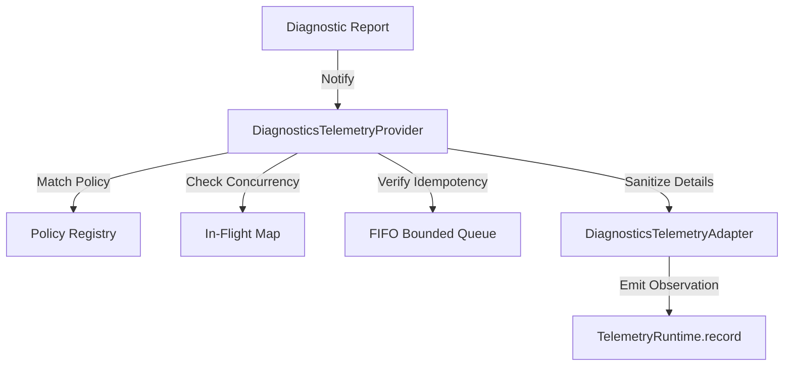

# Phase 18.8.6 — Diagnostics ↔ Telemetry Integration

This document defines the architecture, data flow, policy precedence, severity mapping, sampling logic, error serialization, and idempotency rules for the Diagnostics-Telemetry Integration layer in the Auralis V2 Frontend.

## 1. Objective

Create a clean, provider-independent integration layer that converts completed diagnostic runs and diagnostic results into normalized telemetry records and submits them through the existing Telemetry Runtime.

## 2. Architecture

The integration layer bridges diagnostic outputs to telemetry inputs without merging dependencies:

## 3. Policy Precedence Sorting

Diagnostic observations are resolved using specificity scoring:
$$\text{CHECK-SPECIFIC (Score 6)} > \text{SOURCE-SPECIFIC (Score 5)} > \text{CATEGORY-SPECIFIC (Score 4)} > \text{SEVERITY-SPECIFIC (Score 3)} > \text{STATUS-SPECIFIC (Score 2)} > \text{GLOBAL (Score 1)}$$

Ties are resolved using:
1. Higher numeric priority (`priority`).
2. Alphabetically smaller policy ID (`id`).

## 4. Run-Level vs Result-Level Mappings

Policies target either RUN level (monitoring overall status, check count statistics, overall severity) or RESULT level (monitoring individual check result fields, execution durations, errors) depending on their `level` parameter ('RUN' | 'RESULT').

## 5. Security & Redaction

* Circular references inside attributes/details are converted to `'[CIRCULAR]'` to prevent serialization crashes.
* Sensitive fields matching `password`, `token`, `secret`, `authorization`, `cookie`, `api_key`, `credential` are replaced with `[REDACTED]`.

## 6. Concurrency & Idempotency

* **Idempotency**: Prevents duplicate records using a FIFO bounded queue (capacity: 1000). Repeated evaluation is permitted only when `policy.allowRepeat === true`.
* **Concurrency**: Concurrent requests for the same diagnostic execution key share the same Promise.

---

> [!IMPORTANT]
> PHASE 18.8.7 IS NOT IMPLEMENTED.
> Alerting telemetry integrations, Zustand stores, IndexedDB persistence, or dashboard UI elements are omitted.
