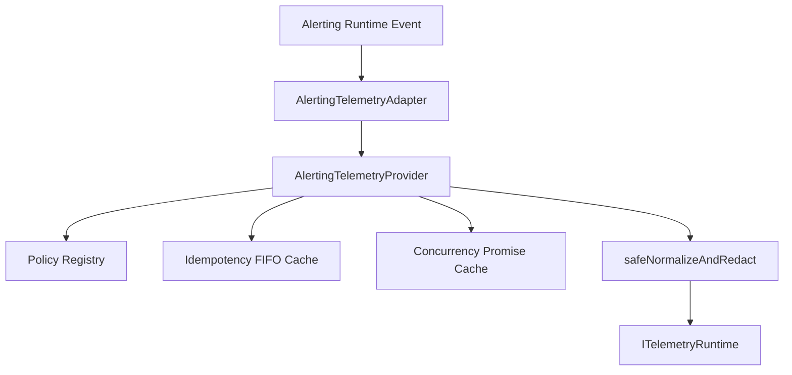

# Phase 18.8.7 — Alerting ↔ Telemetry Integration

This document outlines the architecture, data structures, and lifecycle of the **Alerting ↔ Telemetry Integration** for the Auralis Voice File Manager Observability Platform.

---

## 1. Objective
The goal of this phase is to establish a provider-independent Alerting ↔ Telemetry Integration Runtime. It acts as an integration layer that captures alerting events and translates them into normalized telemetry logs/metrics/events/traces, without modifying the internal business logic of either Alerting or Telemetry.

---

## 2. Architecture
The integration implements a clean pipeline where Alerting trigger events are normalized, matched against user-defined matching policies, checked for historical and concurrent duplication, redacted of sensitive information, and sent to the existing Telemetry Runtime.

---

## 3. Policy Specificity and Precedence Routing
When matching incoming events, policies are evaluated based on their specificity scores. A higher score represents a more specific policy filter.

### Precedence Scores
1. **ALERT-SPECIFIC** (Score 7): Matches a specific `alertId`.
2. **FINGERPRINT-SPECIFIC** (Score 6): Matches a specific alert `fingerprint`.
3. **RULE-SPECIFIC** (Score 5): Matches a specific `ruleId`.
4. **SOURCE-SPECIFIC** (Score 4): Matches a specific `sourceId`.
5. **SEVERITY-SPECIFIC** (Score 3): Matches a specific alert `severity`.
6. **STATUS-SPECIFIC** (Score 2): Matches status or states (`status`, `lifecycleState`, `orchestrationStatus`, or `notificationStatus`).
7. **GLOBAL** (Score 1): Fallback policy with no specific filters.

### Tie-Breaking Rules
1. **Higher Priority**: Policies with higher numeric `priority` take precedence.
2. **Alphabetical ID**: If specificity and priority match, the policy with the alphabetically smaller ID (`id.localeCompare`) wins.

---

## 4. Security & Data Redaction
To prevent sensitive credentials, passwords, or tokens from leaking into telemetry, all attributes, payloads, and metadata are recursively sanitized.
- **Keys Redacted**: Keys matching `password`, `token`, `secret`, `authorization`, `cookie`, `api_key`, `credential`, `access_token`, `refresh_token`, `client_secret` (checked case-insensitively).
- **Circular References**: Replaced with `[CIRCULAR]`.
- **Error Objects**: Normalized safely into `{ name, message, stack }`.
- **DOM / React Elements**: Replaced with safety placeholders (e.g. `[REACT_ELEMENT]`, `[DOM_NODE_Name]`).

---

## 5. Idempotency & Concurrency Cache
- **Idempotency Protection**: A bounded FIFO cache of 1000 keys prevents identical historical alerts from flooding the telemetry pipeline. Key format: `kind/alertId/fingerprint/lifecycleState/timestamp/policyId/telemetryType`. Can be bypassed using `allowRepeat: true` in the policy options.
- **Concurrency Deduplication**: In-flight requests are cached using a Map keyed on event attributes to share the same execution promise.

---

## 6. Statistics & Diagnostics
The integration runtime collects comprehensive metrics and exposes health summaries:
- **Statistics**: Integration attempts, successes, skips, duplicates, failures, dispatch errors, policy match counts, and average duration.
- **Diagnostics**: Health state (`HEALTHY`, `DEGRADED`, `UNHEALTHY`), policy count, recent failures list, and cache/promise usage sizes.

---

## 7. Explicit Phase Boundary
> [!IMPORTANT]
> **Phase 18.8.8 and all later phases are NOT implemented.**
>
> This integration does NOT introduce React UI components, Zanzibar-like/Zustand stores, IndexedDB persistence, external observability platform connectors, or third-party email/push/SMS dispatch endpoints.
