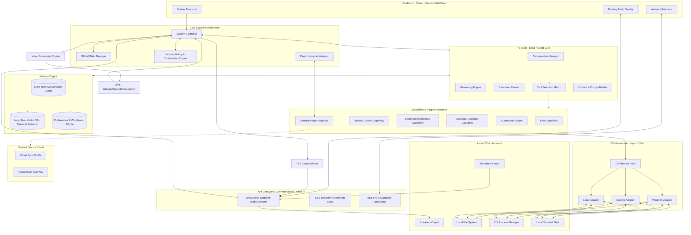
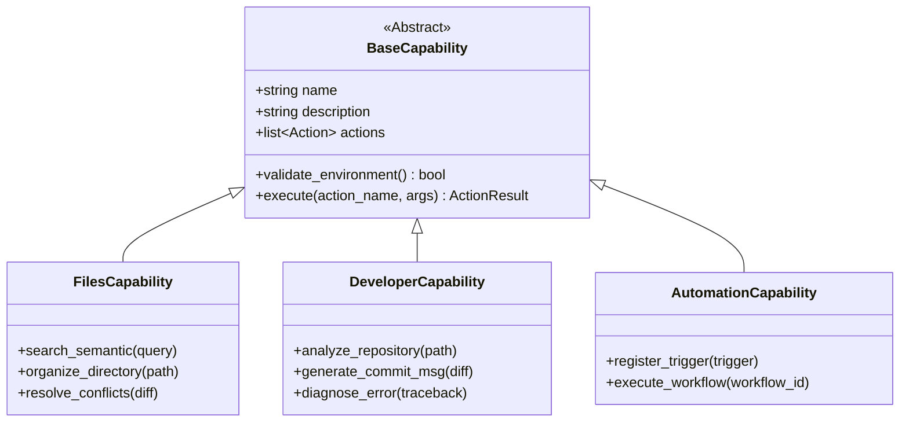
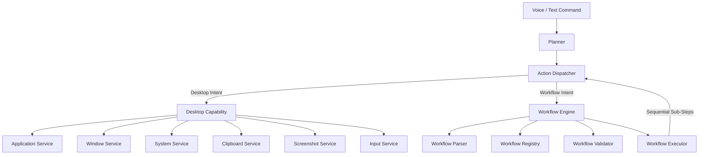

# Software Architecture Design Document (SADD)

## Project: Auralis – AI Operating System Assistant
**Version:** 2.0.0-Arch  
**Status:** Design Proposal  
**Author:** Principal Software Architect  

---

## 1. Overall Architecture Diagram

Auralis is designed as a local-first, agentic AI operating system assistant. The system uses a clean separation of concerns inspired by Hexagonal (Ports and Adapters) and Clean Architecture patterns. 

The architecture is built around an **AI Brain** containing a **Reasoning Loop** and a **State Planner** that orchestrates decoupled modular **Capabilities** through abstract system interfaces.



---

## 2. Complete Folder Structure

The directory layout is organized by functional responsibility rather than technical file type. This isolates business domains, ensuring that modifications to capabilities or OS platforms do not affect core orchestration.

```
Auralis/
├── config/                         # System-wide configuration templates
│   ├── app.yaml                    # Global daemon settings
│   ├── security.yaml               # Permissions and confirmation rules
│   └── plugins.yaml                # Enabled plugins list and credentials
├── docs/                           # Software architecture and API specs
│   ├── architecture.md             # This document
│   └── api_spec.yaml               # OpenAPI/AsyncAPI specification
├── scripts/                        # Infrastructure automation scripts
│   ├── build.py                    # Cross-platform bundler script
│   └── setup_env.py                # Installs local models and dependencies
├── src/                            # Main application source code
│   ├── core/                       # Core system orchestrator
│   │   ├── __init__.py
│   │   ├── bootstrap.py            # System initialization sequence
│   │   ├── controller.py           # Core orchestrator loop
│   │   ├── state.py                # Shared global state manager
│   │   └── exceptions.py           # Global exception definitions
│   ├── gateway/                    # Communication layer
│   │   ├── __init__.py
│   │   ├── http/                   # REST API controllers
│   │   │   ├── routes_system.py    # Daemon stats and controls
│   │   │   └── routes_chat.py      # Conversation REST endpoint
│   │   ├── ws/                     # WebSocket streams
│   │   │   └── audio_stream.py     # Bidirectional audio transmission
│   │   └── sse/                    # Server-Sent Events
│   │   │   └── reasoning_log.py    # Streams LLM thoughts to UI
│   ├── brain/                      # AI Brain and Reasoning loop
│   │   ├── __init__.py
│   │   ├── agent.py                # Main reasoning loop controller
│   │   ├── prompt_builder.py       # Handles prompt compilation and variables
│   │   ├── context_builder.py      # Merges user, memory, and OS state
│   │   ├── reasoning_engine.py     # Interacts with local/cloud model runtimes
│   │   └── tool_selector.py        # Compares available capabilities with plans
│   ├── memory/                     # Memory and context storage systems
│   │   ├── __init__.py
│   │   ├── short_term.py           # Sliding-window conversation buffer
│   │   ├── long_term.py            # Vector database abstraction (Chroma/Qdrant)
│   │   ├── preference_store.py     # SQLite-backed preference key-value store
│   │   └── file_indexer.py         # Incremental local file system indexer
│   ├── voice/                      # Audio capture and synthesis system
│   │   ├── __init__.py
│   │   ├── wake_word.py            # Local wake word detector (OpenWakeWord)
│   │   ├── speech_to_text.py       # Local transcription engine (Whisper)
│   │   ├── text_to_speech.py       # Local synthesizer engine (Piper)
│   │   └── audio_filter.py         # Noise suppression and gain control
│   ├── security/                   # System boundaries and permissions
│   │   ├── __init__.py
│   │   ├── policies.py             # Parses read/write permission scopes
│   │   ├── confirmations.py        # Prompts user for destructive actions
│   │   └── encryption.py           # Encrypted storage (secrets, OAuth tokens)
│   ├── database/                   # Relational and vector storage abstractions
│   │   ├── __init__.py
│   │   ├── connection.py           # SQLite connection pools
│   │   └── vector_client.py        # Local vector database engine instance
│   ├── osal/                       # Operating System Abstraction Layer (OSAL)
│   │   ├── __init__.py
│   │   ├── ports/                  # Abstract Base Classes (ABCs)
│   │   │   ├── file_system.py      # Abstract OS file system API
│   │   │   ├── process.py          # Abstract OS process API
│   │   │   └── terminal.py         # Abstract OS terminal execution API
│   │   └── adapters/               # Concrete platform implementations
│   │       ├── windows/            # Win32 API adapters
│   │       ├── linux/              # Linux-specific dbus/bash adapters
│   │       └── macos/              # macOS-specific Cocoa/zsh adapters
│   ├── capabilities/               # Modular capability packages
│   │   ├── __init__.py
│   │   ├── base.py                 # Abstract Base Capability interface
│   │   ├── files/                  # Intelligent folder & file operations
│   │   │   ├── capability.py
│   │   │   └── actions.py
│   │   ├── desktop/                # Screen, windows, and widget commands
│   │   │   ├── capability.py
│   │   │   └── actions.py
│   │   ├── documents/              # Doc text parsing, OCR, and extracts
│   │   │   ├── capability.py
│   │   │   └── actions.py
│   │   ├── developer/              # Code repository tools, git, debug
│   │   │   ├── capability.py
│   │   │   └── actions.py
│   │   ├── automation/             # Schedules, triggers, and sequences
│   │   │   ├── capability.py
│   │   │   └── actions.py
│   │   └── system/                 # Diagnostics, CPU metrics, resources
│   │       ├── capability.py
│   │       └── actions.py
│   └── plugins/                    # Sandbox system for user extensions
│       ├── __init__.py
│       ├── base.py                 # Abstract Plugin classes
│       ├── loader.py               # Dynamic runtime module loader
│       └── sandbox.py              # Wasm or process-isolated sandbox wrapper
├── tests/                          # Automated tests partitioned by scope
│   ├── unit/                       # Component isolated tests
│   ├── integration/                # Multi-component state integration tests
│   └── system/                     # E2E UI and system automation tests
└── ui/                             # Desktop User Interface
    ├── package.json
    ├── vite.config.ts
    ├── index.html
    ├── src/
    │   ├── main.tsx                # Frontend entry bootstrap
    │   ├── App.tsx                 # Routing manager
    │   ├── components/             # Reusable widgets (cards, waveform, timeline)
    │   ├── hooks/                  # Global state management hooks
    │   ├── views/                  # Screen views (Assistant, Automation, Dev)
    │   └── services/               # REST, SSE, and WebSocket client service
```

---

## 3. Module Responsibilities

### Core System Controller (`core/controller.py`)
* **Responsibility:** Orchestrates system startup, processes user inputs from gateways, routes tasks through the AI Brain, coordinates with the Confirmation Engine, and dispatches instructions.
* **Inputs:** Raw voice transcriptions, text chat inputs, background system events, client state packets.
* **Outputs:** SSE reasoning updates, WebSocket audio frames, client UI updates.
* **Dependencies:** `brain/agent.py`, `gateway/`, `security/confirmations.py`.
* **Future Expansion:** Support for federated core clusters, coordinating commands across multiple devices.

### AI Agent Loop (`brain/agent.py`)
* **Responsibility:** Executes the iterative Reasoning Loop (ReAct paradigm). Translates the user's overall goal into a structured plan, dynamically decides which tools to invoke, and evaluates results.
* **Inputs:** User request, system state context, capability definitions, conversation history.
* **Outputs:** Structured execution plan, targeted tool invocations, user feedback responses.
* **Dependencies:** `brain/reasoning_engine.py`, `brain/tool_selector.py`, `memory/short_term.py`.
* **Future Expansion:** Self-refining multi-agent networks, where sub-agents negotiate complex operations.

### OSAL Ports Interface (`osal/ports/`)
* **Responsibility:** Defines standard abstract base classes (ABCs) that capabilities use to interact with the host OS. This decouples the application's core logic from platform-specific APIs.
* **Inputs:** High-level system actions (e.g., `create_directory(path)`, `kill_process(pid)`).
* **Outputs:** Platform-neutral data models (e.g., standard file handles, process metadata).
* **Dependencies:** None.
* **Future Expansion:** Support for remote OSAL endpoints (e.g., control a remote container or Virtual Machine via SSH/gRPC).

---

## 4. Capability-Based Design

Rather than executing static commands, the Auralis architecture treats system functions as dynamic capabilities. Every capability extends a base class and registers itself with the AI Brain as a set of callable JSON-Schema tools.



### Action Dispatch and Invocation Lifecycle

1. **Discovery:** During bootstrap, `brain/tool_selector.py` imports all registered capabilities and compiles their schemas into a tool definition matrix.
2. **Declaration:** The AI Brain sends these tool definitions to the LLM as functional schemas.
3. **Selection:** The LLM requests a tool call (e.g., `files:organize_directory` with args: `{"path": "C:/Downloads"}`).
4. **Validation:** The controller intercept calls and routes them to `security/policies.py` to check permission scopes. If the action is marked sensitive, the controller suspends execution and triggers the Confirmation Engine.
5. **Execution:** The controller calls the target capability's `execute()` method. The capability uses OSAL adapters to interact with the host OS and returns an `ActionResult` to the AI Brain.

---

## 5. AI Brain

The AI Brain coordinates reasoning, intent classification, context assembling, and tool selection.

```
       +------------------+
       |   User Request   |
       +------------------+
                |
                v
  +----------------------------+
  |    Context Builder         | <--- Short-Term Memory
  |  (Assembles System State)  | <--- Long-Term Memory
  +----------------------------+ <--- OS Metrics / Active App
                |
                v
  +----------------------------+
  |    Prompt Builder          | <--- Prompt Templates
  +----------------------------+
                |
                v
  +----------------------------+
  |    Reasoning Engine        | <--- Interacts with LLM
  |   (Iterative ReAct Loop)   |
  +----------------------------+
        |              |
        | Thought      | Tool Call
        v              v
  +-----------+  +----------------------------+
  |  System   |  |   Tool Selection Matrix    |
  | Response  |  +----------------------------+
  +-----------+                |
                               v
                 +----------------------------+
                 |    Safety & Permissions    |
                 +----------------------------+
                               |
                               v
                 +----------------------------+
                 |    Capability Dispatch     |
                 +----------------------------+
```

### Components

* **Conversation Manager:** Tracks the active conversational thread. Identifies when to fork conversations or archive old contexts.
* **Context Builder:** Merges current OS variables (active window, directory, system resources) and relevant memories into a rich text context.
* **Reasoning Engine:** Executes an agentic loop (e.g., Plan-and-Solve or ReAct). Runs a lightweight LLM locally (e.g., Llama 3 via llama.cpp or Ollama) with a fallback to secure hosted APIs.
* **Prompt Builder:** Compiles dynamic prompt templates based on the current execution phase, injecting active tool definitions and system rules.
* **Tool Selection Matrix:** Maps the LLM's requested actions to local capability registration IDs and performs argument type validation.
* **Safety & Policy Validator:** Scans LLM reasoning chains for hallucinations, unsafe actions (e.g., deleting root files), or commands that violate system policies.

---

## 6. Memory Architecture

Auralis uses a tiered memory system to maintain context without overloading the LLM's context window.

```
+-------------------+----------------------------+-----------------------------+
| Memory Tier       | Storage Implementation     | Update Trigger              |
+-------------------+----------------------------+-----------------------------+
| Short-Term        | In-Memory deque            | Every message turn          |
|                   | (sliding window)           |                             |
+-------------------+----------------------------+-----------------------------+
| Long-Term         | Local Vector DB            | On session close or         |
|                   | (Qdrant / Chroma)          | significant events          |
+-------------------+----------------------------+-----------------------------+
| Preference Store  | SQLite database            | Explicit user settings or   |
|                   | (relational keys)          | verified behavioral pattern |
+-------------------+----------------------------+-----------------------------+
| Project Context   | File indexes / DB          | Directory workspace change  |
+-------------------+----------------------------+-----------------------------+
| Workflow Memory   | Relational tables          | Saving automated routines   |
+-------------------+----------------------------+-----------------------------+
```

### Retrieval and Storage Mechanics

1. **Short-Term Memory:** Retains the exact text of the last 15-20 messages in memory for conversational flow.
2. **Long-Term Memory:** When a session ends, key interactions are summarized and embedded using a local embedding model (e.g., `all-minilm-l6-v2`). The resulting vectors are stored in a local vector database. At the start of a query, the system searches the vector database for semantically similar historical contexts and injects them into the prompt.
3. **Preference Memory:** Stores configuration keys (e.g., `"editor": "VS Code"`, `"backup_dir": "D:/Backup"`). Updated when the user issues commands like *"Always use cursor for dev work"*.
4. **File Index:** Runs an incremental background thread utilizing system event loops (e.g., `FindFirstChangeNotification` on Windows, `inotify` on Linux) to build a fast relational index of filenames, structures, and metadata.

---

## 7. Desktop Architecture

Auralis runs as a background system daemon with a floating user interface.

```
                  +-----------------------------------+
                  |        OS Background Daemon       |
                  |  - Startup Service                |
                  |  - Audio Pipeline & STT Listener  |
                  |  - API Gateway / WebSocket Server |
                  +-----------------------------------+
                                    ^
                                    | IPC / WebSocket
                                    v
                  +-----------------------------------+
                  |        UI Shell Window            |
                  |  - System Tray Management         |
                  |  - Global Hotkeys (Alt + Space)   |
                  +-----------------------------------+
                       /            |             \
                      v             v              v
             +------------+   +------------+   +------------+
             | Floating   |   | Full-View  |   | Speech     |
             | Panel      |   | Workspace  |   | Overlay    |
             +------------+   +------------+   +------------+
```

### Components

* **System Tray Daemon:** Launches on system startup. Manages background listeners, triggers updates, and provides a quick toggle menu.
* **UI Window States:**
  * *Floating Assistant:* Centered launcher window (similar to Spotlight/Raycast) that opens with a global hotkey (e.g., `Alt + Space`).
  * *Speech Overlay:* A clean HUD animation displayed at the bottom of the screen when the wake word is detected, indicating listening states.
  * *Workspace View:* A full-screen interface for writing automations, reviewing file search logs, checking developer configurations, and managing settings.
* **Voice Animation Loop:** Processes real-time microphone input volume on a separate thread, sending volume data to the UI via WebSockets to drive fluid SVG voice animations.

---

## 8. Voice System

The voice pipeline runs locally to protect user privacy.

```
       +-----------------------+
       |   Microphone Stream   |
       +-----------------------+
                   |
                   v
       +-----------------------+
       |   DSP Noise Filter    |
       +-----------------------+
                   |
                   v
       +-----------------------+
       |   Wake Word Engine    | ---> If "Hey Auralis"
       |    (Always-On Loop)   |
       +-----------------------+
                   |
                   v
       +-----------------------+
       |   Voice Profile Check | ---> Rejects background noise
       +-----------------------+
                   |
                   v
       +-----------------------+
       | Speech-To-Text (Whis) |
       +-----------------------+
                   |
                   v
       +-----------------------+
       |    System Core Loop   |
       +-----------------------+
```

* **DSP Pipeline:** Uses WebRTC Audio Processing (or equivalent Python bindings) for acoustic echo cancellation, noise suppression, and automatic gain control.
* **Wake Word Engine:** A lightweight, local thread using `OpenWakeWord` or `Snowboy` to monitor the audio input. When the wake word is detected, it triggers the main assistant overlay.
* **Speech-to-Text (STT):** Powered by a local instance of Whisper (specifically `faster-whisper` running on CPU or local GPU) to convert voice inputs into text.
* **Speech Synthesis (TTS):** Uses `Piper` or `Coqui TTS` to generate high-quality, natural-sounding voice responses offline, keeping latency under 150ms.
* **Voice Profiles:** Learns user voice prints to ignore commands from background speech (e.g., television or conversations).

---

## 9. Operating System Layer (OSAL)

To ensure the codebase remains cross-platform, capabilities never call OS functions directly. Instead, they interact with the Operating System Abstraction Layer (OSAL).

```
                            +--------------------------+
                            |    Capabilities Module   |
                            +--------------------------+
                                         |
                                         v
                            +--------------------------+
                            |      OSAL interface      |
                            | (Abstract Ports Class)   |
                            +--------------------------+
                                 /       |       \
            +-------------------+        |        +-------------------+
            |                            |                            |
            v                            v                            v
  +-------------------+        +-------------------+        +-------------------+
  |  Windows Adapter  |        |   Linux Adapter   |        |   macOS Adapter   |
  |  - Win32 APIs     |        |  - GDBus / Udev   |        |  - AppleScript    |
  |  - PowerShell     |        |  - Bash CLI       |        |  - Cocoa API      |
  +-------------------+        +-------------------+        +-------------------+
            |                            |                            |
            +----------------------------+----------------------------+
                                         |
                                         v
                            +--------------------------+
                            |   Host Operating System  |
                            +--------------------------+
```

### OSAL Implementation Pattern

```python
# osal/ports/file_system.py
from abc import ABC, abstractmethod

class FileSystemPort(ABC):
    @abstractmethod
    def move_file(self, src: str, dest: str) -> bool:
        pass

    @abstractmethod
    def get_free_space(self, path: str) -> int:
        pass

# osal/adapters/windows/file_system.py
import ctypes
import shutil
from osal.ports.file_system import FileSystemPort

class WindowsFileSystemAdapter(FileSystemPort):
    def move_file(self, src: str, dest: str) -> bool:
        # Implements Win32 IFileOperation for rich Shell status
        shutil.move(src, dest)
        return True

    def get_free_space(self, path: str) -> int:
        free_bytes = ctypes.c_ulonglong(0)
        ctypes.windll.kernel32.GetDiskFreeSpaceExW(
            ctypes.c_wchar_p(path), None, None, ctypes.byref(free_bytes)
        )
        return free_bytes.value
```

---

## 10. Developer Assistant

The Developer Assistant capability integrates local workspace analysis, shell execution, and version control support directly into Auralis.

```
       +-------------------------------------------------+
       |           Developer Assistant Module            |
       +-------------------------------------------------+
          /          |               |               \
         v           v               v                v
  +----------+  +----------+  +--------------+  +-----------+
  | Git Port |  | Terminal |  | Environment  |  | Doc/Gen   |
  |  - Diff  |  |  - Exec  |  |  - Profiler  |  |  - README |
  |  - Comm  |  |  - Logs  |  |  - Venv/Dep  |  |  - Commits|
  +----------+  +----------+  +--------------+  +-----------+
```

### Components

* **Git Orchestrator:** Interprets repositories, builds semantic commit messages from diffs, and manages branches and conflicts.
* **Terminal Controller:** Spawns persistent, non-blocking shells (PowerShell, bash, zsh) with stdout/stderr capture pipelines.
* **Environment Profiler:** Auto-detects runtime configurations (Python venv, Node node_modules, Docker environments) and lists diagnostic issues.
* **Project Parser:** Scans project directories, analyzes code files to build AST (Abstract Syntax Tree) representations, and maps imports to index code symbols for easy navigation.
* **Debug Engine:** Evaluates execution tracebacks, matches errors against StackOverflow/GitHub Issues databases, and proposes context-aware code fixes.

---

## 11. Document Intelligence

This module parses text and layouts from documents, processing search queries locally without external cloud dependencies.

```
+------------------+     +------------------+     +------------------+
|  Document Input  | --> | Extraction Pipeline| --> |   Vector Store   |
| (PDF, DOCX, XLSX)|     | (OCR, Text, Table|     |  (Chunk Indexing)|
+------------------+     +------------------+     +------------------+
                                                        |
                                                        v
                                                  +------------------+
                                                  |   RAG Engine     |
                                                  |  (Local Q&A)     |
                                                  +------------------+
```

* **Extraction Engine:** Integrates `PyMuPDF` for PDF text extraction, `python-docx` for Word parsing, and local `Tesseract OCR` for image scans.
* **Semantic Chunking:** Splits document text into overlapping segments based on syntax and paragraph structures to preserve contextual integrity.
* **Local Vector Store:** Generates vector embeddings for document chunks and indexes them in a local vector database.
* **Question-Answering (RAG):** Answers natural language questions by retrieving relevant document chunks and passing them to a local LLM as context.
* **Summary Generator:** Generates structured document summaries, highlighting key action items and metadata.

---

## 12. Automation Engine

The Automation Engine runs background tasks and organizes file systems based on system events, schedules, or user triggers.

```
+-------------------------------------------------------------+
|                     Automation Engine                       |
+-------------------------------------------------------------+
|   [Triggers]          [Evaluations]          [Actions]      |
|  - Cron Schedules   ->  - Condition Matrix ->  - OS Run     |
|  - FS Events            - State Matches          - UI Alerts  |
|  - System Boot                                 - Script runs|
+-------------------------------------------------------------+
```

* **Routines Registry:** Stores schedules, event configurations, and automated action lists in the SQLite database.
* **Trigger Monitor:** Monitors system events (e.g., disk insertion, file creations, screen lock states) using OSAL event adapters.
* **Condition Evaluator:** Evaluates rules (e.g., *"If file extension is .pdf and file size is > 5MB"*) before executing actions.
* **Workflow Executor:** Runs automated routines asynchronously, maintaining execution logs and error recovery checkpoints.
* **Routine Builder:** Provides a visual editor in the frontend app for constructing triggers, conditions, and actions.

---

## 13. Plugin Architecture

Auralis features an extensible plugin system, allowing developers to add new capabilities and connect external services safely.

```
+-------------------------------------------------------------+
|                      Plugin Sandbox                         |
+-------------------------------------------------------------+
|                                                             |
|   +------------------+             +------------------+     |
|   |  Plugin Module   | <---------> |  Security Guard  |     |
|   |  (Wasm / Python) |             |  (Scope Limits)  |     |
|   +------------------+             +------------------+     |
|            |                                |               |
|            v                                v               |
|   +------------------+             +------------------+     |
|   | Capability Port  |             |  System Resource |     |
|   | (Abstract APIs)  |             |  (Cpu/Memory)    |     |
|   +------------------+             +------------------+     |
|                                                             |
+-------------------------------------------------------------+
```

### Components

* **Dynamic Loader:** Uses `importlib.metadata` and dynamic imports to discover and load installed plugins at startup.
* **Security Sandbox:** Runs plugins in a sandboxed environment with restricted access to system resources. Plugins must declare their required permission scopes (e.g., `network_access`, `file_read:Downloads`) in their manifest file.
* **Host API Bridge:** Exposes a safe subset of the Auralis Core API to plugins, routing all system calls through the permission manager.
* **Lifecycle Manager:** Controls plugin states (initialization, activation, suspension, shutdown). Allows plugins to be updated or disabled at runtime without restarting the main application.

---

## 14. Security Architecture

Auralis is designed with a strict local-first, zero-trust approach to protect user data.

```
                  +-----------------------------------+
                  |        Core Command Request       |
                  +-----------------------------------+
                                    |
                                    v
                  +-----------------------------------+
                  |         Permission Policy         |
                  |     (Check configured scopes)     |
                  +-----------------------------------+
                                    |
                       +------------+------------+
                       | Allowed                 | Needs Confirmation
                       v                         v
            +-------------------+     +-------------------+
            |  Direct Dispatch  |     |    User Dialog    |
            |   (Execution)     |     |   (Confirm/Deny)  |
            +-------------------+     +-------------------+
```

### Security Measures

* **Confirmation Engine:** Intercepts potentially destructive operations (e.g., executing shell scripts, bulk-deleting directories, modifying git history) and requires explicit confirmation from the user via the UI.
* **Secure Key Vault:** Uses the host OS's native credential store (Windows Credential Manager, macOS Keychain, or Linux Secret Service via `keyring`) to store API keys and OAuth tokens.
* **Local Sandboxing:** Ensures local LLMs and audio engines communicate over local loopback interfaces (`127.0.0.1`), blocking external network connections.
* **Encrypted Storage:** Encrypts local database backups and vector indexes using AES-256 keys tied to the user's system profile.
* **Behavioral Audit Logs:** Maintains a read-only local database log of all system actions, commands, and file modifications.

---

## 15. Database Design

Auralis uses SQLite for structured relational data and a local vector database for semantic search.

```
                                +-------------------+
                                |    Database       |
                                +-------------------+
                                 /                 \
                                v                   v
                  +-------------------+       +-------------------+
                  |   SQLite Engine   |       | Vector Database   |
                  | - User Prefs      |       | - Doc Embeddings  |
                  | - Routines        |       | - History Vectors |
                  | - Audit Logs      |       | - File Semantics  |
                  | - File Index      |       +-------------------+
                  +-------------------+
```

### Databases

#### Relational Database (SQLite)
* **Purpose:** Stores user configurations, automation schedules, activity logs, file indexes, and workflow steps.
* **Why it exists:** Provides transactional security, fast queries, and low resource overhead on local systems.

#### Vector Database (Qdrant / Chroma - Embedded)
* **Purpose:** Stores and queries vector embeddings for document chunks, long-term memory records, and code symbol lookups.
* **Why it exists:** Enables semantic, similarity-based search across documents and conversation histories.

---

## 16. Frontend Architecture

The user interface is designed as an interactive desktop assistant UI built with React, Vite, and Vanilla CSS.

```
       +-------------------------------------------------+
       |               Frontend Shell App                |
       +-------------------------------------------------+
          /          |               |               \
         v           v               v                v
  +----------+  +----------+  +--------------+  +-----------+
  |  Views   |  | Components| | State Stores |  | Services  |
  | - Assist |  | - Waveform| | - Session    |  | - Ws Conn |
  | - Config |  | - Explorer| | - FileCache  |  | - Sse Conn|
  | - Rules  |  | - Timeline| | - Preference |  | - Http    |
  +----------+  +----------+  +--------------+  +-----------+
```

* **Views:**
  * *Assistant:* Chat console supporting both voice and text inputs, showing real-time reasoning logs.
  * *Explorer:* A visual interface for managing search results, categorizing files, and checking directory stats.
  * *Automation:* A visual, node-based builder for creating workflows and managing schedules.
  * *Developer:* Workspace dashboard showing active git repositories, environment states, and terminal logs.
* **State Management:** Uses React Context or lightweight stores (e.g., Zustand) to coordinate connection states, session histories, and preferences.
* **Communication Interface:** Uses WebSockets for real-time audio streams and server connection states, SSE (Server-Sent Events) for streaming reasoning logs, and REST APIs for file operations and configurations.

---

## 17. Backend Architecture

Auralis Backend uses FastAPI and Uvicorn to run a set of modular services.

```
                     +---------------------------+
                     |        HTTP Request       |
                     +---------------------------+
                                   |
                                   v
                     +---------------------------+
                     |    FastAPI Router Map     |
                     +---------------------------+
                                   |
                                   v
                     +---------------------------+
                     |    Security Policy Guard  |
                     +---------------------------+
                                   |
                                   v
                     +---------------------------+
                     |    Controller & Agent     |
                     +---------------------------+
                       /           |           \
                      v            v            v
             +-----------+   +-----------+   +-----------+
             | Database  |   | AI Engine |   | OSAL Port |
             +-----------+   +-----------+   +-----------+
```

### Execution Lifecycles

#### Text Command Request Lifecycle
1. **Receive:** The client sends a command to `/api/v2/chat` via HTTP POST.
2. **Retrieve Context:** The system fetches current system state and relevant long-term memories.
3. **Reason:** The AI Brain processes the command and builds a structured execution plan.
4. **Authorize:** The Security Guard checks if the plan requires user approval.
5. **Execute:** The Dispatcher runs the plan's actions using OSAL adapters.
6. **Respond:** The response builder formats the execution results and returns a JSON response to the client.

#### Asynchronous Error Recovery Plan
* **Process Isolation:** Runs compute-intensive workloads (like document OCR or voice processing) in separate OS processes using Python's `multiprocessing` library to keep the main web server responsive.
* **State Backups:** Automatically saves the agent state before executing risky commands. If an operation fails, the system runs rollback actions (e.g., restoring deleted files or reverting git commits).
* **Graceful Degradation:** If local GPU resources are exhausted, the voice engine automatically falls back to faster CPU-only models.

---

## 18. API Design

The API supports REST endpoints for configuration, Server-Sent Events (SSE) for streaming text, and WebSockets for real-time audio.

### Endpoints

#### `POST /api/v2/chat`
* **Purpose:** Send text commands to the assistant.
* **Payload:** `{"message": "summarize this PDF", "context": {"active_file": "C:/docs/report.pdf"}}`
* **Response:** `{"session_id": "uuid", "response": "Summary of report.pdf..."}`

#### `GET /api/v2/chat/reasoning`
* **Purpose:** Stream the assistant's thoughts and execution steps in real-time.
* **Protocol:** Server-Sent Events (SSE)
* **Response Stream:** `data: {"type": "thought", "content": "I need to open report.pdf and read its text."}`

#### `WS /api/v2/voice/stream`
* **Purpose:** Bidirectional voice streaming for hands-free interactions.
* **Protocol:** WebSockets
* **Data Payload:** Raw binary PCM audio packets (16kHz, 16-bit Mono).

---

## 19. Cross-Platform Design

To run seamlessly across Windows, Linux, and macOS without duplicate code, Auralis uses the Factory pattern to load the appropriate OS adapter at startup.

```python
# osal/connection.py
import sys
from osal.ports.file_system import FileSystemPort
from osal.adapters.windows.file_system import WindowsFileSystemAdapter
from osal.adapters.macos.file_system import MacOSFileSystemAdapter
from osal.adapters.linux.file_system import LinuxFileSystemAdapter

class OSALFactory:
    @staticmethod
    def get_file_system_adapter() -> FileSystemPort:
        platform = sys.platform
        if platform == "win32":
            return WindowsFileSystemAdapter()
        elif platform == "darwin":
            return MacOSFileSystemAdapter()
        elif platform.startswith("linux"):
            return LinuxFileSystemAdapter()
        else:
            raise NotImplementedError(f"Operating system '{platform}' is not supported.")
```

---

## 20. Scalability

Auralis is designed to scale from a single desktop app to a multi-device productivity ecosystem.

* **Federated Profile Sync:** Syncs settings, custom routines, and long-term memory across multiple devices securely using End-to-End Encrypted (E2EE) database replication.
* **Remote Desktop Integration:** Runs a lightweight Auralis OSAL agent on a remote server, allowing users to control remote environments using voice commands on their local machine.
* **Distributed Agent Teams:** Orchestrates complex tasks by delegating work to specialized sub-agents running on remote servers or local containers.

---

## 21. Migration Plan

Transitioning the codebase from the current command-based flow to the redesigned architecture requires a structured, phased approach to keep the application functional throughout the process.

### Code Analysis & Redirection

```
+------------------------------------+--------------------------+-------------------------------------------------+
| Current File Path                  | Action                   | Redesign Target Path                            |
+------------------------------------+--------------------------+-------------------------------------------------+
| backend/ai_engine/command_parser.py| Rewrite (Refactor logic) | src/brain/agent.py & src/brain/tool_selector.py |
+------------------------------------+--------------------------+-------------------------------------------------+
| backend/app/state_manager.py       | Move & Extend            | src/core/state.py                               |
+------------------------------------+--------------------------+-------------------------------------------------+
| backend/file_engine/file_ops.py    | Move (Decouple OS calls) | src/capabilities/files/actions.py               |
+------------------------------------+--------------------------+-------------------------------------------------+
| backend/file_engine/search_engine.py| Rename & Adapt           | src/memory/file_indexer.py                      |
+------------------------------------+--------------------------+-------------------------------------------------+
| backend/voice_engine/speech_to_text| Move & Optimize          | src/voice/speech_to_text.py                     |
+------------------------------------+--------------------------+-------------------------------------------------+
```

### Phased Migration Strategy

#### Phase 1: Setup Workspace Structure & Introduce OSAL
* **Goal:** Create the new `src/` directory layout and configure dependencies.
* **Steps:**
  1. Initialize the new folder structure.
  2. Implement abstract OSAL ports (`src/osal/ports/`).
  3. Create platform-specific adapters and port the core file system code from the current `file_engine/` directory.

#### Phase 2: Implement the API Gateway & Core State Controller
* **Goal:** Set up the new FastAPI router and global state controller.
* **Steps:**
  1. Set up the new router structure in `src/gateway/`.
  2. Implement the core state controller and routing logic.
  3. Connect the frontend API layer to the new endpoints using Vite reverse proxies.

#### Phase 3: Build the AI Brain and Tool Selector
* **Goal:** Replace the legacy command parser with the agentic reasoning loop.
* **Steps:**
  1. Implement the `brain/` modules.
  2. Register existing file actions as tools in `src/capabilities/`.
  3. Replace the legacy `/command` endpoint with the `/chat` streaming endpoint.

#### Phase 4: Integrate the Local Memory and Database Engines
* **Goal:** Set up vector search capabilities and persistent local memory.
* **Steps:**
  1. Add SQLite for preferences and logs.
  2. Integrate Chroma/Qdrant databases to support long-term memory.
  3. Configure the background file system indexer.

#### Phase 5: Implement UI Redesigns & Desktop Features
* **Goal:** Deploy the floating assistant UI and desktop tray launcher.
* **Steps:**
  1. Build the Raycast-style floating launcher UI in the frontend.
  2. Add support for system tray controls.
  3. Configure the local Whisper/Piper audio processing pipelines.

---

## 22. Development Roadmap

The roadmap is divided into five phases, ensuring that each phase produces a stable, testable release of the application.

```
[Phase 1: OSAL & Core] ──> [Phase 2: Gateway & State] ──> [Phase 3: Agentic Brain] ──> [Phase 4: Memory System] ──> [Phase 5: UI & Voice]
```

### Phase 1: OSAL Foundation & Core File Capabilities (Weeks 1-3)
* **Goal:** Build the OS Abstraction Layer and implement core file capabilities.
* **Testing:** Run automated unit tests to verify directory operations and path resolution on target operating systems.

### Phase 2: Gateway Layer & State Machine (Weeks 4-6)
* **Goal:** Create the FastAPI routers and state machine.
* **Testing:** Validate endpoints using mock client requests and verify state transitions.

### Phase 3: Agentic Brain & Capability Toolkits (Weeks 7-9)
* **Goal:** Deploy the AI agent reasoning loop and register capabilities as tools.
* **Testing:** Run evaluation tests to verify the planner's ability to choose the correct tools for a given query.

### Phase 4: Tiered Memory Engine & SQLite Store (Weeks 10-12)
* **Goal:** Implement the vector store and SQLite database.
* **Testing:** Verify that relevant historical context is successfully retrieved and injected into the prompt.

### Phase 5: Voice Pipelines & UI Redesign (Weeks 13-15)
* **Goal:** Deploy the offline speech engines and launch the redesigned floating UI.
* **Testing:** Run end-to-end integration tests (from audio input to OS execution) and verify UI performance.

---

## 23. Desktop Automation & Workflow Engine (v0.4.0)

Version 0.4.0 implements Phase 4 Desktop Control and Automation capabilities. It extends the core Auralis pipeline by introducing the `DesktopCapability` routing engine and a sequential `WorkflowEngine`.

### Architecture & Design Pattern


### Key Subsystems
1. **Desktop Capability (`capabilities/desktop/`)**: 
   - A single cohesive capability wrapper exposed to the dispatcher. Coordinates and delegates requests to specialized services.
   - Enforces execution latency logging, structured JSON event logging, and telemetry profiling metrics.
2. **Sequential Workflow Engine (`automation/workflow/`)**:
   - Manages pre-registered multi-step workflows.
   - **Parser**: Translates user phrases into normalized mode triggers.
   - **Registry**: Configures default modes (Start Coding, Study Mode, Meeting Mode, Movie Mode, Clean Workspace).
   - **Validator**: Runs dependency validation on targets (folders and apps) to verify availability.
   - **Executor**: Executes sub-steps sequentially via the core `ActionDispatcher`, logging execution status for rollback readiness.

