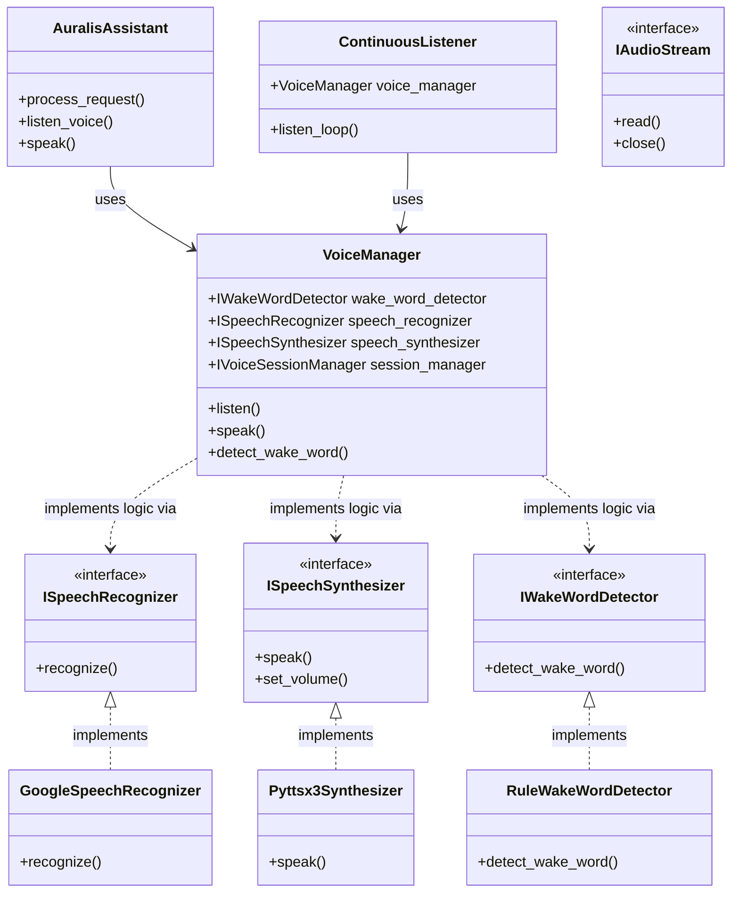

# Auralis Voice Subsystem Refactoring & Migration Report

This report documents the migration of the Auralis Voice subsystem from a flat set of utility scripts into a clean, modular, interface-driven architecture.

---

## 1. Migration Report

### 1.1 Rationale for Refactoring
Previously, the voice subsystem consisted of loose utility scripts (`speech_to_text.py`, `text_to_speech.py`, `wake_word.py`) and a continuous listener loop module (`continuous_listener.py`). While functional, this organization suffered from:
1. **Tight Coupling**: Direct dependencies on specific libraries (`speech_recognition`, `pyttsx3`) throughout the engine loop.
2. **No Dependency Injection**: Inability to substitute mock audio streams or custom wake-phrase engines during automated testing.
3. **Poor Extensibility**: Switching from Google Speech API to an offline engine (like Whisper or Vosk) would require rewrites of the core files.

### 1.2 Accomplished Migration Steps
* **Interface Abstraction**: Created `interfaces.py` containing formal python abstract base classes for `IAudioStream`, `ISpeechRecognizer`, `ISpeechSynthesizer`, `IWakeWordDetector`, and `IVoiceListener`.
* **Sub-module Decomposition**:
  * Decomposed audio capture into `audio_stream.py`.
  * Decomposed engine logic into concrete drivers under `providers/` (`google_recognizer.py`, `pyttsx3_synthesizer.py`, `rule_wake_word.py`).
  * Decomposed state context tracking into `voice_session.py`.
* **Coordinating Layer**: Created the `VoiceManager` class (in `manager.py`) which acts as the main facade coordinating all speech modules.
* **Compatibility Layer**: Preserved existing import hooks by rewriting the original files to behave as thin delegate wrappers forwarding to the `VoiceManager` singleton.

---

## 2. Updated Subsystem Architecture

The following diagram illustrates the relationship between components:



---

## 3. Future Extension Points

With the interface-driven architecture, developers can extend or swap voice components without modifying the core orchestrator or continuous listener.

### 3.1 Swapping the Speech Recognizer (e.g. Offline Whisper)
To implement offline OpenAI Whisper recognition:
1. Create a class `WhisperSpeechRecognizer` under `providers/whisper_recognizer.py` implementing the `ISpeechRecognizer` interface:
   ```python
   from voice.interfaces import ISpeechRecognizer

   class WhisperSpeechRecognizer(ISpeechRecognizer):
       def recognize(self, timeout=10.0, phrase_time_limit=10.0):
           # Custom Whisper offline transcription logic here
           return "transcribed text"
   ```
2. Inject it into the `VoiceManager` constructor:
   ```python
   recognizer = WhisperSpeechRecognizer()
   manager = VoiceManager(speech_recognizer=recognizer)
   ```

### 3.2 Swapping the Speech Synthesizer (e.g. ElevenLabs Cloud TTS)
To implement a custom cloud synthesizer:
1. Implement the `ISpeechSynthesizer` interface:
   ```python
   from voice.interfaces import ISpeechSynthesizer

   class ElevenLabsSynthesizer(ISpeechSynthesizer):
       def speak(self, text, wait=True):
           # ElevenLabs API request & stream playback
           return True
       # Implement other properties...
   ```
2. Pass it to the `VoiceManager` initialization.

### 3.3 Adding Alternative Wake Word Detectors (e.g. Picovoice Porcupine)
Instead of matching starting strings via regular expressions, you can integrate a local hotword engine:
1. Implement the `IWakeWordDetector` interface:
   ```python
   from voice.interfaces import IWakeWordDetector

   class PorcupineWakeWordDetector(IWakeWordDetector):
       def detect_wake_word(self, command):
           # Picovoice Porcupine logic
           return {"activated": True, "cleaned_command": command}
   ```
2. Instantiate `VoiceManager` injecting `PorcupineWakeWordDetector`.
