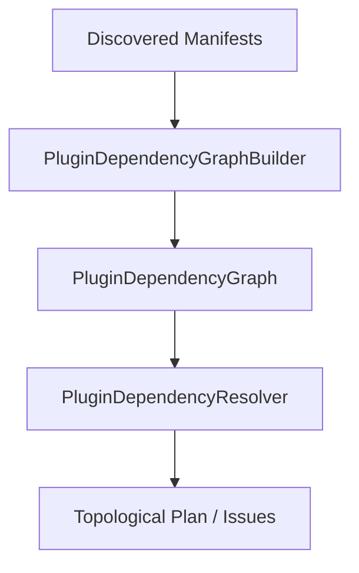

# Phase 17.3 — Plugin Dependency Resolution Runtime

The Auralis Frontend V2 plugin system features a robust, provider-independent, and pure TypeScript dependency resolution runtime. This engine ensures that plugins are loaded in a strict topological order and that any resolution problems (missing dependencies, circular dependencies, version mismatches) are safely caught and diagnosed.

## Architecture & Data Flow

### 1. Domain Models (`dependency.ts`)
- **`PluginDependencyGraph`**: A snapshot representation of nodes (plugin definitions and their dependencies) and directed edges (dependent relationships).
- **`DependencyResolutionResult`**: The final product of a resolution pass, including status (`RESOLVED`, `FAILED`, `PARTIAL`), the execution order plan, and structural diagnostics issues.
- **`freezeDeepSafe`**: An immutable cloning engine designed to prevent state mutation of nested arrays, plain objects, `Map`, and `Set` instances.

### 2. SemVer Range Engine (`SemVerValidator.ts`)
- Evaluates SemVer version satisfaction against ranges using operators:
  - Caret (`^`) (e.g., `^1.2.3`, `^0.2.0`)
  - Tilde (`~`) (e.g., `~1.2.3`, `~1.2`)
  - Wildcards (`*`, `x`, `X`)
  - Relational operators (`>=`, `<=`, `>`, `<`)
  - Compound logical constraints (`&&` / space-separated and `||` / OR ranges)
- Properly handles pre-release tags (`1.2.3-alpha`) in compliance with SemVer range matching rules.

### 3. Graph Builder (`PluginDependencyGraphBuilder.ts`)
- Construct nodes and edges from discovered manifests.
- Operates deterministically by alphabetically pre-sorting manifest lists to guarantee identical graph snapshots on identical inputs.

### 4. Dependency Resolver (`PluginDependencyResolver.ts`)
- Runs a Depth-First Search (DFS) algorithm with three-color node coloring (`white`, `gray`, `black`) for cycle detection and topological sorting.
- Detects required dependency cycles as `error` severity and optional dependency cycles as `warning` severity.
- Resolves partial subgraphs when some roots are healthy while other branches contain errors.
- Gathers full path cycles (e.g., `["A", "B", "C", "A"]`) to output detailed debugging feedback.
